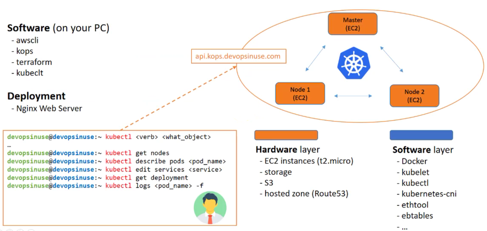
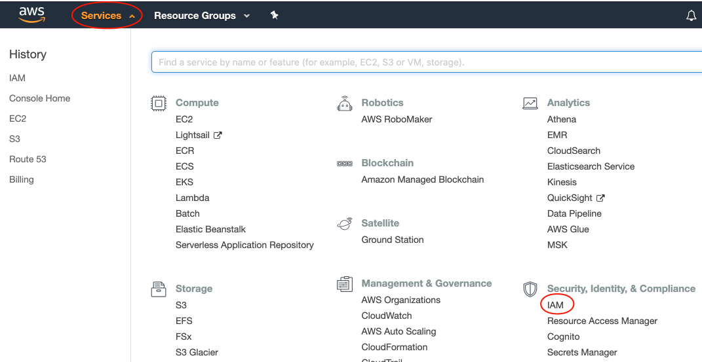
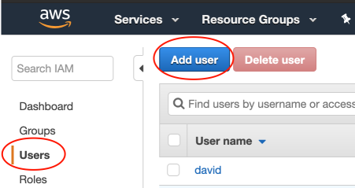
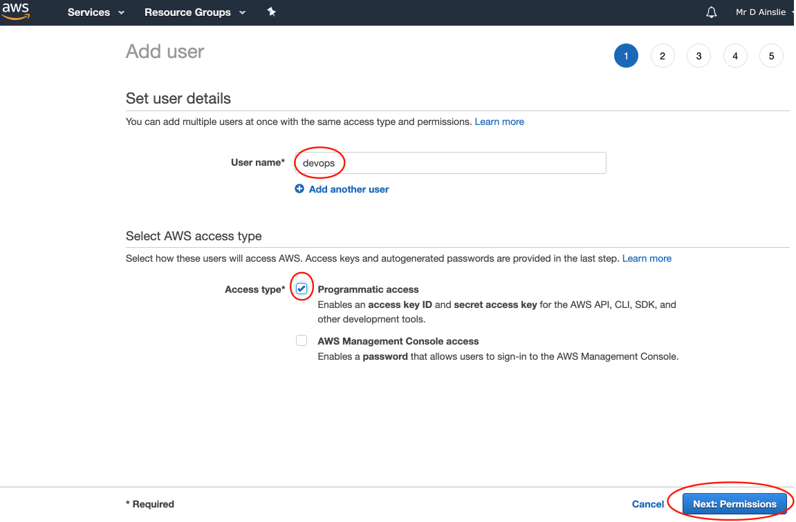
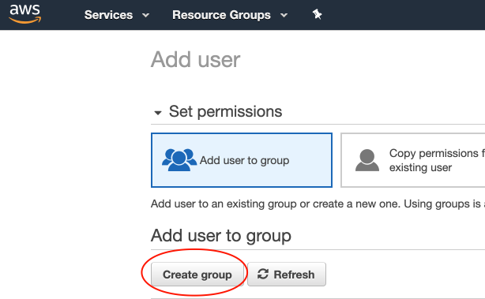
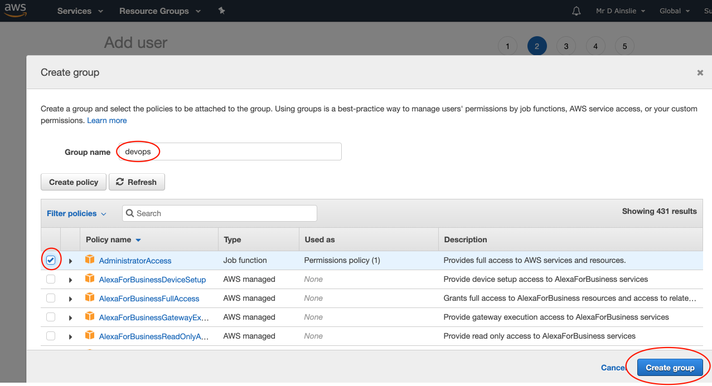

# Introduction



## Required Installations

Follow the [setup](../../docs/setup.md) to install the essentials which include:

- AWS
- Kubernetes
- Kops
- Terraform

## AWS

We'll be provisioning and deploying onto AWS.

#### Configure AWS CLI (Binary) to communicate with AWS


Let's create a new user and group of **devops**:



---



---



---



---



**Don't forget to save the generated credentials**.

With these credentials, we can save them into the [~/.aws/credentials](~/.aws/credentials) file e.g.

```properties
[default]
aws_access_key_id = ...
aws_secret_access_key = ...

...

[devops]
aws_access_key_id = ...
aws_secret_access_key = ...
```

and add a profile to the [~/.aws/config](~/.aws/config) e.g.

```properties
[default]
...

[profile devops]
region = eu-west-2
output = json
```

Now we can use the new profile to be able to communicate with AWS:

```bash
$ export AWS_DEFAULT_PROFILE=devops
```

```bash
~ via ⬢ v8.9.4 using ☁️ devops via 🐍 3.7.0
➜ aws iam get-user
{
    "User": {
        "Path": "/",
        "UserName": "devops",
        "UserId": "...",
        "Arn": "arn:aws:iam::...:user/devops",
        "CreateDate": "2019-04-13T14:14:23Z"
    }
}
```