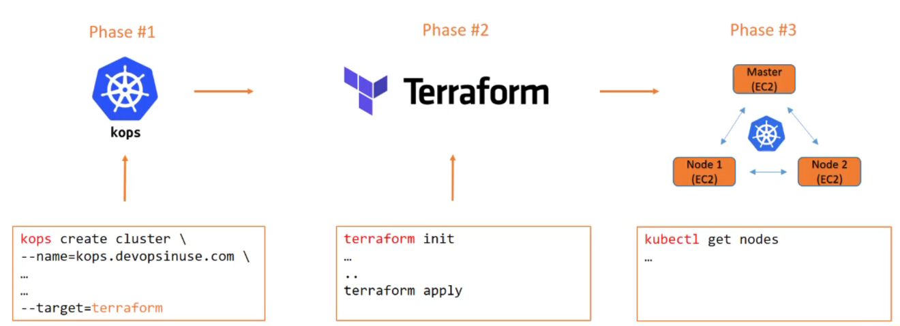
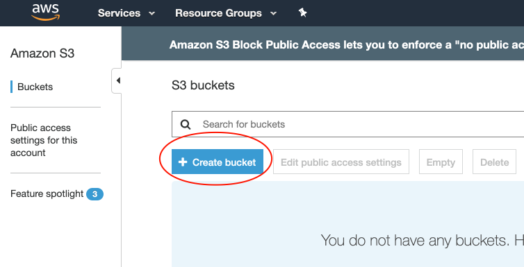
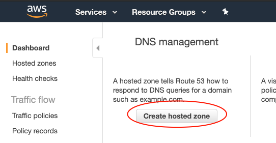
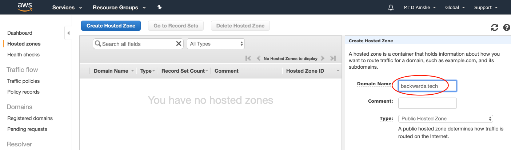
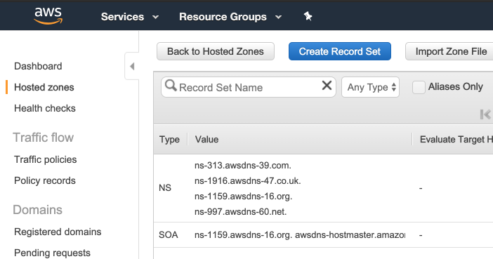
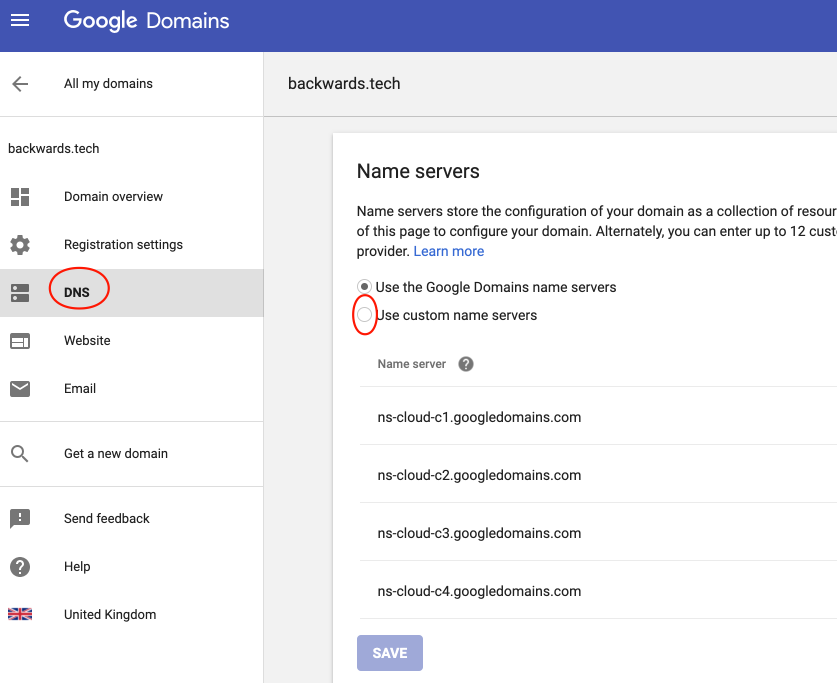
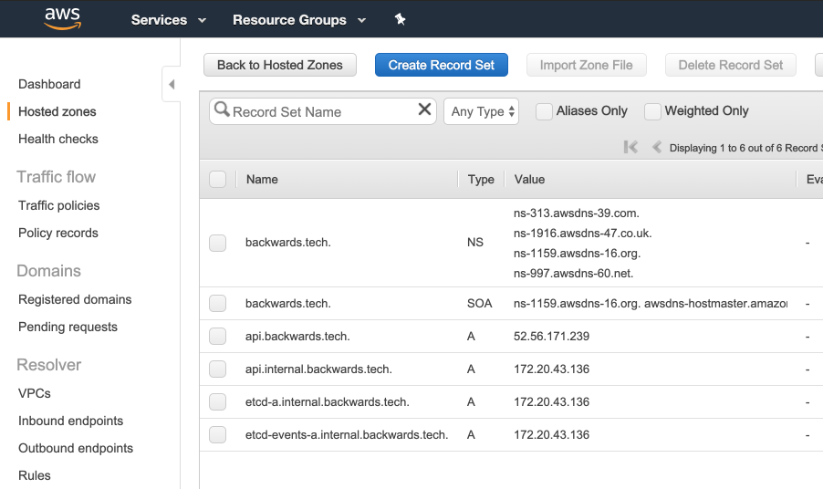

# Kops



Start a Kubernetes cluster using Kops we use the following form:

```bash
$ kops create cluster \
  --name=backwards.tech \
  --state=s3://backwards.tech \
  --authorization RBAC \
  --zones=eu-west-2a \
  --node-count=2 \
  --node-size=t2.micro \
  --master-size=t2.micro \
  --master-count=1 \
  --dns-zone=backwards.tech \
  --out=backwards-terraform \
  --target=terraform \
  --ssh-public-key=~/.ssh/devops.pub
```


## S3 Bucket

As noted above, before running our "kops create", we need an **S3 bucket**:



## Route 53



---



---



Note the **name servers** (NS) and enter them into the DNS section of your domain name registrar e.g. my domain name of **backwards.tech** is with Google Domains:



## SSH

To be able to *jump* onto an instance of our cluster, we will have to provide a public key (and private key) to be issued upon cluster creation. So we need a public/private key pair:

```bash
$ ssh-keygen -f ~/.ssh/devops
```

## Create Kubernetes Cluster


Run [kops-cluster.sh](../kops-cluster.sh) which has the **kops create cluster** command with all relevant flags. Upon execution a directory **backwards-terraform** is generated allowing terraform to be *applied* to communicate our intentions with AWS:

```bash
kubernetes-backwards/devops-kubernetes-kops-terraform on master [!+?] using ☁️ devops
➜ ./kops-cluster.sh
I0413 19:50:03.942792   77699 create_cluster.go:1407] Using SSH public key: /Users/davidainslie/.ssh/devops.pub
I0413 19:50:04.783006   77699 create_cluster.go:496] Inferred --cloud=aws from zone "eu-west-2a"
I0413 19:50:04.915473   77699 subnets.go:184] Assigned CIDR 172.20.32.0/19 to subnet eu-west-2a
I0413 19:50:07.753015   77699 executor.go:103] Tasks: 0 done / 73 total; 31 can run
I0413 19:50:07.756866   77699 dnszone.go:242] Check for existing route53 zone to re-use with name "backwards.tech"
I0413 19:50:07.989330   77699 dnszone.go:249] Existing zone "backwards.tech." found; will configure TF to reuse
I0413 19:50:08.143404   77699 vfs_castore.go:736] Issuing new certificate: "apiserver-aggregator-ca"
I0413 19:50:08.302653   77699 vfs_castore.go:736] Issuing new certificate: "ca"
I0413 19:50:08.573439   77699 executor.go:103] Tasks: 31 done / 73 total; 24 can run
I0413 19:50:08.980201   77699 vfs_castore.go:736] Issuing new certificate: "apiserver-aggregator"
I0413 19:50:09.052836   77699 vfs_castore.go:736] Issuing new certificate: "kubelet-api"
I0413 19:50:09.069646   77699 vfs_castore.go:736] Issuing new certificate: "kube-controller-manager"
I0413 19:50:09.074895   77699 vfs_castore.go:736] Issuing new certificate: "apiserver-proxy-client"
I0413 19:50:09.089156   77699 vfs_castore.go:736] Issuing new certificate: "kops"
I0413 19:50:09.092682   77699 vfs_castore.go:736] Issuing new certificate: "kubelet"
I0413 19:50:09.149276   77699 vfs_castore.go:736] Issuing new certificate: "kube-scheduler"
I0413 19:50:09.323706   77699 vfs_castore.go:736] Issuing new certificate: "master"
I0413 19:50:09.326322   77699 vfs_castore.go:736] Issuing new certificate: "kubecfg"
I0413 19:50:09.433175   77699 vfs_castore.go:736] Issuing new certificate: "kube-proxy"
I0413 19:50:09.629708   77699 executor.go:103] Tasks: 55 done / 73 total; 16 can run
I0413 19:50:09.840529   77699 executor.go:103] Tasks: 71 done / 73 total; 2 can run
I0413 19:50:09.840895   77699 executor.go:103] Tasks: 73 done / 73 total; 0 can run
I0413 19:50:09.849571   77699 target.go:312] Terraform output is in backwards-terraform
I0413 19:50:09.948915   77699 update_cluster.go:290] Exporting kubecfg for cluster
kops has set your kubectl context to backwards.tech

Terraform output has been placed into backwards-terraform
Run these commands to apply the configuration:
   cd backwards-terraform
   terraform plan
   terraform apply

Suggestions:
 * validate cluster: kops validate cluster
 * list nodes: kubectl get nodes --show-labels
 * ssh to the master: ssh -i ~/.ssh/id_rsa admin@api.backwards.tech
 * the admin user is specific to Debian. If not using Debian please use the appropriate user based on your OS.
 * read about installing addons at: https://github.com/kubernetes/kops/blob/master/docs/addons.md.
```

```bash
kubernetes-backwards/devops-kubernetes-kops-terraform using ☁️ devops at ☸️ backwards.tech
➜ tree backwards-terraform
backwards-terraform
├── data
│   ├── aws_iam_role_masters.backwards.tech_policy
│   ├── aws_iam_role_nodes.backwards.tech_policy
│   ├── aws_iam_role_policy_masters.backwards.tech_policy
│   ├── aws_iam_role_policy_nodes.backwards.tech_policy
│   ├── aws_key_pair_kubernetes.backwards.tech-09dcd772093f0ffce7aef0a8bfe581ad_public_key
│   ├── aws_launch_configuration_master-eu-west-2a.masters.backwards.tech_user_data
│   └── aws_launch_configuration_nodes.backwards.tech_user_data
└── kubernetes.tf
```

Note the **at backwards.tech**.

```bash
➜ cd backwards-terraform
```

```bash
➜ terraform init

Initializing provider plugins...
- Checking for available provider plugins on https://releases.hashicorp.com...
- Downloading plugin for provider "aws" (2.6.0)...

The following providers do not have any version constraints in configuration,
so the latest version was installed.

To prevent automatic upgrades to new major versions that may contain breaking
changes, it is recommended to add version = "..." constraints to the
corresponding provider blocks in configuration, with the constraint strings
suggested below.

* provider.aws: version = "~> 2.6"

Terraform has been successfully initialized!

You may now begin working with Terraform. Try running "terraform plan" to see
any changes that are required for your infrastructure. All Terraform commands
should now work.

If you ever set or change modules or backend configuration for Terraform,
rerun this command to reinitialize your working directory. If you forget, other
commands will detect it and remind you to do so if necessary.
```

```bash
➜ terraform apply
```

```bash
➜ kops validate cluster --state=s3://backwards.tech
Using cluster from kubectl context: backwards.tech

Validating cluster backwards.tech

INSTANCE GROUPS
NAME                ROLE      MACHINETYPE   MIN   MAX   SUBNETS
master-eu-west-2a   Master    t2.micro      1     1     eu-west-2a
nodes               Node      t2.micro      2     2     eu-west-2a

NODE STATUS
NAME                                          ROLE    READY
ip-172-20-35-51.eu-west-2.compute.internal    node    True
ip-172-20-43-136.eu-west-2.compute.internal   master  True
ip-172-20-44-40.eu-west-2.compute.internal    node    True

Your cluster backwards.tech is ready
```

```bash
➜ kubectl get nodes
NAME                                          STATUS    ROLES     AGE       VERSION
ip-172-20-35-51.eu-west-2.compute.internal    Ready     node      6m        v1.11.9
ip-172-20-43-136.eu-west-2.compute.internal   Ready     master    7m        v1.11.9
ip-172-20-44-40.eu-west-2.compute.internal    Ready     node      5m        v1.11.9
```

Route 53 will have 4 new entries:



(When you issue a command with **kubectl** it will talk to **api.backwards.tech**).