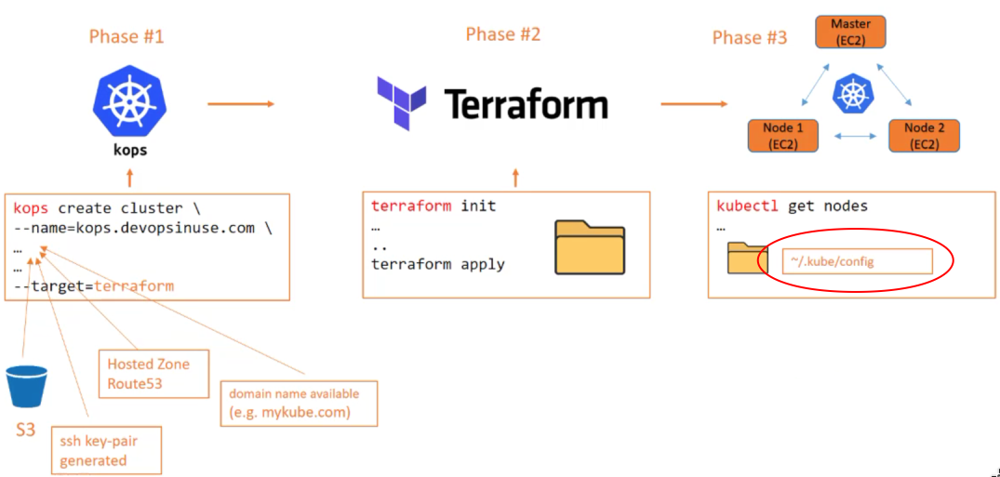

# Kubernetes

How does **kubectl** communicate with our newly created cluster on AWS?



If we display the kubernetes config file via cat; bat; vim; code or whatever:

```bash
➜ code ~/.kube/config
```

```yaml
apiVersion: v1
clusters:
- cluster:
    certificate-authority-data: ...
    server: https://api.backwards.tech
  name: backwards.tech
...
contexts:
- context:
    cluster: backwards.tech
    user: backwards.tech
  name: backwards.tech
...
current-context: backwards.tech
...
users:
- name: backwards.tech
  user:
    client-certificate-data: ...
    client-key-data: ...
    password: ...
    username: admin
- name: backwards.tech-basic-auth
  user:
    password: ...
    username: admin
```

