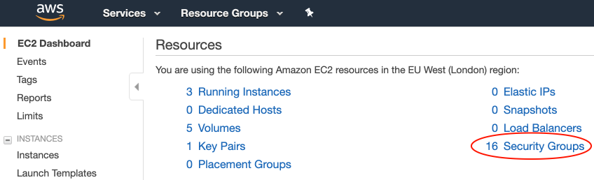
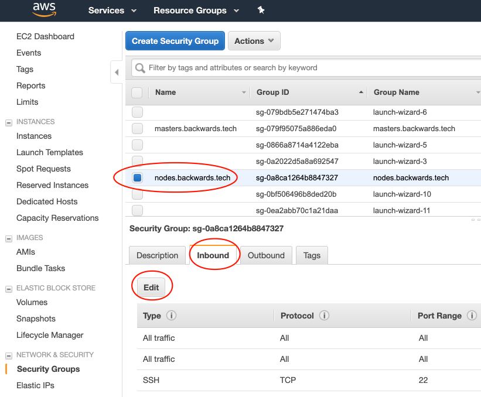
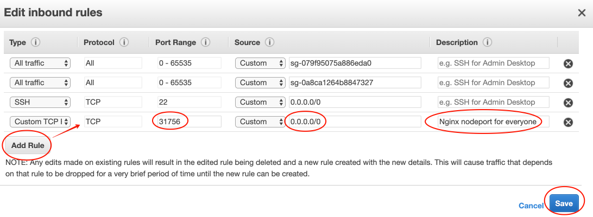
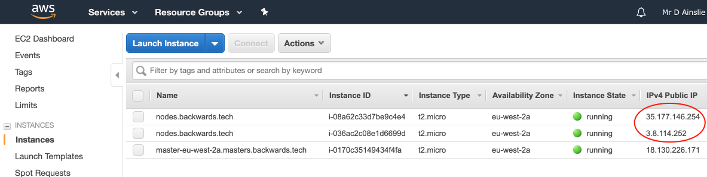
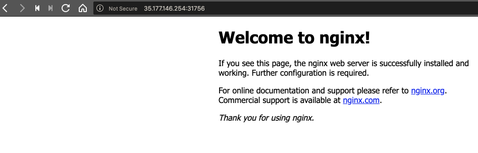
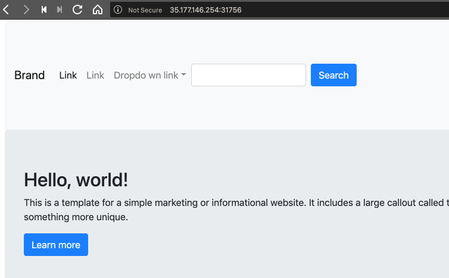
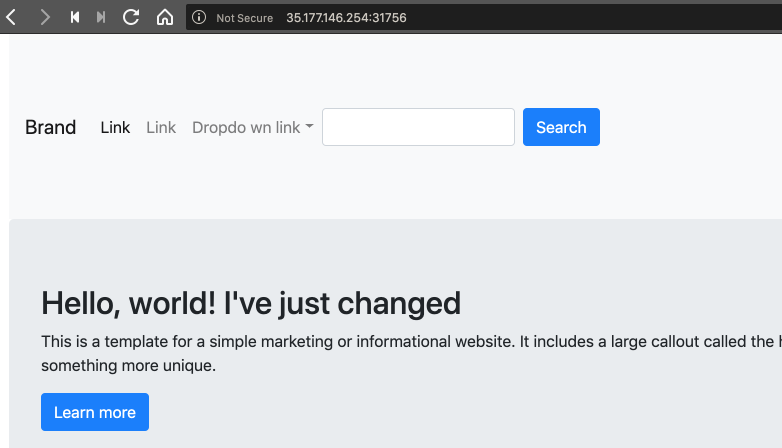

# Nginx

The following is not necessary as it shows a more traditional approach to installing **nginx** on bare metal e.g. Mac:

```bash
➜ brew install nginx
...
==> Pouring nginx-1.15.11.mojave.bottle.tar.gz
==> Caveats
Docroot is: /usr/local/var/www

The default port has been set in /usr/local/etc/nginx/nginx.conf to 8080 so that
nginx can run without sudo.

nginx will load all files in /usr/local/etc/nginx/servers/.

To have launchd start nginx now and restart at login:
  brew services start nginx
Or, if you do not want/need a background service you can just run:
  nginx
```

To deploy **nginx** to our **kubernetes cluster on AWS** we have Kubernetes manifests which serve the same purpose as the following (though the manifests have more detailed configuration):

```bash
➜ kubectl create deployment nginx-deployment --image=nginx
deployment "nginx-deployment" created

➜ kubectl get deployments
NAME               DESIRED   CURRENT   UP-TO-DATE   AVAILABLE   AGE
nginx-deployment   1         1         1            1           1m

➜ kubectl get pods
NAME                               READY     STATUS    RESTARTS   AGE
nginx-deployment-5cd5bccfb-49tf9   1/1       Running   0          1m
```

```bash
➜ kubectl expose deployment nginx-deployment \
	--port=80 \
	--type=NodePort \
	--name=nginx-service
service "nginx-service" exposed

➜ kubectl get services
NAME            TYPE        CLUSTER-IP      EXTERNAL-IP   PORT(S)        AGE
kubernetes      ClusterIP   100.64.0.1      <none>        443/TCP        13m
nginx-service   NodePort    100.66.92.200   <none>        80:31756/TCP   2m
```

And now the port **31756** is exposed by the (worker) nodes that were listed by **kubectl get nodes**.

By default, ports are unavailable on AWS until we set up the firewall rules. Access **Security Groups** on AWS which is essentially the configurations of firewall rules:



Let's add a rule for our new exposed port **31756**:



---



Now, what are the public IPs of the nodes?



Select one and with the exposed node port we can access nginx:



Or run **httpie** or **curl**:

```bash
➜ http http://35.177.146.254:31756
HTTP/1.1 200 OK
Accept-Ranges: bytes
Connection: keep-alive
Content-Length: 612
Content-Type: text/html
Date: Sun, 14 Apr 2019 11:35:20 GMT
ETag: "5cac8013-264"
Last-Modified: Tue, 09 Apr 2019 11:20:51 GMT
Server: nginx/1.15.11

<!DOCTYPE html>
<html>
<head>
<title>Welcome to nginx!</title>
<style>
    body {
        width: 35em;
        margin: 0 auto;
        font-family: Tahoma, Verdana, Arial, sans-serif;
    }
</style>
</head>
<body>
<h1>Welcome to nginx!</h1>
<p>If you see this page, the nginx web server is successfully installed and
working. Further configuration is required.</p>

<p>For online documentation and support please refer to
<a href="http://nginx.org/">nginx.org</a>.<br/>
Commercial support is available at
<a href="http://nginx.com/">nginx.com</a>.</p>

<p><em>Thank you for using nginx.</em></p>
</body>
</html>
```

So, here is where we currently are:


Now for the nginx manifests and configmap.


Let's first apply our configmap:

```bash
➜ kubectl create configmap nginx-content --from-file=index.html
configmap "nginx-content" created
```

```bash
➜ kubectl get configmap
NAME            DATA      AGE
nginx-content   1         2m
```

And deploy:

```bash
➜ kubectl apply -f .
deployment "nginx" created
service "nginx" created
```

```bash
➜ kubectl get all
NAME           DESIRED   CURRENT   UP-TO-DATE   AVAILABLE   AGE
deploy/nginx   2         2         2            2           7s

NAME                  DESIRED   CURRENT   READY     AGE
rs/nginx-5bd44978f6   2         2         2         7s

NAME                        READY     STATUS    RESTARTS   AGE
po/nginx-5bd44978f6-2625s   1/1       Running   0          7s
po/nginx-5bd44978f6-gdb2v   1/1       Running   0          7s

NAME             TYPE        CLUSTER-IP      EXTERNAL-IP   PORT(S)        AGE
svc/kubernetes   ClusterIP   100.64.0.1      <none>        443/TCP        4h
svc/nginx        NodePort    100.65.62.116   <none>        80:31756/TCP   7s
```



How about we change **index.html**.

```
➜ kubectl delete configmap nginx-content
configmap "nginx-content" deleted

➜ kubectl create configmap nginx-content --from-file=index.html
configmap "nginx-content" created
```



And let's just see where our **index.html** is on one of our pods:

```bash
➜ kubectl get pods
NAME                     READY     STATUS    RESTARTS   AGE
nginx-5bd44978f6-2625s   1/1       Running   0          2h
nginx-5bd44978f6-gdb2v   1/1       Running   0          2h

➜ kubectl exec -it nginx-5bd44978f6-2625s -- bash

root@nginx-5bd44978f6-2625s:/# ls -las /usr/share/nginx/html
total 12
4 drwxrwxrwx 3 root root 4096 Apr 14 16:14 .
4 drwxr-xr-x 3 root root 4096 Jan 27  2015 ..
4 drwxr-xr-x 2 root root 4096 Apr 14 16:14 ..2019_04_14_16_14_47.194316105
0 lrwxrwxrwx 1 root root   31 Apr 14 16:14 ..data -> ..2019_04_14_16_14_47.194316105
0 lrwxrwxrwx 1 root root   17 Apr 14 13:58 index.html -> ..data/index.html
```

