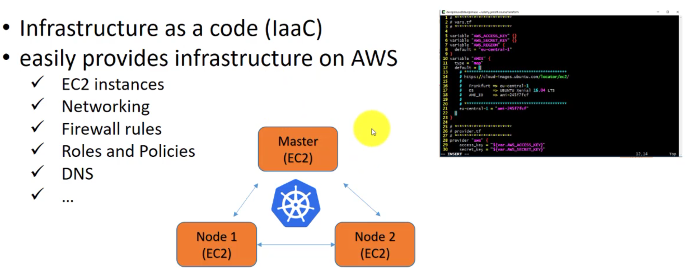
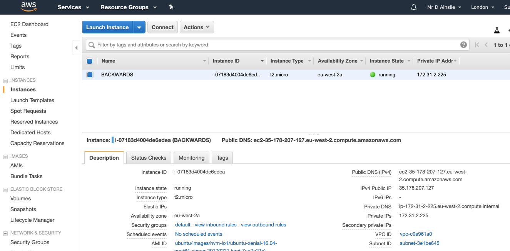

# Terraform



We need a terraform file [terraform.tfvars](../terraform-example.tfvars) with our AWS credentials:

```properties
AWS_ACCESS_KEY="your access key"
AWS_SECRET_KEY="your secret key"
```

and another terraform file [terraform.code.tf](../terraform.code.tf):

```json
    # ************************
    # vars.tf
    # ************************
     
    variable "AWS_ACCESS_KEY" {}
    variable "AWS_SECRET_KEY" {}
    variable "AWS_REGION" {
      default = "eu-west-2"
    }
    variable "AMIS" {
      type = "map"
      default = {
        # *******************************************
        # https://cloud-images.ubuntu.com/locator/ec2/
        #
        #   London => eu-west-2
        #   OS        => UBUNTU Xenial 16.04 LTS
        #   AMI_ID    => ami-7ad7c21e
        #
        #   AMI shortcut (AMAZON MACHINE IMAGE)
        #
        # *******************************************
        eu-west-2 = "ami-7ad7c21e"
      }
    }
     
    # ************************
    # provider.tf
    # ************************
    provider "aws" {
        access_key = "${var.AWS_ACCESS_KEY}"
        secret_key = "${var.AWS_SECRET_KEY}"
        region = "${var.AWS_REGION}"
    }
     
     
    # ************************
    # instance.tf
    # ************************
    resource "aws_instance" "BACKWARDS" {
      ami = "${lookup(var.AMIS, var.AWS_REGION)}"
      tags { Name = "BACKWARDS" }
      instance_type = "t2.micro"
      provisioner "local-exec" {
         command = "echo ${aws_instance.BACKWARDS.private_ip} >> private_ips.txt"
      }
    }
    output "ip" {
        value = "${aws_instance.BACKWARDS.public_ip}"
    }
```

## Use Terraform

```bash
kubernetes-backwards/devops-kubernetes-kops-terraform on  master [!+?]
➜ export AWS_DEFAULT_PROFILE=devops

kubernetes-backwards/devops-kubernetes-kops-terraform on  master [!+?] using ☁️ devops
➜ terraform init

Initializing provider plugins...
- Checking for available provider plugins on https://releases.hashicorp.com...
- Downloading plugin for provider "aws" (2.6.0)...

The following providers do not have any version constraints in configuration,
so the latest version was installed.

To prevent automatic upgrades to new major versions that may contain breaking
changes, it is recommended to add version = "..." constraints to the
corresponding provider blocks in configuration, with the constraint strings
suggested below.

* provider.aws: version = "~> 2.6"

Terraform has been successfully initialized!

You may now begin working with Terraform. Try running "terraform plan" to see
any changes that are required for your infrastructure. All Terraform commands
should now work.

If you ever set or change modules or backend configuration for Terraform,
rerun this command to reinitialize your working directory. If you forget, other
commands will detect it and remind you to do so if necessary.
```

Now **apply** to execute our terraform files:

```bash
kubernetes-backwards/devops-kubernetes-kops-terraform on  master [!+?] using ☁️ devops
➜ terraform apply

An execution plan has been generated and is shown below.
Resource actions are indicated with the following symbols:
  + create

Terraform will perform the following actions:

  + aws_instance.BACKWARDS
      id:                           <computed>
      ami:                          "ami-7ad7c21e"
      arn:                          <computed>
      associate_public_ip_address:  <computed>
      availability_zone:            <computed>
      cpu_core_count:               <computed>
      cpu_threads_per_core:         <computed>
      ebs_block_device.#:           <computed>
      ephemeral_block_device.#:     <computed>
      get_password_data:            "false"
      host_id:                      <computed>
      instance_state:               <computed>
      instance_type:                "t2.micro"
      ipv6_address_count:           <computed>
      ipv6_addresses.#:             <computed>
      key_name:                     <computed>
      network_interface.#:          <computed>
      network_interface_id:         <computed>
      password_data:                <computed>
      placement_group:              <computed>
      primary_network_interface_id: <computed>
      private_dns:                  <computed>
      private_ip:                   <computed>
      public_dns:                   <computed>
      public_ip:                    <computed>
      root_block_device.#:          <computed>
      security_groups.#:            <computed>
      source_dest_check:            "true"
      subnet_id:                    <computed>
      tags.%:                       "1"
      tags.Name:                    "BACKWARDS"
      tenancy:                      <computed>
      volume_tags.%:                <computed>
      vpc_security_group_ids.#:     <computed>


Plan: 1 to add, 0 to change, 0 to destroy.

Do you want to perform these actions?
  Terraform will perform the actions described above.
  Only 'yes' will be accepted to approve.

  Enter a value: yes

aws_instance.BACKWARDS: Creating...
  ami:                          "" => "ami-7ad7c21e"
  arn:                          "" => "<computed>"
  associate_public_ip_address:  "" => "<computed>"
  availability_zone:            "" => "<computed>"
  cpu_core_count:               "" => "<computed>"
  cpu_threads_per_core:         "" => "<computed>"
  ebs_block_device.#:           "" => "<computed>"
  ephemeral_block_device.#:     "" => "<computed>"
  get_password_data:            "" => "false"
  host_id:                      "" => "<computed>"
  instance_state:               "" => "<computed>"
  instance_type:                "" => "t2.micro"
  ipv6_address_count:           "" => "<computed>"
  ipv6_addresses.#:             "" => "<computed>"
  key_name:                     "" => "<computed>"
  network_interface.#:          "" => "<computed>"
  network_interface_id:         "" => "<computed>"
  password_data:                "" => "<computed>"
  placement_group:              "" => "<computed>"
  primary_network_interface_id: "" => "<computed>"
  private_dns:                  "" => "<computed>"
  private_ip:                   "" => "<computed>"
  public_dns:                   "" => "<computed>"
  public_ip:                    "" => "<computed>"
  root_block_device.#:          "" => "<computed>"
  security_groups.#:            "" => "<computed>"
  source_dest_check:            "" => "true"
  subnet_id:                    "" => "<computed>"
  tags.%:                       "" => "1"
  tags.Name:                    "" => "BACKWARDS"
  tenancy:                      "" => "<computed>"
  volume_tags.%:                "" => "<computed>"
  vpc_security_group_ids.#:     "" => "<computed>"
aws_instance.BACKWARDS: Still creating... (10s elapsed)
aws_instance.BACKWARDS: Still creating... (20s elapsed)
aws_instance.BACKWARDS: Still creating... (30s elapsed)
aws_instance.BACKWARDS: Provisioning with 'local-exec'...
aws_instance.BACKWARDS (local-exec): Executing: ["/bin/sh" "-c" "echo 172.31.2.225 >> private_ips.txt"]
aws_instance.BACKWARDS: Creation complete after 32s (ID: i-07183d4004de6edea)

Apply complete! Resources: 1 added, 0 changed, 0 destroyed.

Outputs:

ip = 35.178.207.127
```

The output will be a randomly generated IP we can SSH onto. Double check your AWS console:



When you're done, **DON'T FORGET TO SHUT DOWN YOUR INSTANCES** e.g.

```bash
kubernetes-backwards/devops-kubernetes-kops-terraform on  master [!+?] using ☁️ devops
➜ terraform destroy
aws_instance.BACKWARDS: Refreshing state... (ID: i-07183d4004de6edea)

An execution plan has been generated and is shown below.
Resource actions are indicated with the following symbols:
  - destroy

Terraform will perform the following actions:

  - aws_instance.BACKWARDS


Plan: 0 to add, 0 to change, 1 to destroy.

Do you really want to destroy all resources?
  Terraform will destroy all your managed infrastructure, as shown above.
  There is no undo. Only 'yes' will be accepted to confirm.

  Enter a value: yes

aws_instance.BACKWARDS: Destroying... (ID: i-07183d4004de6edea)
aws_instance.BACKWARDS: Still destroying... (ID: i-07183d4004de6edea, 10s elapsed)
aws_instance.BACKWARDS: Still destroying... (ID: i-07183d4004de6edea, 20s elapsed)
aws_instance.BACKWARDS: Destruction complete after 30s

Destroy complete! Resources: 1 destroyed.
```

