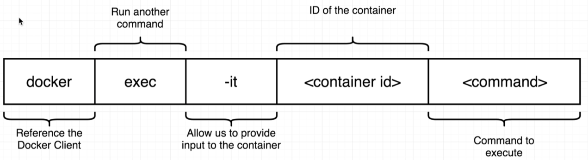
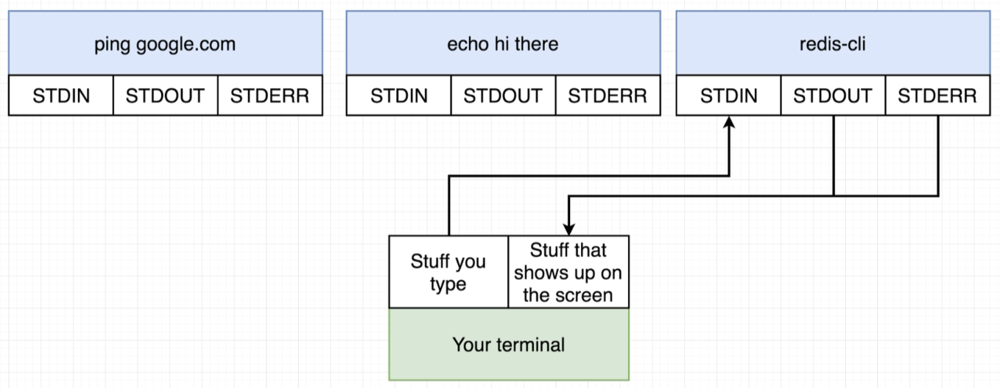
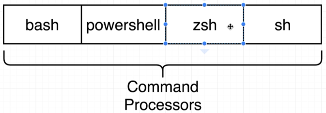

# Docker Exec

Execute an additional command in a container e.g. start up a redis server with Docker and run the redis-cli against said server - without exposing the server, we need to run an additional command in the container.

> 

```bash
$ docker run redis
...
1:M 11 Dec 2018 14:33:22.068 * Ready to accept connections
```

```bash
$ docker ps
CONTAINER ID    IMAGE    COMMAND                  PORTS       NAMES
d0a6a840c31a    redis    "docker-entrypoint.s…"   6379/tcp    adoring_meitner

$ docker exec -it d0a6a840c31a redis-cli
127.0.0.1:6379> set myKey 5
OK
127.0.0.1:6379> get myKey
"5"
```

## -it

> 

**-i** - attach our terminal to the **stdin** of the running process in our container.

**-t** - basically gives nice formatting to what goes in and comes out of the container.

Try the above without **-t** and we'll see that things are harder to follow such as the prompt and missing context help:

```bash
$ docker exec -i d0a6a840c31a redis-cli
set myKey 5
OK
get myKey
5
```

## Docker Shell

> 

```bash
$ docker exec -it d0a6a840c31a sh
# pwd
/root
# cd /
# ls
bin  boot  data  dev  etc  home  lib  lib64  media  mnt  opt  proc  root  run  sbin  srv  sys  tmp  usr  var
# redis-cli
127.0.0.1:6379>
```

We can run a shell when we run/instantiate a container - note that the default command will not be run at this point.

```bash
$ docker run -it redis sh
# redis-cli
Could not connect to Redis at 127.0.0.1:6379: Connection refused
not connected>
```

