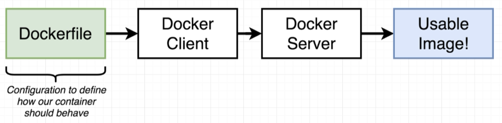
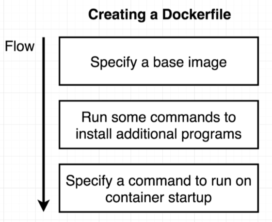
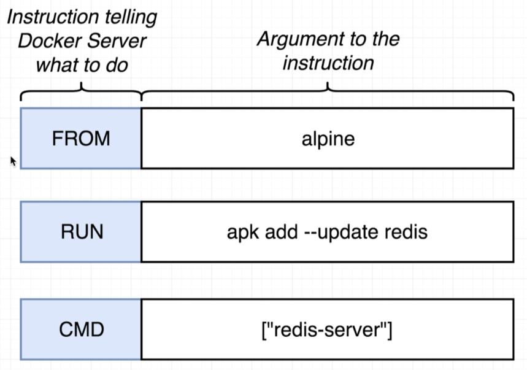

# Docker Images

> 
---
> 

## Example - Create Image That Runs Redis Server

Take a look at the example [Redis Dockerfile](../examples/redis/Dockerfile). In said directory run:

```bash
$ docker build .
...
Successfully built 019c1c3c5d45

$ docker run 019c1c3c5d45
...
1:M 18 Dec 21:46:14.798 * Ready to accept connections
```

The Dockerfile essentials are:

> 

## Dockerfile Introduction

> 
---
> 

## Manual

Let's manually generate our Redis image by running commands inside a container:

```bash
$ docker run -it alpine sh
/ # apk add --update redis
fetch http://dl-cdn.alpinelinux.org/alpine/v3.8/main/x86_64/APKINDEX.tar.gz
fetch http://dl-cdn.alpinelinux.org/alpine/v3.8/community/x86_64/APKINDEX.tar.gz
(1/1) Installing redis (4.0.11-r0)
Executing redis-4.0.11-r0.pre-install
Executing redis-4.0.11-r0.post-install
Executing busybox-1.28.4-r1.trigger
OK: 6 MiB in 14 packages
```

In another terminal, run a command to take a snapshot of the running container:

```bash
$ docker ps
CONTAINER ID  IMAGE   COMMAND   CREATED        STATUS       PORTS  NAMES
3f8933bff41a  alpine  "sh"      2 minutes ago  Up 2 minutes        infallible_bhaskara

$ docker commit -c 'CMD ["redis-server"]' 3f8933bff41a
sha256:998e82ae5c6e177c186f52951b67b36734620f014b29122be6e28ae164e2d994
```

and instantiate a new container for this new image:

```bash
$ docker run 998e82ae5c6e177c
...
1:M 20 Dec 21:40:49.680 * Ready to accept connections
```
