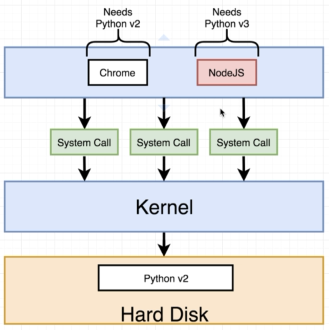

# Docker Basics

> 
---
> 

## Example - *docker run hello-world*

> 

## Docker and Your Computer

> 

Now what if 2 of our processes (in a crazy world) need different versions of Python?

> 

A crazy solution (for our crazy world) could you the idea of **namespacing**:

> 
---
> 

Thinking **virtually** we view the above as a **container**:

> 
---
> 

which you can image as translated to:

> 

But how does the above work when namespacing (and control groups) are specific to Linux e.g. I'm on a Mac? When Docker for Mac is installed, under the hood, a Linux Virtual Machine will be running.

> 

We can prove this by running:

```bash
$ docker version
Client: Docker Engine - Community
 Version:           18.09.0
 API version:       1.39
 Go version:        go1.10.4
 Git commit:        4d60db4
 Built:             Wed Nov  7 00:47:43 2018
 OS/Arch:           darwin/amd64
 Experimental:      false

Server: Docker Engine - Community
 Engine:
  Version:          18.09.0
  API version:      1.39 (minimum version 1.12)
  Go version:       go1.10.4
  Git commit:       4d60db4
  Built:            Wed Nov  7 00:55:00 2018
  OS/Arch:          linux/amd64
  Experimental:     false
```

Note that the client correctly shows **darwin/amd64** regarding a Mac, but that the server shows **linux/amd64** - Aha! Our virtual machine.