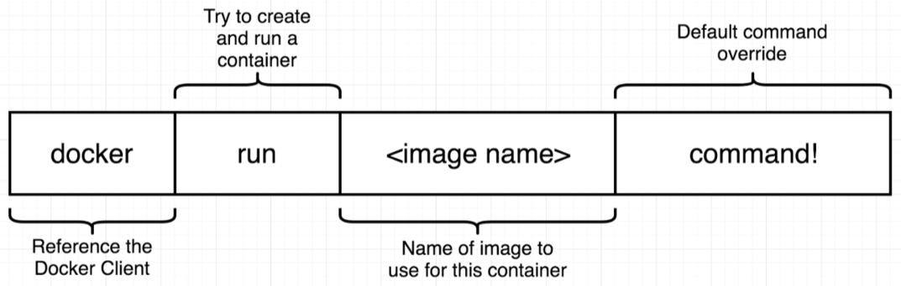
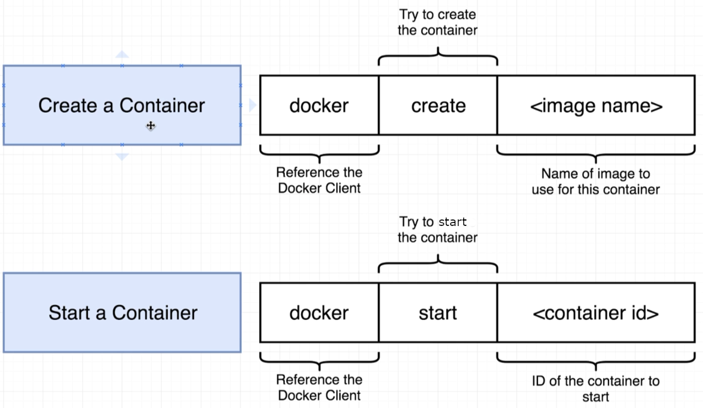
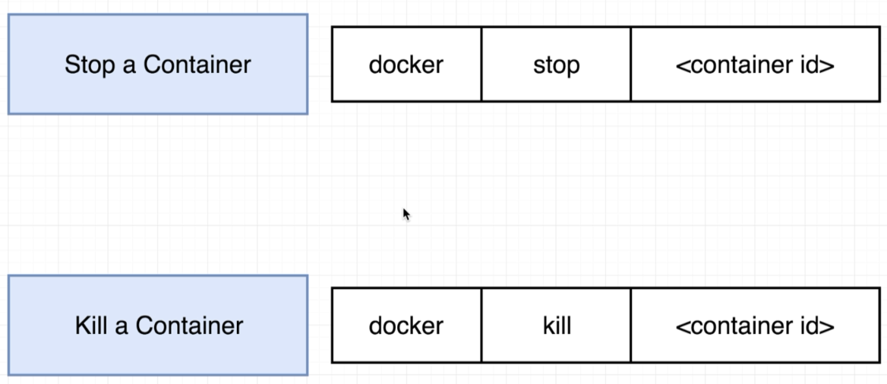
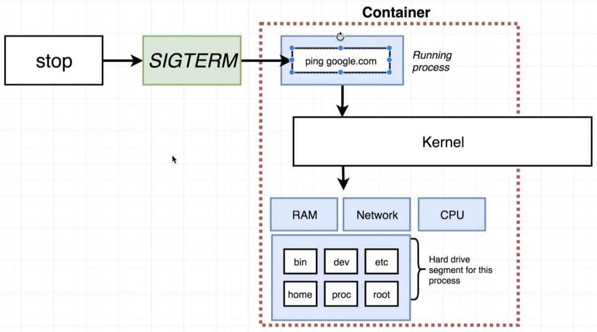
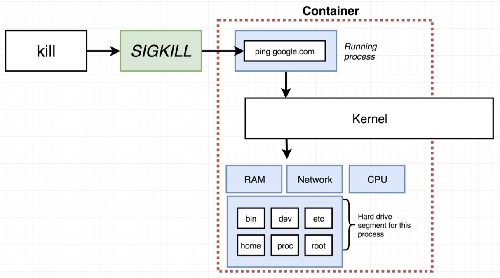

# Docker Run

## Run

> 

```bash
$ docker run busybox

# With override
$ docker run busybox echo hi there
```

## Create and Start

Docker **run** is actually equivalent to the combination of the two commands **create** and **start**:

```scala
docker run = docker create + docker start
```

> 

```bash
$ docker create hello-world
8c041bbea8eb8b0bb982aa5dc2a72d11631beca2b578cbe445d233b750c60f78

$ docker start -a 8c041bbea8eb8b0bb982aa5dc2a72d11631beca2b578cbe445d233b750c60f78
Hello from Docker!
```

Think of "-a" as "attach" to watch for any output and print at "my" terminal i.e. without the "-a" we would not see any output.

## Start (again)

Once a container has **exited** we can restart it with **start** i.e. we don't need **create** again:

```bash
$ docker ps -a
CONTAINER ID   IMAGE        COMMAND    CREATED        STATUS   PORTS   NAMES
8c041bbea8eb   hello-world  "/hello"   5 minutes ago  Exited           elegant_hugle

$ docker start -a 8c041bbea8eb
Hello from Docker!
```

Note that when restarting we cannot replace the command.

Let's remove the exited containers (as they are taking up disk space):

```bash
$ docker system prune
```

## Logs

As a sidenote, related to logging, what if we **start** without the "-a"? We can still look at the logs, in this case the output that could be printed on our terminal:

```bash
$ docker create busybox echo hi there
0ae5ea829e17fb587a9182c643ed9a6c436c45dfadd7e4c00f7bd5e4027afc31

$ docker start 0ae5ea829e17fb587a9182c643ed9a6c436c45dfadd7e4c00f7bd5e4027afc31
0ae5ea829e17fb587a9182c643ed9a6c436c45dfadd7e4c00f7bd5e4027afc31

$ docker logs 0ae5ea829e17fb587a9182c643ed9a6c436c45dfadd7e4c00f7bd5e4027afc31
hi there
```

## Stop and Kill

> 

and what is the difference? Of course, **stop** is more graceful:

> 

> 

```bash
$ docker stop 0ae5ea829e17fb587a9182c643ed9a6c436c45dfadd7e4c00f7bd5e4027afc31
```

Now **docker stop** waits 10 seconds and if the container is not done, then a **docker kill** will be automatically issued.