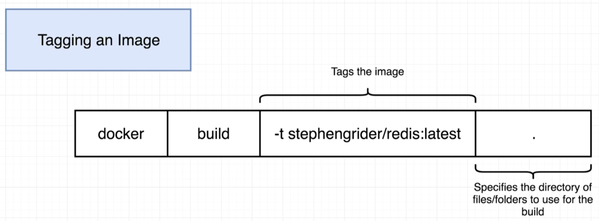
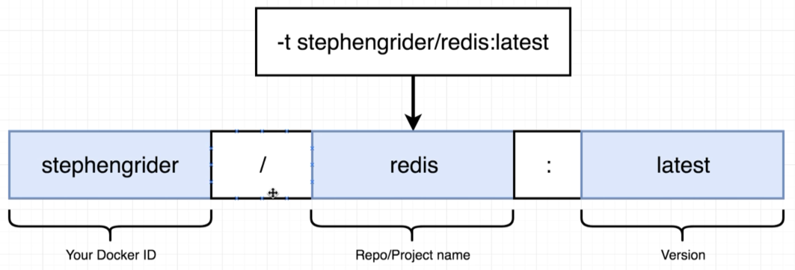

# Docker Tagging

> 

where the tagging convention is (in this case "latest" is technically the tag):

> 

## Example Tagging

Using our [Redis Dockerfile](../examples/redis/Dockerfile):

```bash
$ docker build -t davidainslie/redis:latest .
```

(And hey! Don't forget the ".").

Now we can run using said tag instead of the autogenerated ID:

```bash
$ docker run davidainslie/redis
```
