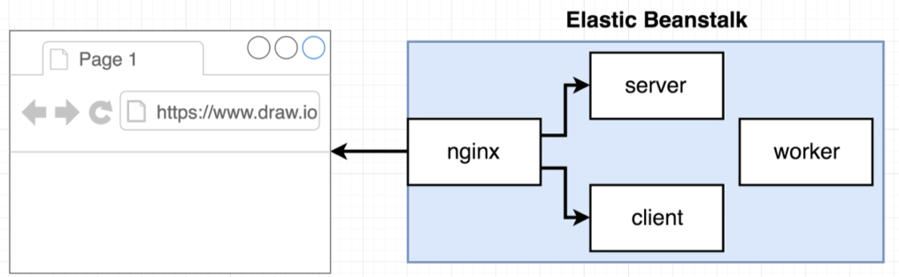
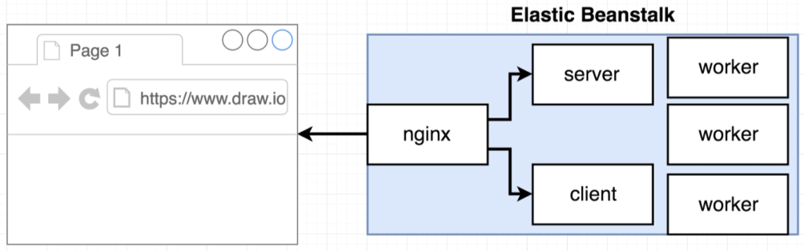
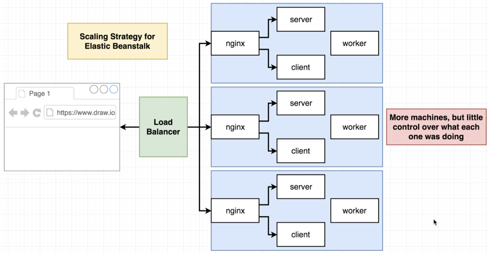
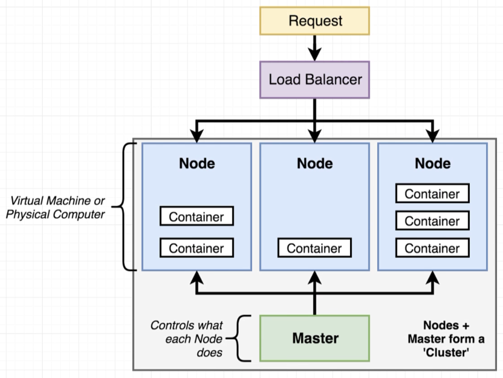
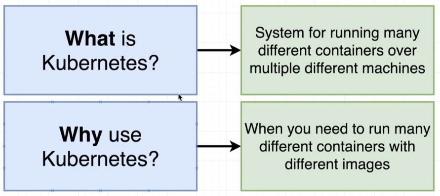
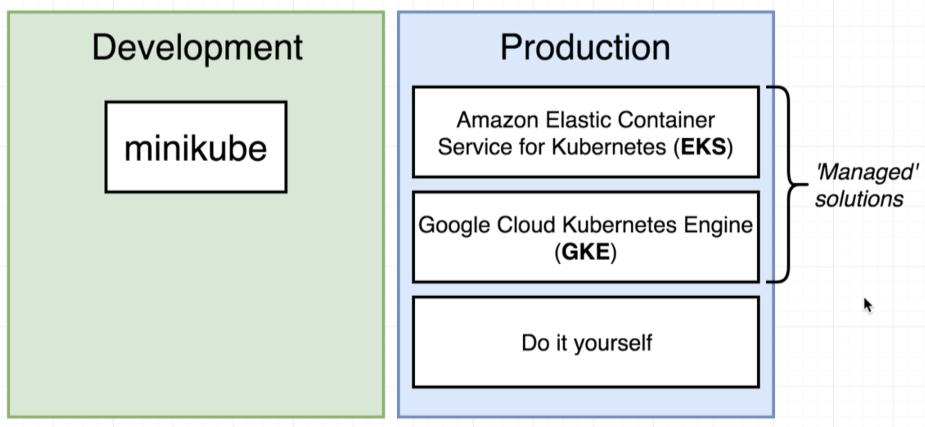
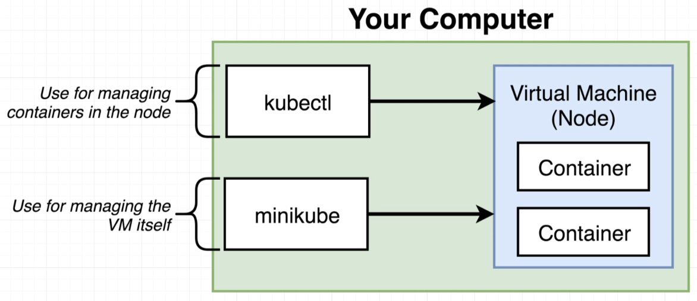

# Kubernetes

## Without Kubernetes

Before Kubernetes, we deployed 4 containers onto AWS Elastic Beanstalk:

> 

The **worker** calculates Fibonacci and with more users we would eventually need to scale up this service:

> 

E.g. 3 users could now submit their requests and each is handled by a different **worker**.

However, Elastic Beanstalk will scale up everything, not just the **worker**:

> 

## Kubernetes Approach

Kubernetes approach to solving the above issue:

> 

And so, what is and why use Kubernetes?

> 

## Working with Kubernetes

> 

> 