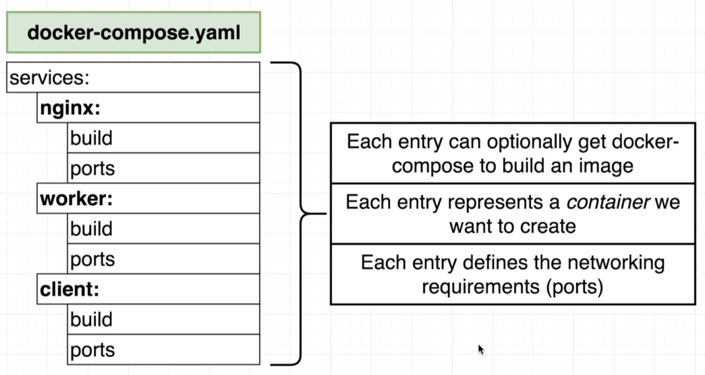
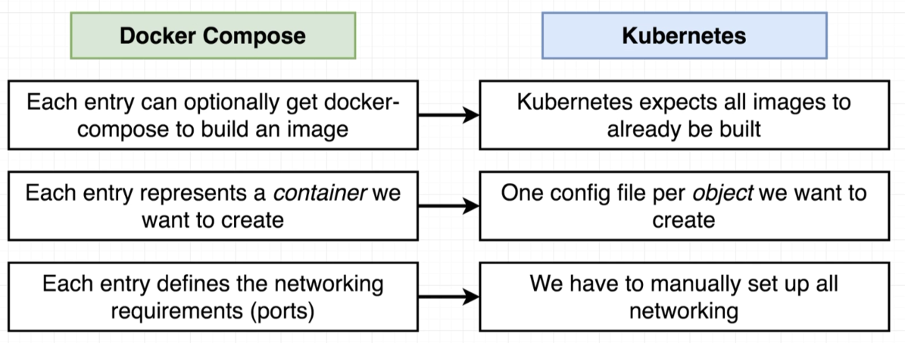
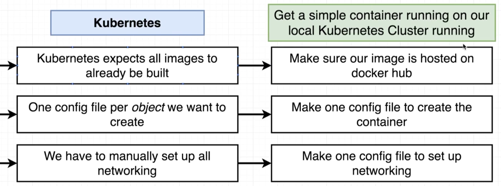

# Minikube

```bash
$ minikube start
...

$ minikube status
host: Running
kubelet: Running
apiserver: Running
kubectl: Correctly Configured: pointing to minikube-vm at 192.168.99.100

$ kubectl cluster-info
Kubernetes master is running at https://192.168.99.100:8443
KubeDNS is running at https://192.168.99.100:8443/api/v1/namespaces/kube-system/services/kube-dns:dns/proxy

To further debug and diagnose cluster problems, use 'kubectl cluster-info dump'.
```

## Multi Client Image Running on Local Kubernetes

We'll take the [multi-client image](../examples/multi/README.md) we set up previously:

> 

> 

> 

The necessary files are in the example: [simple-k8s](../examples/simple-k8s/README.md)