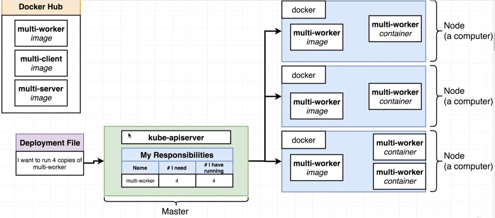
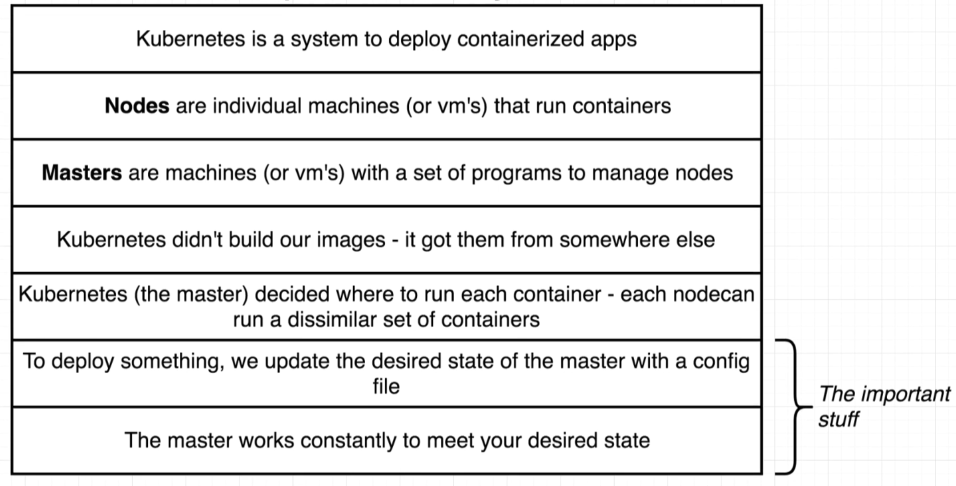
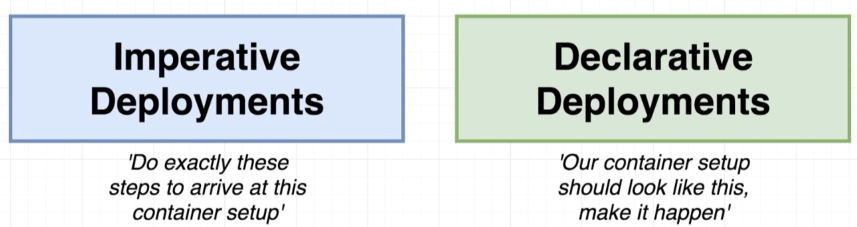
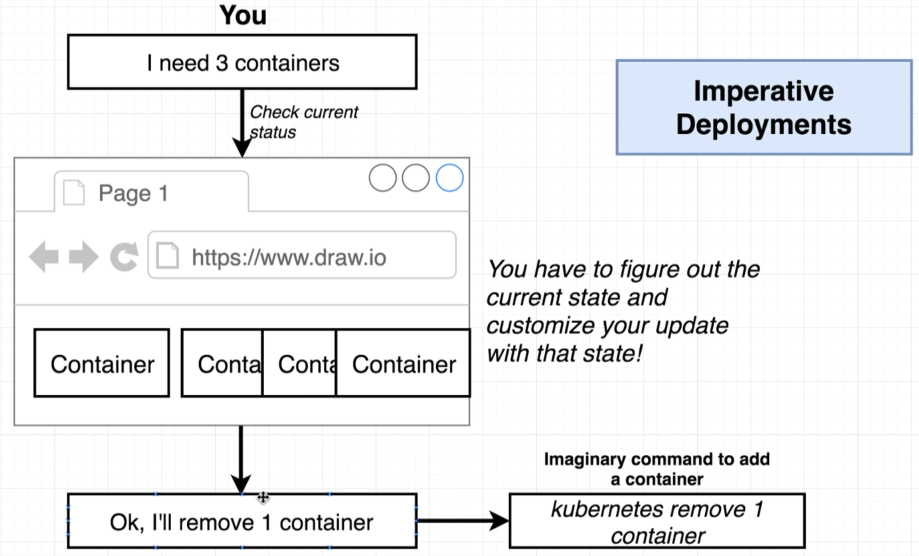
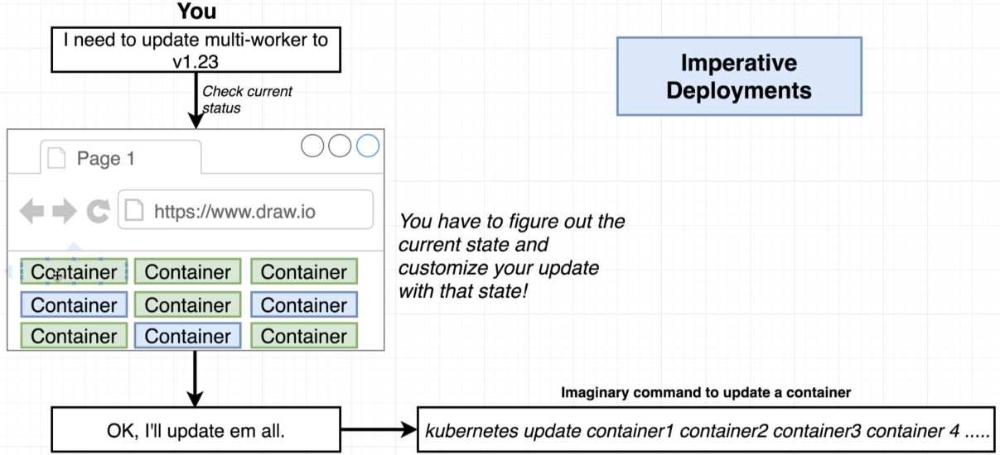
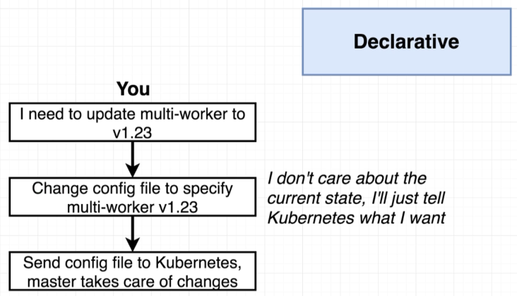
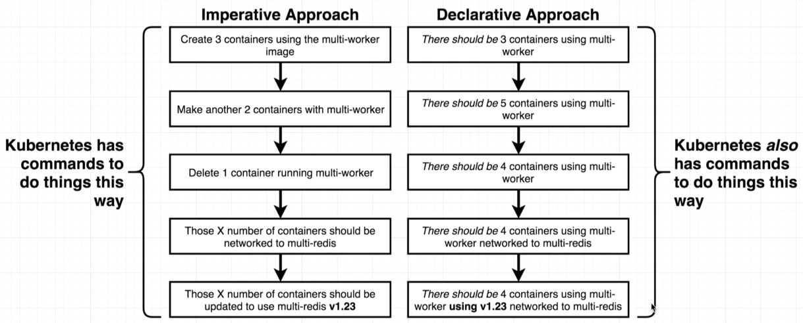

# Deployment Workflow

> 

> 

## Imperative / Declarative

> 

## Imperative

> 

> 

## Declarative

> 

## Imperative vs Declarative

> 

So even though Kubernetes allows an *imperative approach*, it is best to take a **declarative approach**.