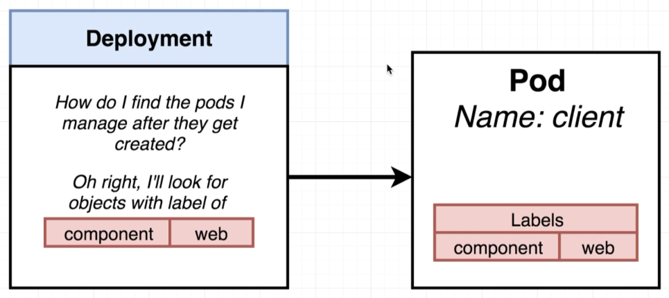
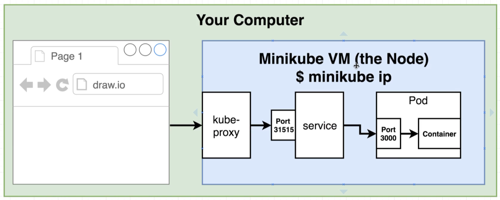
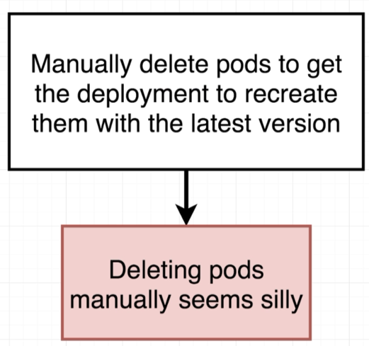
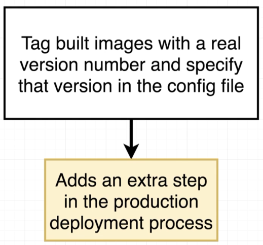
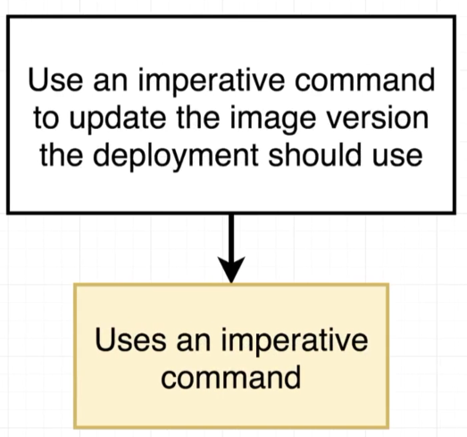

# Deployment

```yaml
apiVersion: apps/v1
kind: Deployment
metadata:
  name: client-deployment
spec:
  replicas: 1
  selector:
    matchLabels:
      component: web
  template:
    metadata:
      labels:
        component: web
    spec:
      containers:
        - name: client
          image: davidainslie/multi-client
          ports:
            - containerPort: 3000
          resources:
            limits:
              memory: 256Mi
              cpu: 250m
```

- replicas

  The number of Pods required by this Deployment

- selector

  Deployment needs to monitor the Pods and to identify them we use *selector*

- matchLabels

  Provide us with a *handle* on the same labels in the template i.e. Kubernetes says "I have matchLabels" to monitor, so look up the related Pods with matching *label*s
> 

```bash
$ kubectl apply -f client-deployment.yml
deployment "client-deployment" created

$ kubectl apply -f client-node-port.yml
service "client-node-port" created
```

```bash
$ kubectl get pods
NAME                                READY     STATUS    RESTARTS   AGE
client-deployment-947d86bdb-ffjwm   1/1       Running   0          40s
```

```bash
$ kubectl get deployments
NAME                DESIRED   CURRENT   UP-TO-DATE   AVAILABLE   AGE
client-deployment   1         1         1            1           1m
```

Can we access the React service running in a Container, in a Pod, in a Kubernetes cluster (VM set up by Minikube):

> 

```bash
$ minikube ip
192.168.99.103
```

and we navigate to [http://192.168.99.103:31515](http://192.168.99.103:31515).

## Why Do We Need Service?

```bash
$ kubectl get pods -o wide
NAME                               READY  STATUS    RESTARTS   AGE     IP           NODE
client-deployment-947d86bdb-ffjwm  1/1    Running   0          16m     172.17.0.8   minikube
```

Every Pod get its own IP.

In this case the Pods IP is **172.17.0.8**. This IP is internal to the VM, and we cannot visit this IP externally from the VM. Now if the Pod is updated, or replaced because it crashed and Kubernetes restarted a replacement, chances are that a new/different IP will be assigned.

A Service matches every Pod that matches its **selector**, so if the Pod's IP changes, we don't care.

## Scale Up

In Deployment change **replicas** to **5** and:

```bash
$ kubectl apply -f client-deployment.yml
deployment "client-deployment" configured
```

Note that this time the Deployment is **configured** instead of **created**.

```bash
$ kubectl get deployments
NAME                DESIRED   CURRENT   UP-TO-DATE   AVAILABLE   AGE
client-deployment   5         5         5            3           34m

$ kubectl get deployments
NAME                DESIRED   CURRENT   UP-TO-DATE   AVAILABLE   AGE
client-deployment   5         5         5            5           34m
```

```bash
$ kubectl get pods
NAME                                READY     STATUS    RESTARTS   AGE
client-deployment-947d86bdb-7k4fn   1/1       Running   0          4m
client-deployment-947d86bdb-9mvtz   1/1       Running   0          4m
client-deployment-947d86bdb-ffjwm   1/1       Running   0          37m
client-deployment-947d86bdb-hhwf2   1/1       Running   0          4m
client-deployment-947d86bdb-jwrv7   1/1       Running   0          4m
```

## Deploying a New Version of Our Image

Lets change [App.js](../multi/client/src/App.js) back in the **multi** module. We'll update the **title** to:

**Fib Calculator version - Version 2**

Now rebuild and push the image. In the [client](../multi/client) directory:

```bash
$ docker build -t davidainslie/multi-client .

$ docker push davidainslie/multi-client
```

```bash
$ kubectl apply -f client-deployment.yml
deployment "client-deployment" unchanged
```

Mmmm. **Unchanged**! We may have pushed a new version of our image to Dockerhub, but the deployment has not changed and so Kubernetes does nothing!

Three possible solutions.

> 

---

> 

---

> 