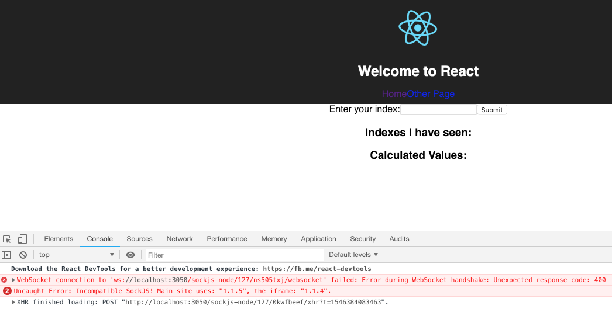
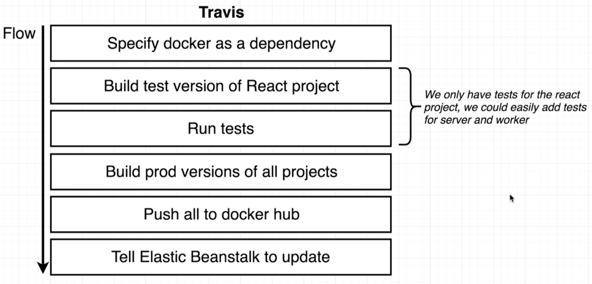
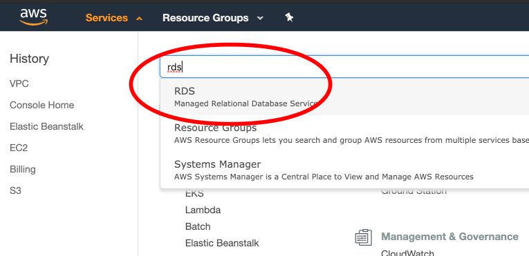
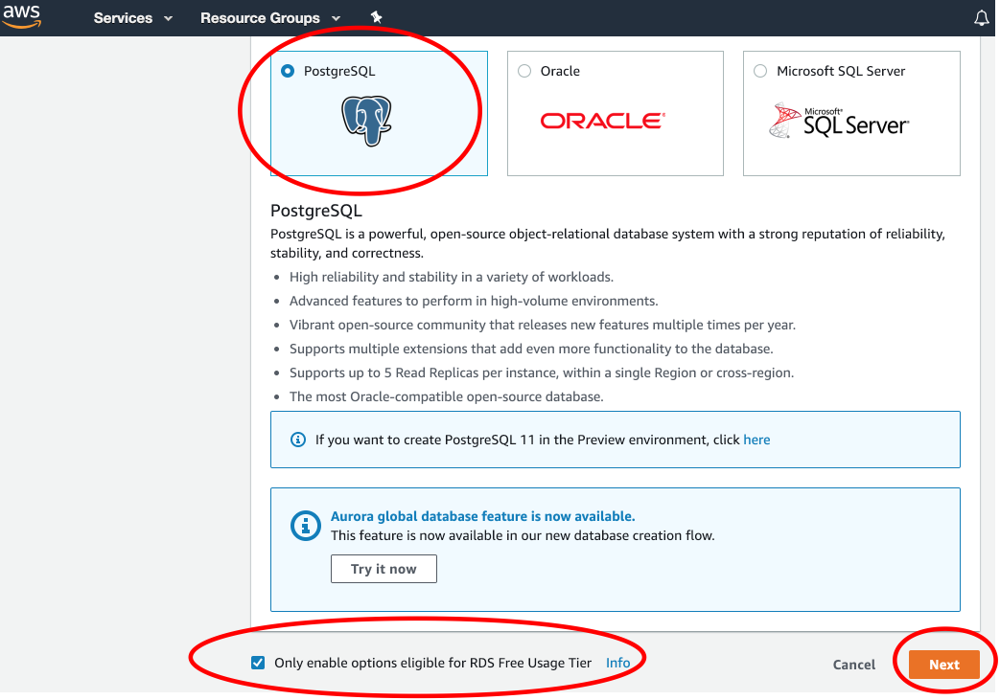

# Multi Container App Deployed to AWS

This application will be an **over the top** Fibonacci calculator.

> 

> 

> 

- Browser hits nginx which in turn hits the React server for the GUI.
- All API calls are routed to the Express server e.g. user submits *index* for Fibonacci calculation.

> 

- All *seen* values are persisted in Postgres.
- Calculated values are cached in Redis.

> 

Most of the files related to the above are straightforward. Just a little extra is required for the **react app**.

Hopefully you already went through [Setup](../../../docs/setup.md), where you need the following:

```bash
$ npm install -g create-react-app
```

Now we can create the react app:

```bash
$ create-react-app client
...
Installing packages. This might take a couple of minutes.
...
```

## Dockerize for Dev

> 

#### In "client" directory

```bash
$ docker build -f Dockerfile.dev -t davidainslie/multi-client .

$ docker run davidainslie/multi-client
```

#### In "server" directory

```bash
$ docker build -f Dockerfile.dev -t davidainslie/multi-server .

$ docker run davidainslie/multi-server
```

Initial run will result in an error because of missing containers to connect to.

#### In "worker" directory

```bash
$ docker build -f Dockerfile.dev -t davidainslie/multi-worker .

$ docker run davidainslie/multi-worker
```

## Docker Compose

> 

[docker-compose.yml][docker-compose.yml]

## Nginx Path Routing

Within configurations, we shall refer to the **React server** as **client** as provides the client frontend such as web pages. And we shall refer to the **Express server** as **api**.

> 

> 

> 

We have the following [default.conf](nginx/default.conf):

```nginx
upstream client {
  server client:3000;
}

upstream api {
  server api:5000;
}

server {
  listen 80;

  location / {
    proxy_pass http://client;
  }

  location /api {
    rewrite /api/(.*) /$1 break;
    proxy_pass http://api;
  }
}
```

and we want to apply this to a new nginx docker image.

## Boot (Test)

First time:

```bash
$ docker-compose up --build
```

Next time:

```bash
$ docker-compose up
```

Open up browser at [localhost:3050](http://localhost:3050):

> 

Notice we have right clicked the screen so that we can select **Inspect** upon which we shall see an error in the **Console**:

> 

We need an extra configuration for React (in development mode).

## Opening Websocket Connection

React expects an open websocket connection to push through notifications. However, we have **nginx** proxied between the browser and the client/frontend, and so we have to configure this. Note the **sockjs-node** error in the **Console** to be added to [default.conf](nginx/default.conf):

```nginx
upstream client {
  server client:3000;
}

upstream api {
  server api:5000;
}

server {
  listen 80;

  location / {
    proxy_pass http://client;
  }

  location /sockjs-node {
    proxy_pass http://client;
    proxy_http_version 1.1;
    proxy_set_header Upgrade $http_upgrade;
    proxy_set_header Connection "Upgrade";
  }

  location /api {
    rewrite /api/(.*) /$1 break;
    proxy_pass http://api;
  }
}
```

and we'll have to rebuild:

```bash
$ docker-compose up --build
```

## Workflow to AWS

> 

> 

```bash
$ git init
$ git add .
$ git commit -m "Initial"
```

> 

Once the repository is created:

```bash
$ git remote add origin https://github.com/davidainslie/multi-docker.git
$ git push -u origin master
```

Next we need a link between Github and Travis CI.

> 

As part of the [.travis.yml](.travis.yml) we need environment variables in [travis](https://travis-ci.com) for [docker hub](https://hub.docker.com) credentials.

> 

and we add our docker hub credentials:

> 

So we have a CI that pulls the repository from Github, builds some images and pushes them to Docker Hub. How do we deploy onto AWS?

> 

Elastic Beanstalk can handle one Dockerfile, it will automatically build and run. But when multiple Dockerfiles are involved, EB can't just randomly select one!

Let's create some instruction for EB with [Dockerrun.aws.json](Dockerrun.aws.json). The idea is similar to a **docker-compose.yml**, with slightly different jargon, e.g. instead of **Services** our new file will describe **Container Definitions**.

> 

Take a look at [Amazon ECS Task Definitions](https://docs.aws.amazon.com/AmazonECS/latest/developerguide/task_definitions.html). What we write in **Dockerrun.aws.json** is defined under [Container Definitions](https://docs.aws.amazon.com/AmazonECS/latest/developerguide/task_definition_parameters.html#container_definitions).

With this new file we have to set up our environment on AWS:

> 

> 

> 

> 

> 

> 

> 

## AWS Sidetrack Regarding Required Services

> 

> 

> 

> 

To have our services in Elastic Beanstalk talk to "other" services such as the managed Redis, we need a **security group** (a fancy name for **firewall rules**):

> 

Anything can connect to services on our EB instance via port 80.

And we can set up our own rules e.g. "allow traffic on port 3010 from IP 172.0.40.2".

To look up the security group...

> 

> 

And so how do we allow our EB to communicate with Redis and Postgres? We add a firewall rule:

**Allow any traffic from any other AWS service that has this security group**.

> 

So let's create postgres, redis and a security group to be applied to all the above so that they can communicate.

## RDS

> 

> 

> 

> 

> 

## ElastiCache

> 

> 

> 

> 

> 

and we should go for **0** replicas.

> 

## Custom Security Group (to wire all instances together)

Back on the VPC dashboard:

> 

> 

> 

> 

> 

Now we have to assigned this configured security group to our 3 services.

## Apply Security Group to Resources

Add the new security group onto Redis:

> 

> 

Next add the new security group to RDS:

> 

> 

and now for Elastic Beanstalk:

> 

> 

## Environment Variables

Choosing our Elastic Beanstalk instance, then:

> 

To add the **Redis host** environment variable, we have to look up:

> 

> 

To add the **Postgres host** environment variable, we have to look up:

> 

> 

> 

> 

## IAM Keys for Deployment

Now Elastic Beanstalk only really needs the [Dockerrun.aws.json](Dockerrun.aws.json) file which it reads and pulls in all images declared in said file.

Let's create a new **user** with deployment access:

> 

> 

> 

> 

> 

We'll copy the generate keys to Travis.

> 

> 

## Travis Deploy

Finally we can add **deploy** to [.travis.yml](.travis.yml). Note, we'll need to look up the **bucket name**:

> 

## Test Deployment

If there are any errors, check out the logs:

> 

> 

To view our application click the generated link:

> 

## Teardown Resources

Teardown Elastic Beanstalk instance:

> 

Next we'll teardown the RDS instance:

> 

> 

And teardown Elasticache:

> 

Finally, we can remove the security group we set up for these services:

> 

And just to be ultra efficient, let's remove the IAM keys we set up:

> 