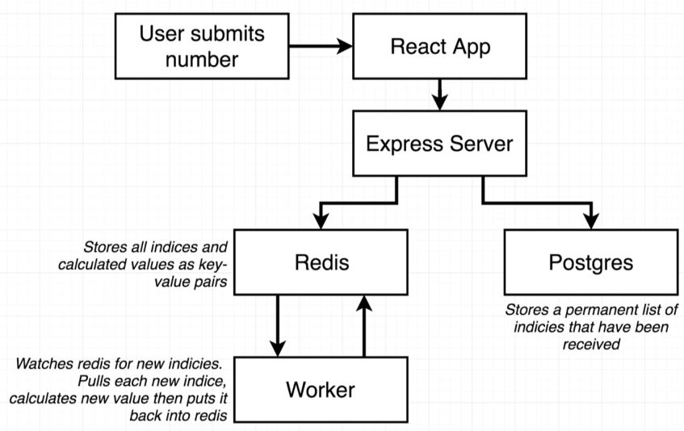

# Multi Container App Deployed to AWS

This application will be an **over the top** Fibonacci calculator.

> 

> 

> 

- Browser hits nginx which in turn hits the React server for the GUI.
- All API calls are routed to the Express server e.g. user submits *index* for Fibonacci calculation.

> 

- All *seen* values are persisted in Postgres.
- Calculated values are cached in Redis.

> 

Most of the files related to the above are straightforward. Just a little extra is required for the **react app**.

Hopefully you already went through [Setup](../../../docs/setup.md), where you need the following:

```bash
$ npm install -g create-react-app
```

Now we can create the react app:

```bash
$ create-react-app client
...
Installing packages. This might take a couple of minutes.
...
```

## Dockerize for Dev

> 

#### In "client" directory

```bash
$ docker build -f Dockerfile.dev -t davidainslie/multi-client .

$ docker run davidainslie/multi-client
```

#### In "server" directory

```bash
$ docker build -f Dockerfile.dev -t davidainslie/multi-server .

$ docker run davidainslie/multi-server
```

Initial run will result in an error because of missing containers to connect to.

#### In "worker" directory

```bash
$ docker build -f Dockerfile.dev -t davidainslie/multi-worker .

$ docker run davidainslie/multi-worker
```

## Docker Compose

> 

[docker-compose.yml][docker-compose.yml]

## Nginx Path Routing

Within configurations, we shall refer to the **React server** as **client** as provides the client frontend such as web pages. And we shall refer to the **Express server** as **api**.

> 

> 

> 

We have the following [default.conf](nginx/default.conf):

```nginx
upstream client {
  server client:3000;
}

upstream api {
  server api:5000;
}

server {
  listen 80;

  location / {
    proxy_pass http://client;
  }

  location /api {
    rewrite /api/(.*) /$1 break;
    proxy_pass http://api;
  }
}
```

and we want to apply this to a new nginx docker image.

## Boot (Test)

First time:

```bash
$ docker-compose up --build
```

Next time:

```bash
$ docker-compose up
```

Open up browser at [localhost:3050](http://localhost:3050):

> 

Notice we have right clicked the screen so that we can select **Inspect** upon which we shall see an error in the **Console**:

> 

We need an extra configuration for React (in development mode).

## Opening Websocket Connection

React expects an open websocket connection to push through notifications. However, we have **nginx** proxied between the browser and the client/frontend, and so we have to configure this. Note the **sockjs-node** error in the **Console** to be added to [default.conf](nginx/default.conf):

```nginx
upstream client {
  server client:3000;
}

upstream api {
  server api:5000;
}

server {
  listen 80;

  location / {
    proxy_pass http://client;
  }

  location /sockjs-node {
    proxy_pass http://client;
    proxy_http_version 1.1;
    proxy_set_header Upgrade $http_upgrade;
    proxy_set_header Connection "Upgrade";
  }

  location /api {
    rewrite /api/(.*) /$1 break;
    proxy_pass http://api;
  }
}
```

and we'll have to rebuild:

```bash
$ docker-compose up --build
```

