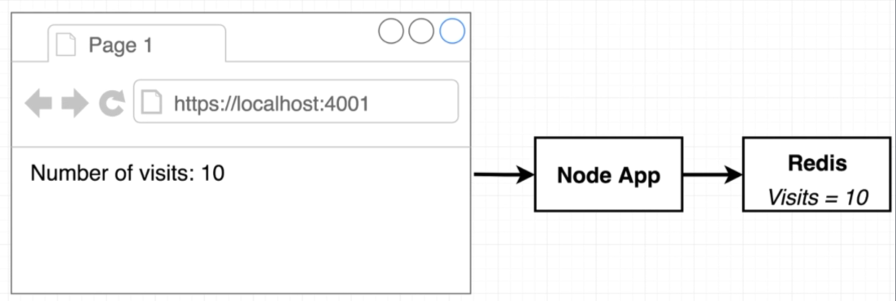
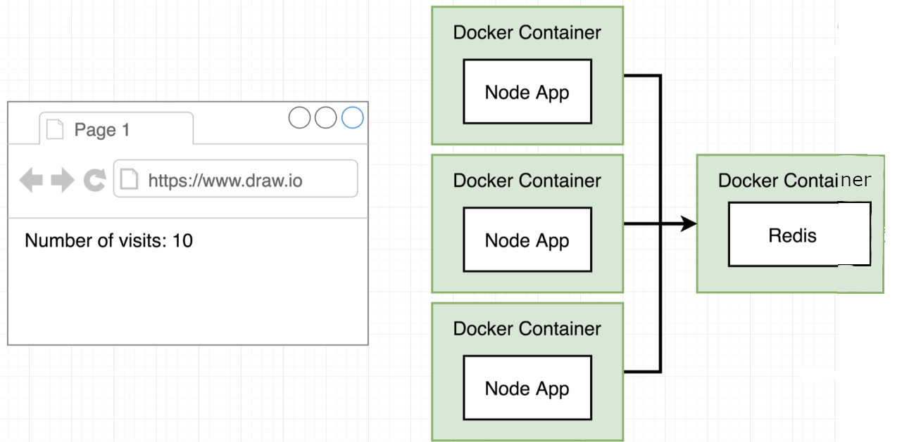
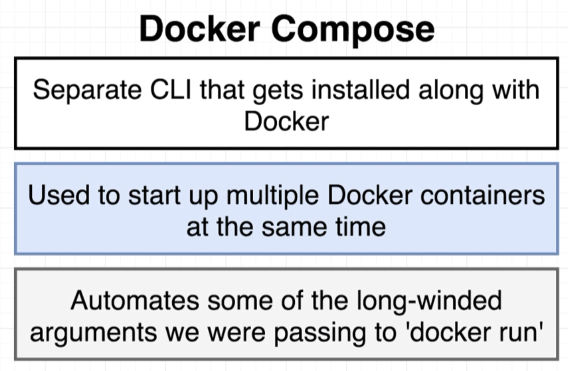
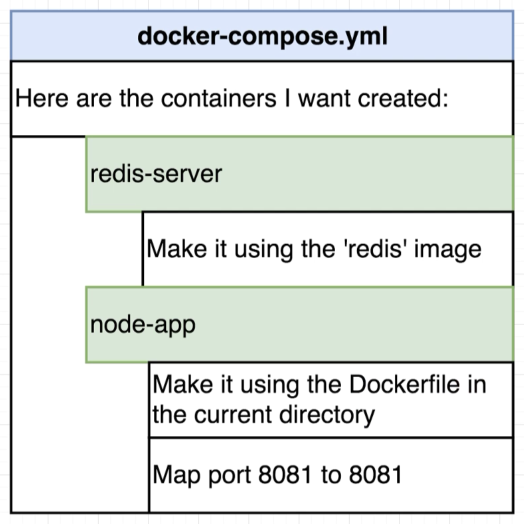
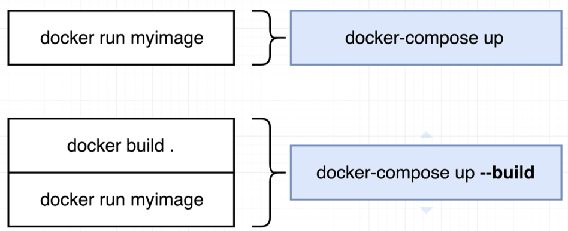
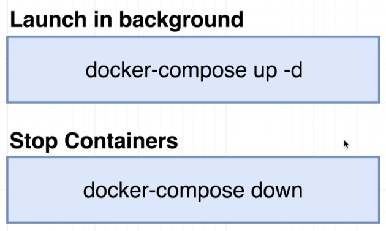
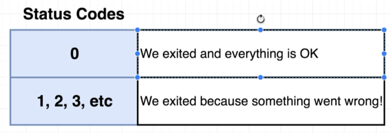
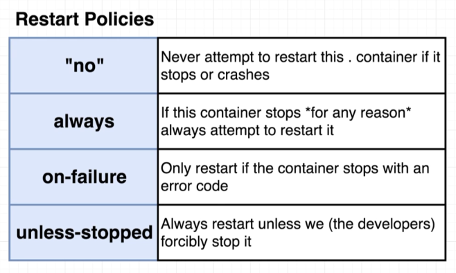

# Web App in Container with Docker Compose

> 
---
> 

```bash
$ docker build -t davidainslie/web-app-hits-example .
```

But, this application needs Redis.

## Docker Compose

> 

```plantuml
[docker build -t image-name\ndocker run image-name] -> [docker-compose.yml]
[docker-compose.yml] --> [docker-compose CLI]

note top of [docker-compose.yml]
  Contains all the options we'd
  normally pass to Docker CLI
end note
```

> 
---
> 

```bash
$ docker-compose up
Creating network "nodejs-hits-count_default" with the default driver
Pulling redis-server (redis:)...
...
WARNING: Image for service node-app was built because it did not already exist. To rebuild this image you must use `docker-compose build` or `docker-compose up --build`.
Creating nodejs-hits-count_redis-server_1 ... done
Creating nodejs-hits-count_node-app_1     ... done
...
redis-server_1  | 1:M 23 Dec 2018 14:36:00.715 * Ready to accept connections
...
node-app_1      | Listening on port 8081
```

```bash
$ http localhost:4001
HTTP/1.1 200 OK
...
Number of hits: 1

$ http localhost:4001
HTTP/1.1 200 OK
...
Number of hits: 2
```

> 

```bash
$ docker-compose down
Stopping nodejs-hits-count_node-app_1     ... done
Stopping nodejs-hits-count_redis-server_1 ... done
Removing nodejs-hits-count_node-app_1     ... done
Removing nodejs-hits-count_redis-server_1 ... done
Removing network nodejs-hits-count_default
```

## Resiliency

I added a **/crash** route to the server to test resiliency. Let's see what initially happened with that first change:

```bash
$ docker-compose up --build
...
redis-server_1  | 1:M 23 Dec 2018 15:04:34.820 * Ready to accept connections
...
node-app_1      | Listening on port 8081
```

```bash
$ http localhost:4001/crash
http: error: ConnectionError: ('Connection aborted.', RemoteDisconnected('Remote end closed connection without response')) while doing GET request to URL: http://localhost:4001/crash
```

and back in the docker logs, a continuation of above:

```bash
...
node-app_1      | Listening on port 8081
nodejs-hits-count_node-app_1 exited with code 0
```

and a **docker ps** will show that our app server container has gone, with just redis remaining:

```bash
$ docker ps
CONTAINER ID  IMAGE  COMMAND                 PORTS      NAMES
8f20cabac258  redis  "docker-entrypoint.s…"  6379/tcp   nodejs-hits-count_redis-server_1
```

> 

These status codes tell docker compose whether it should restart a crashed container (when configured to do so).

> 

So if we go with **on-failure** but *crash* the *app* with an *OK error code* the app will not restart:

```bash
$ docker-compose up
...
node-app_1      | Listening on port 8081
```

```bash
$ http localhost:4001/crash
```

will show docker logs continuation:

```bash
node-app_1      | Listening on port 8081
nodejs-hits-count_node-app_1 exited with code 0
```

With an exit code of say **1** we can retest:

```bash
$ docker-compose up --build
...
node-app_1      | Listening on port 8081
```

```bash
$ http localhost:4001/crash
```

gives docker logs continuation:

```bash
node-app_1      | Listening on port 8081
node-app_1      | npm ERR! code ELIFECYCLE
node-app_1      | npm ERR! errno 1
node-app_1      | npm ERR! @ start: `node index.js`
node-app_1      | npm ERR! Exit status 1
node-app_1      | npm ERR!
node-app_1      | npm ERR! Failed at the @ start script.
node-app_1      | npm ERR! This is probably not a problem with npm. There is likely additional logging output above.
node-app_1      |
node-app_1      | npm ERR! A complete log of this run can be found in:
node-app_1      | npm ERR!     /root/.npm/_logs/2018-12-23T15_26_43_255Z-debug.log
node-app_1      |
node-app_1      | > @ start /app
node-app_1      | > node index.js
node-app_1      |
node-app_1      | Listening on port 8081
```

```bash
$ docker-compose ps
Name                              Command                    State Ports
-----------------------------------------------------------------------------------------
nodejs-hits-count_node-app_1      npm start                     Up 0.0.0.0:4001->8081/tcp
nodejs-hits-count_redis-server_1  docker-entrypoint.sh redis... Up 6379/tcp
```
