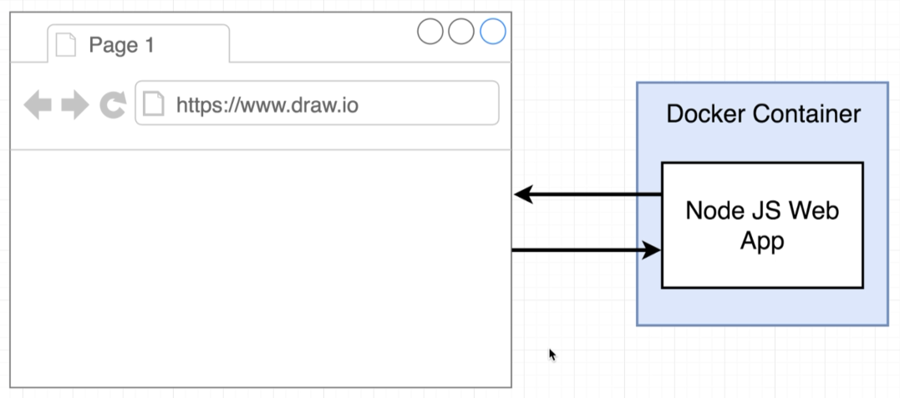
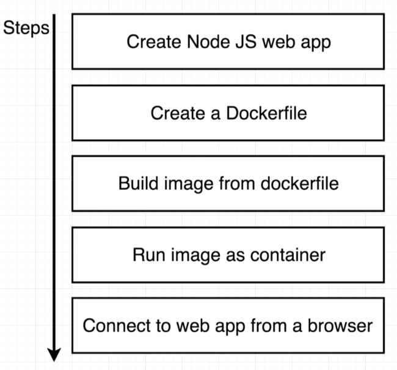
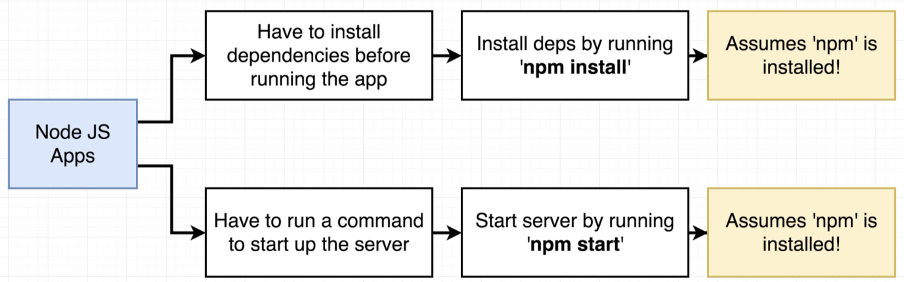
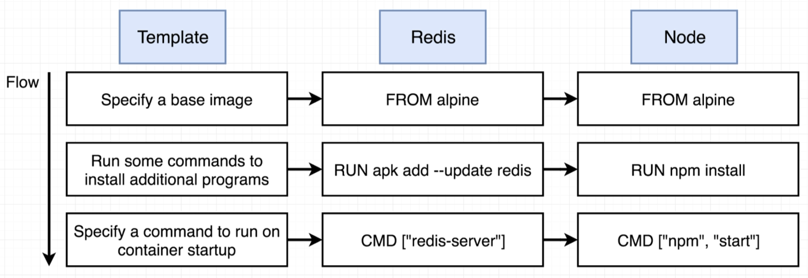
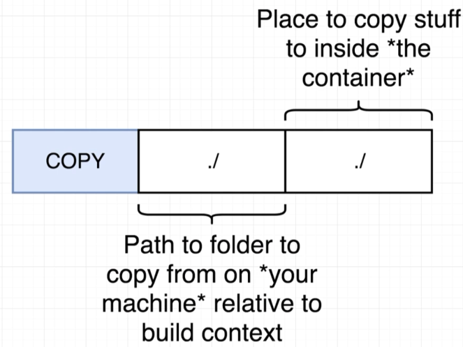
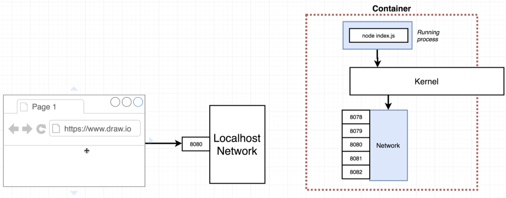
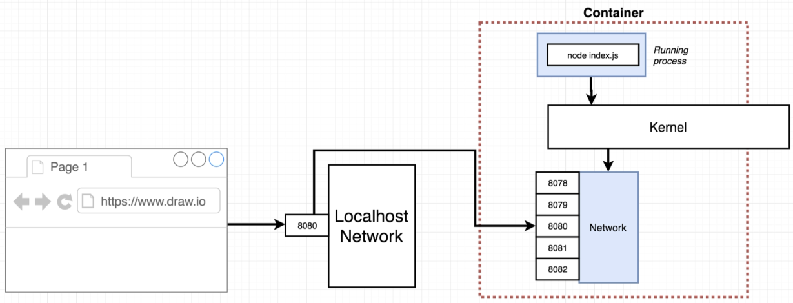
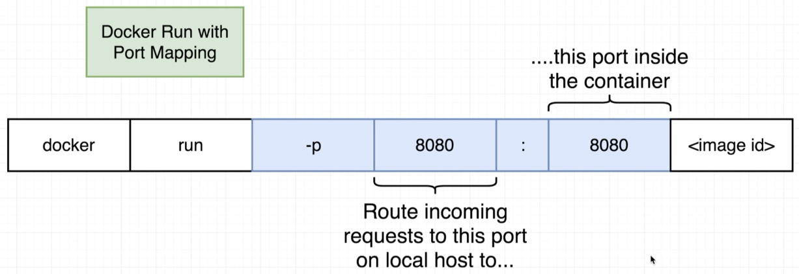
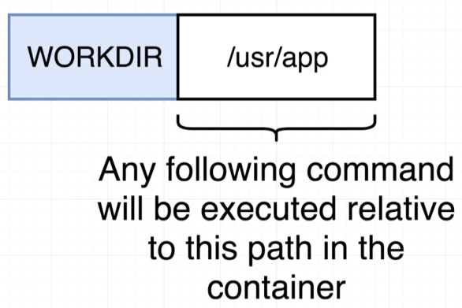

# Web App in Container

> 

> 

> 

> 

## Build and Run

The [Dockerfile](Dockerfile) to build the image needs an appropriate base image which has **node** and **npm** and we need to copy all required files:

> 

where the **build context** is basically what the "**.**" implies when we "**docker build .**".

So let's build:

```bash
$ docker build -t davidainslie/web-app-example .
```

and run:

```bash
$ docker run davidainslie/web-app-example

> @ start /
> node index.js

Listening on port 8080
```

Of course, we won't be able to actually access the application from outside the container as there is no port mapping. What we currently have is:

> 

With port mapping (a runtime contraint) we can have:

> 

> 

```bash
$ docker run -p 8080:8080 davidainslie/web-app-example

> @ start /
> node index.js

Listening on port 8080
```

```bash
$ docker ps
CONTAINER ID  IMAGE                         COMMAND      PORTS
acace195639b  davidainslie/web-app-example  "npm start"  0.0.0.0:8080->8080/tcp
```

```bash
$ http localhost:8080
HTTP/1.1 200 OK
Connection: keep-alive
Content-Length: 8
Content-Type: text/html; charset=utf-8
Date: Sat, 22 Dec 2018 14:11:21 GMT
ETag: W/"8-nkcvCQgrt5dCnQdUXDI4NrfRdcA"
X-Powered-By: Express

Hi there
```

## Working Directory

The original [Dockerfile](Dockerfile) did not specify a **working directory**. Given that original, we could have overridden the default container command to start up a **shell**. At this point the application will not boot, but we just want to take a look at the file structure:

```bash
$ docker run -it davidainslie/web-app-example sh
```

An **ls** inside the container, will show that our **COPY** of the files into the image were in the **root directory**:

```basic
/ # ls -las
total 104
     ...
     4 -rw-r--r--    1 root     root            67 Dec 20 22:50 Dockerfile
     ...
     4 -rw-r--r--    1 root     root           188 Dec 20 22:07 index.js
     ...
    16 -rw-r--r--    1 root     root         13047 Dec 20 22:54 package-lock.json
     4 -rw-r--r--    1 root     root            96 Dec 20 22:54 package.json
     ...
```

With this approach, we may accidentally override files/directories setup by the base image.

The latest [Dockerfile](Dockerfile) correctly uses the docker command **WORKDIR**:

> 

With the docker image instantiated:

```bash
$ docker ps
CONTAINER ID   IMAGE                          COMMAND       PORTS
24569f34cf6f   davidainslie/web-app-example   "npm start"   0.0.0.0:8080->8080/tcp

$ docker exec -it 24569f34cf6f sh 
```

```basic
/usr/app # ls -las
total 48
     ...
     4 -rw-r--r--    1 root     root            85 Dec 22 14:34 Dockerfile
     4 -rw-r--r--    1 root     root          2753 Dec 22 14:32 README.md
     4 drwxr-xr-x    3 root     root          4096 Dec 20 21:50 docs
     4 -rw-r--r--    1 root     root           188 Dec 20 22:07 index.js
     4 drwxr-xr-x   51 root     root          4096 Dec 22 14:41 node_modules
    16 -rw-r--r--    1 root     root         13047 Dec 22 14:41 package-lock.json
     4 -rw-r--r--    1 root     root            96 Dec 22 14:41 package.json
```

