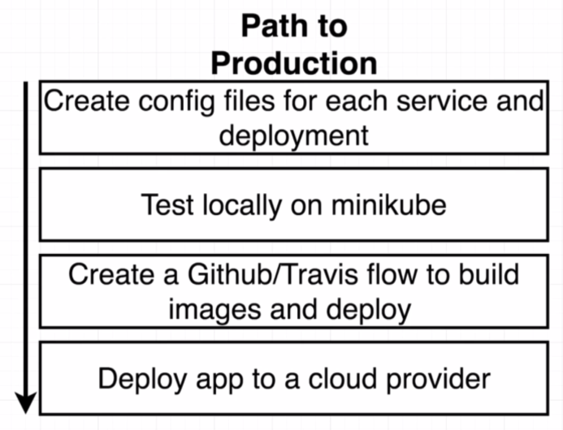
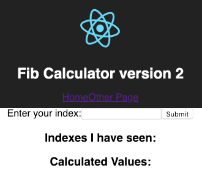
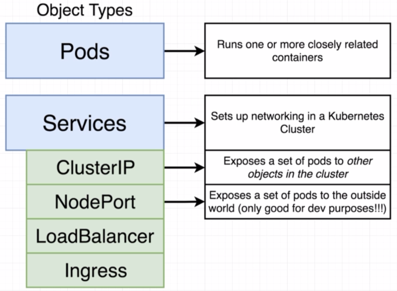
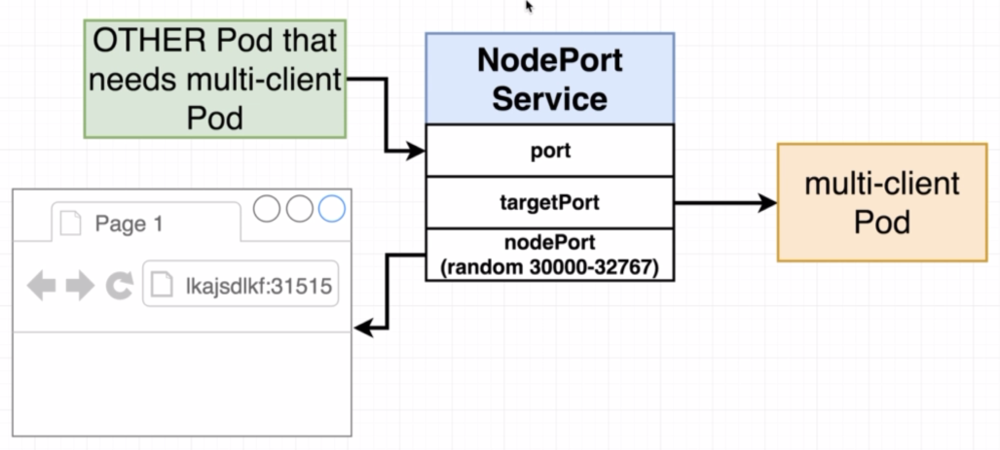
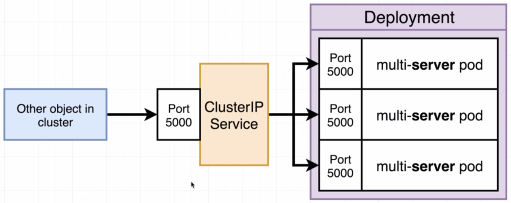

# Path to Production Kubernetes

We are going to need 11 Kubernetes configuration files. One each for all services; one each for all deployments; and one for the persistence volume claim:

> 

---

> 

Before proceeding with Kubernetes, it is good to first check that everything works with Docker as that is easier to assess any issues:

```bash
$ docker-compose up --build
```

Navigate to [localhost:3050](http://localhost:3050):

> 

---

> 

## Multi-Client Configuration

We first create [client-deployment.yml](k8s/client-deployment.yml) then we need a Service, in this case a ClusterIP Service. Recall the following from a NodePort Service, which exposes a port to the outside world:

> 

ClusterIP Service is a similar idea except no port is exposed to the outside world.

And so we end up with [client-cluster-ip-service.yml](k8s/client-cluster-ip-service.yml).

**Checkpoint** - Deploy current configs into Kubernetes:

```bash
$ kubectl apply -f k8s
service "client-cluster-ip-service" created
deployment "client-deployment" created
```

```bash
$ kubectl get deployments
NAME                DESIRED   CURRENT   UP-TO-DATE   AVAILABLE   AGE
client-deployment   3         3         3            3           57s
```

```bash
$ kubectl get pods
NAME                                READY     STATUS    RESTARTS   AGE
client-deployment-947d86bdb-4xnbc   1/1       Running   0          1m
client-deployment-947d86bdb-8p655   1/1       Running   0          1m
client-deployment-947d86bdb-xfkwk   1/1       Running   0          1m
```

```bash
$ kubectl get services
NAME                        TYPE        CLUSTER-IP      EXTERNAL-IP   PORT(S)    AGE
client-cluster-ip-service   ClusterIP   10.99.158.250   <none>        3000/TCP   2m
```

## Multi-Server Configuration

> 

We have configurations: [server-deployment.yml](k8s/server-deployment.yml]) and [server-cluster-ip-service.yml](k8s/server-cluster-ip-service.yml).

## Multi-Worker Configuration

We have configuration: [worker-deployment.yml](k8s/worker-deployment.yml), noting that we don't need a service since nothing is to be exposed.

**Checkpoint** - Deploy current configs into Kubernetes:

```bash
$ kubectl apply -f k8s
service "client-cluster-ip-service" unchanged
deployment "client-deployment" unchanged
service "server-cluster-ip-service" created
deployment "server-deployment" created
deployment "worker-deployment" created
```

```bash
$ kubectl get pods
NAME                                 READY     STATUS    RESTARTS   AGE
client-deployment-947d86bdb-4xnbc    1/1       Running   0          1h
client-deployment-947d86bdb-8p655    1/1       Running   0          1h
client-deployment-947d86bdb-xfkwk    1/1       Running   0          1h
server-deployment-6dcdbbff5f-czg5t   0/1       Pending   0          52s
server-deployment-6dcdbbff5f-jqzt7   0/1       Pending   0          52s
server-deployment-6dcdbbff5f-z74hw   0/1       Pending   0          52s
worker-deployment-677697694-mmq4p    1/1       Running   0          7m
```

```bash
$ kubectl get deployments
NAME                DESIRED   CURRENT   UP-TO-DATE   AVAILABLE   AGE
client-deployment   3         3         3            3           1h
server-deployment   3         3         3            0           1m
worker-deployment   1         1         1            1           8m
```

```bash
$ kubectl get services
NAME                        TYPE        CLUSTER-IP      EXTERNAL-IP   PORT(S)    AGE
client-cluster-ip-service   ClusterIP   10.99.158.250   <none>        3000/TCP   1h
server-cluster-ip-service   ClusterIP   10.97.83.124    <none>        5000/TCP   2m
```

## Redis Configuration

We have configurations: [redis-deployment.yml](k8s/redis-deployment.yml) and [redis-cluster-ip-service.yml](k8s/redis-cluster-ip-service.yml).

**Checkpoint** - Deploy current configs into Kubernetes:

```bash
$ kubectl apply -f k8s
service "client-cluster-ip-service" unchanged
deployment "client-deployment" unchanged
service "redis-cluster-ip-service" created
deployment "redis-deployment" created
service "server-cluster-ip-service" unchanged
deployment "server-deployment" unchanged
deployment "worker-deployment" unchanged
```

