# Path to Production Kubernetes

We are going to need 11 Kubernetes configuration files. One each for all services; one each for all deployments; and one for the persistence volume claim:

> 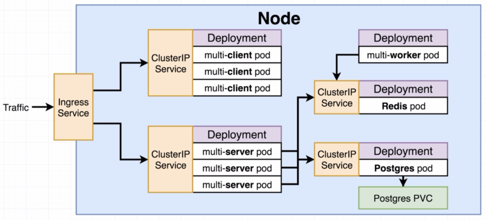

---

> 

Before proceeding with Kubernetes, it is good to first check that everything works with Docker as that is easier to assess any issues:

```bash
$ docker-compose up --build
```

Navigate to [localhost:3050](http://localhost:3050):

> 

---

> 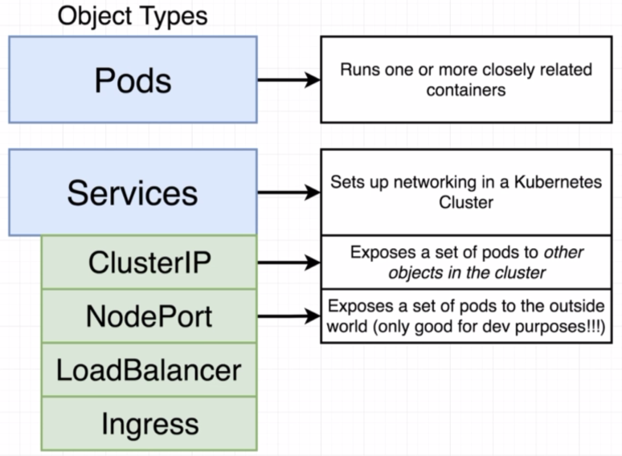

## Multi-Client Configuration

We first create [client-deployment.yml](k8s/client-deployment.yml) then we need a Service, in this case a ClusterIP Service. Recall the following from a NodePort Service, which exposes a port to the outside world:

> 

ClusterIP Service is a similar idea except no port is exposed to the outside world.

And so we end up with [client-cluster-ip-service.yml](k8s/client-cluster-ip-service.yml).

**Checkpoint** - Deploy current configs into Kubernetes:

```bash
$ kubectl apply -f k8s
service "client-cluster-ip-service" created
deployment "client-deployment" created
```

```bash
$ kubectl get deployments
NAME                DESIRED   CURRENT   UP-TO-DATE   AVAILABLE   AGE
client-deployment   3         3         3            3           57s
```

```bash
$ kubectl get pods
NAME                                READY     STATUS    RESTARTS   AGE
client-deployment-947d86bdb-4xnbc   1/1       Running   0          1m
client-deployment-947d86bdb-8p655   1/1       Running   0          1m
client-deployment-947d86bdb-xfkwk   1/1       Running   0          1m
```

```bash
$ kubectl get services
NAME                        TYPE        CLUSTER-IP      EXTERNAL-IP   PORT(S)    AGE
client-cluster-ip-service   ClusterIP   10.99.158.250   <none>        3000/TCP   2m
```

## Multi-Server Configuration

> 

We have configurations: [server-deployment.yml](k8s/server-deployment.yml]) and [server-cluster-ip-service.yml](k8s/server-cluster-ip-service.yml).

## Multi-Worker Configuration

We have configuration: [worker-deployment.yml](k8s/worker-deployment.yml), noting that we don't need a service since nothing is to be exposed.

**Checkpoint** - Deploy current configs into Kubernetes:

```bash
$ kubectl apply -f k8s
service "client-cluster-ip-service" unchanged
deployment "client-deployment" unchanged
service "server-cluster-ip-service" created
deployment "server-deployment" created
deployment "worker-deployment" created
```

```bash
$ kubectl get pods
NAME                                 READY     STATUS    RESTARTS   AGE
client-deployment-947d86bdb-4xnbc    1/1       Running   0          1h
client-deployment-947d86bdb-8p655    1/1       Running   0          1h
client-deployment-947d86bdb-xfkwk    1/1       Running   0          1h
server-deployment-6dcdbbff5f-czg5t   0/1       Pending   0          52s
server-deployment-6dcdbbff5f-jqzt7   0/1       Pending   0          52s
server-deployment-6dcdbbff5f-z74hw   0/1       Pending   0          52s
worker-deployment-677697694-mmq4p    1/1       Running   0          7m
```

```bash
$ kubectl get deployments
NAME                DESIRED   CURRENT   UP-TO-DATE   AVAILABLE   AGE
client-deployment   3         3         3            3           1h
server-deployment   3         3         3            0           1m
worker-deployment   1         1         1            1           8m
```

```bash
$ kubectl get services
NAME                        TYPE        CLUSTER-IP      EXTERNAL-IP   PORT(S)    AGE
client-cluster-ip-service   ClusterIP   10.99.158.250   <none>        3000/TCP   1h
server-cluster-ip-service   ClusterIP   10.97.83.124    <none>        5000/TCP   2m
```

## Redis Configuration

We have configurations: [redis-deployment.yml](k8s/redis-deployment.yml) and [redis-cluster-ip-service.yml](k8s/redis-cluster-ip-service.yml).

**Checkpoint** - Deploy current configs into Kubernetes:

```bash
$ kubectl apply -f k8s
service "client-cluster-ip-service" unchanged
deployment "client-deployment" unchanged
service "redis-cluster-ip-service" created
deployment "redis-deployment" created
service "server-cluster-ip-service" unchanged
deployment "server-deployment" unchanged
deployment "worker-deployment" unchanged
```

## Postgres Configuration

We have configurations: [postgres-deployment](k8s/postgres-deployment.yml) and [postgres-cluster-ip-service.yml](k8s/postgres-cluster-ip-service.yml).

## Persistence Volume Claim

> 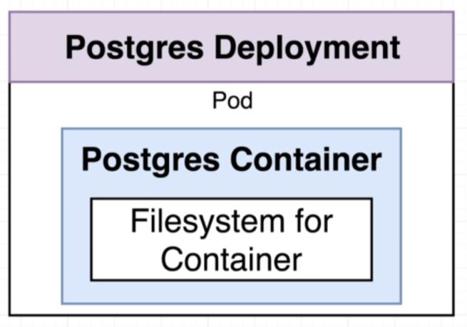

---

> 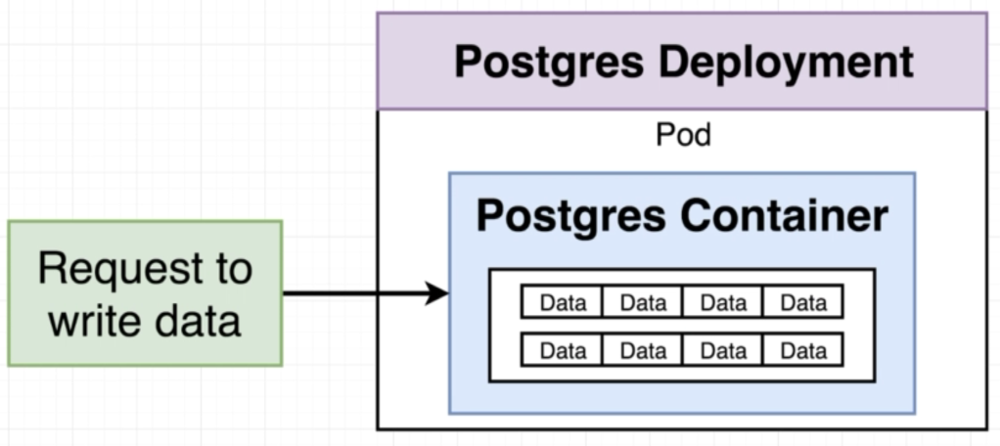

---

> 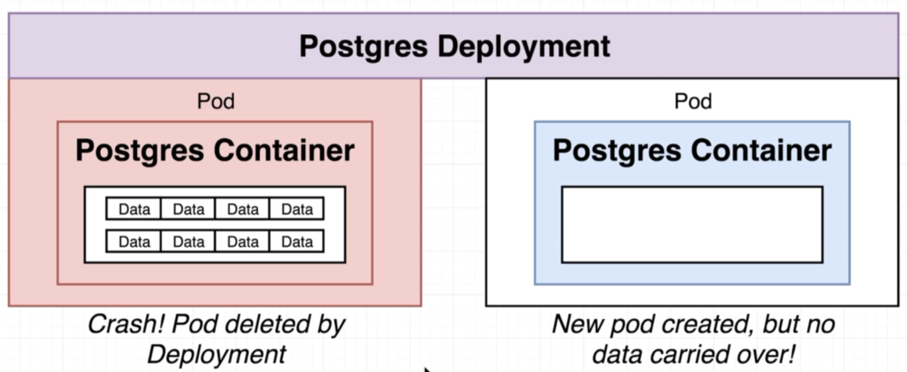

---

> 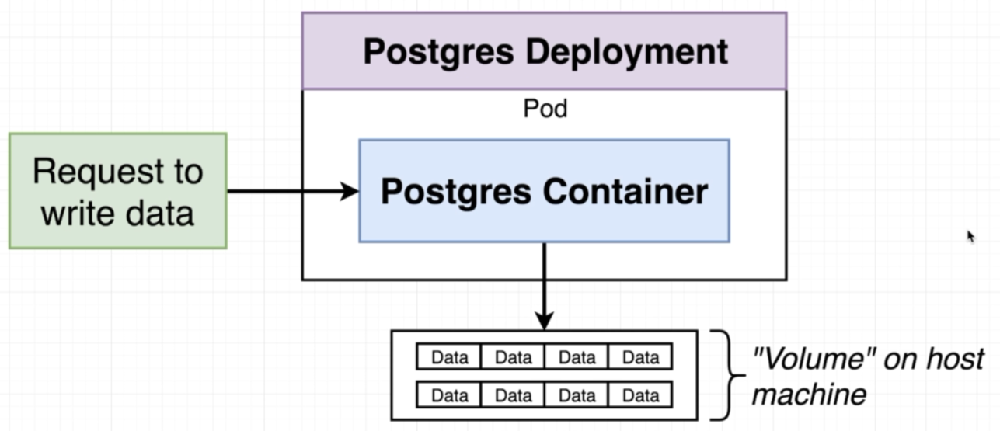

---

> 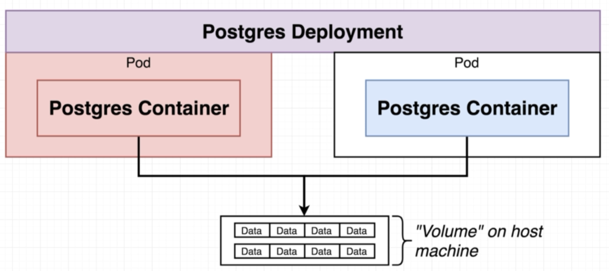

---

> 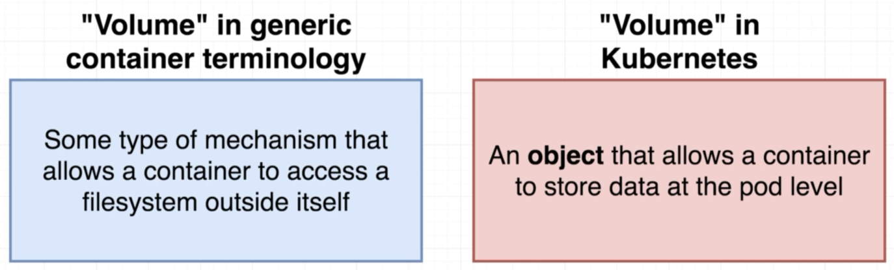

---

> 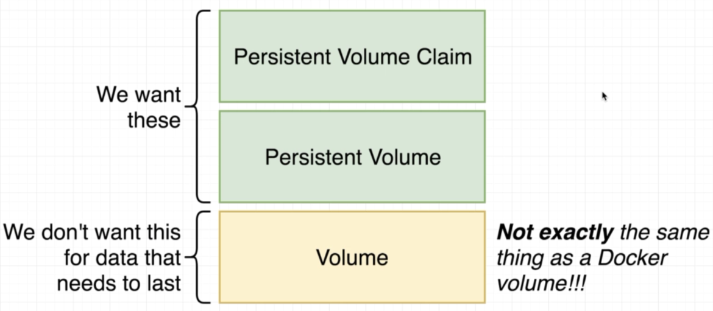

---

> 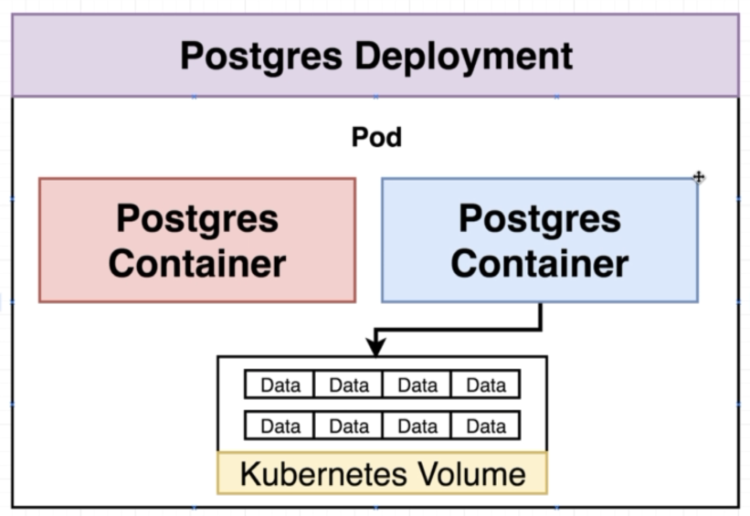

In this case, if the container (in red) dies and blue starts up, it gets any data that was persisted in the volume. However, if the pod dies, then all data is lost.

> 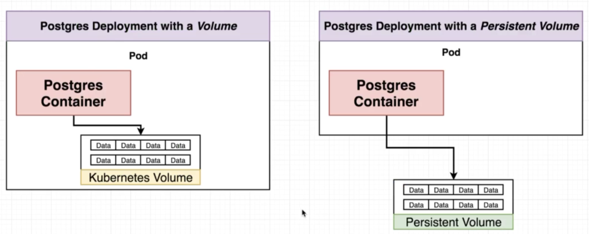

---

> 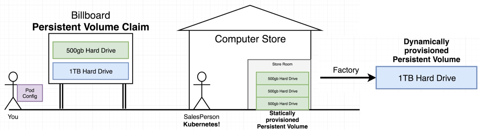

Our "advert" of [persistent volume claim](k8s/database-persistent-volume-claim.yml) to attach to a pod configuration:

```yaml
apiVersion: v1
kind: PersistentVolumeClaim
metadata:
  name: database-persistent-volume-claim
spec:
  accessModes:
    - ReadWriteOnce
  resources:
    requests:
      storage: 2Gi
```
By not specifying **storageClassName** we accept the default.

> 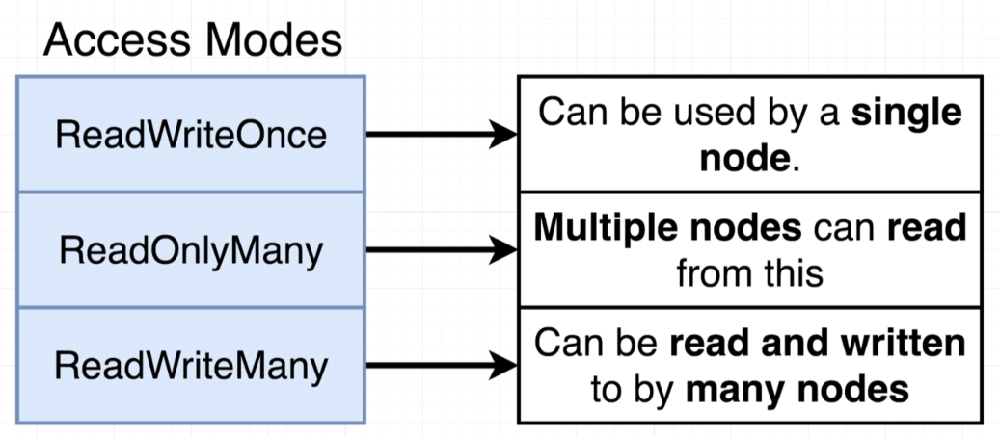

When we attach the persistent volume claim to a pod configuration and hand that over to Kubernetes, then Kubernetes will have to look up an available resource with the given access mode, or dynamically generate one.

So, we hand over the pod configuration to Kubernetes and:

> 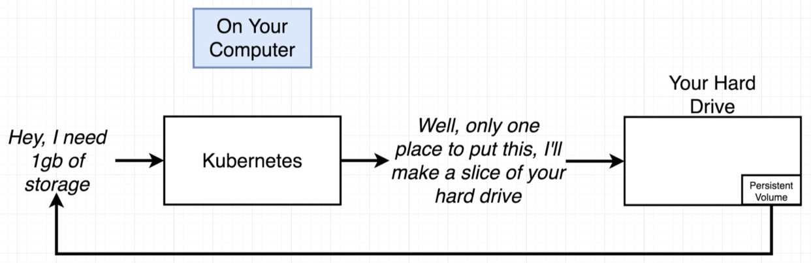

---

> 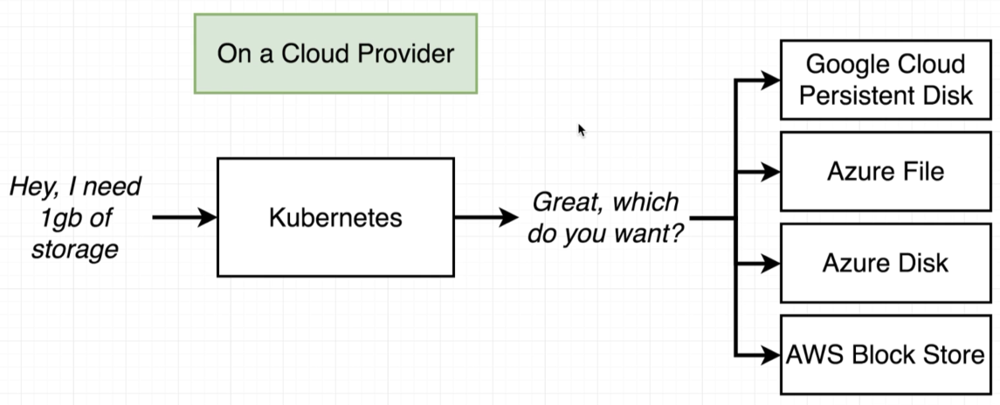

**Checkpoint** - Deploy current configs into Kubernetes:

```bash
$ kubectl apply -f k8s
service "client-cluster-ip-service" created
deployment "client-deployment" created
persistentvolumeclaim "database-persistent-volume-claim" created
service "postgres-cluster-ip-service" created
deployment "postgres-deployment" created
service "redis-cluster-ip-service" created
deployment "redis-deployment" created
service "server-cluster-ip-service" created
deployment "server-deployment" created
deployment "worker-deployment" created
```

```bash
$ kubectl get pods
NAME                                   READY     STATUS              RESTARTS   AGE
client-deployment-6f9788d584-6x4w8     1/1       Running             0          2m
client-deployment-6f9788d584-jq4hg     1/1       Running             0          2m
client-deployment-6f9788d584-lmd9f     1/1       Running             0          2m
postgres-deployment-7b6fd8c755-4dbr9   0/1       Pending             0          2m
redis-deployment-54c4fdfbd9-2lfzg      1/1       Running             0          2m
server-deployment-7bfbfd7cc-8kvb9      1/1       Running             0          2m
server-deployment-7bfbfd7cc-c8qjw      0/1       ContainerCreating   0          2m
server-deployment-7bfbfd7cc-skbkt      1/1       Running             0          2m
worker-deployment-86d85bcccb-kg85c     0/1       ContainerCreating   0          2m
```

```bash
$ kubectl get pv
NAME      CAPACITY  ACCESS  RECLAIM POLICY CLAIM                                 STORAGECLASS
pvc-48... 1Gi       RWO     Delete         default/database-persistent-volume-claim  standard
```

```bash
$ kubectl get pvc
NAME                              VOLUME     CAPACITY   ACCESS MODES   STORAGECLASS   AGE
database-persistent-volume-claim  pvc-48...  1Gi        RWO            standard       5m
```

## Environment Variables

> 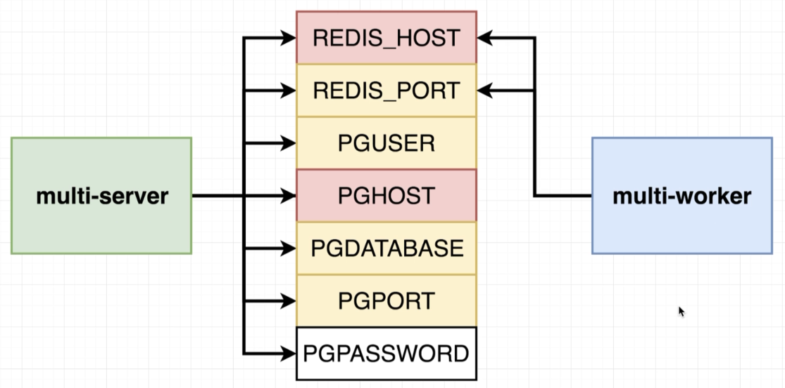

- Yellow and Red: Constant values
- White: Sensitive

> 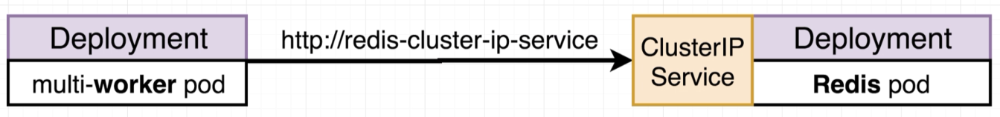

## Encoded Secret

> 

---

> 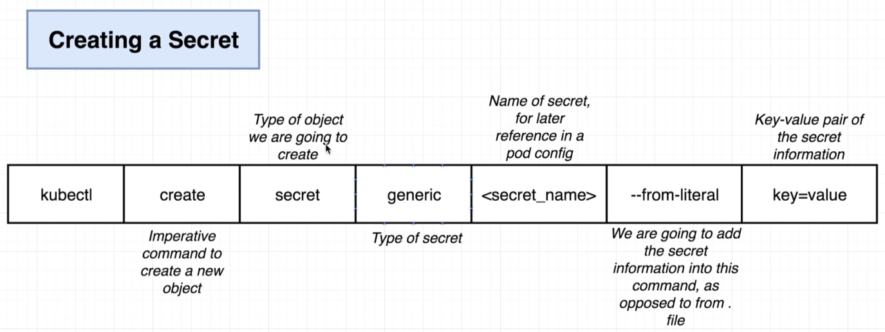

Types of secret:

- generic
- docker-registry
- tls

```bash
$ kubectl create secret generic pgpassword --from-literal PGPASSWORD=123
secret "pgpassword" created
```

```bash
$ kubectl get secrets
NAME                  TYPE                                  DATA      AGE
pgpassword            Opaque                                1         33s
```

Note that a secret can have many key/value pairs. The following [server-deployment.yml](k8s/server-deployment.yml) shows the use of our secret:

```yaml
apiVersion: apps/v1
kind: Deployment
metadata:
  name: server-deployment
spec:
  replicas: 3
  selector:
    matchLabels:
      component: server
  template:
    metadata:
      labels:
        component: server
    spec:
      containers:
        - name: server
          image: davidainslie/multi-server
          ports:
            - containerPort: 5000
          env:
            - name: REDIS_HOST
              value: redis-cluster-ip-service
            - name: REDIS_PORT
              value: "6379"
            - name: PGUSER
              value: postgres
            - name: PG_HOST
              value: postgres-cluster-ip-service
            - name: PGPORT
              value: "5432"
            - name: PGDATABASE
              value: postgres
            - name: PGPASSWORD
              valueFrom:
                secretKeyRef:
                  name: pgpassword
                  key: PGPASSWORD
```

and again in [postgres-deployment.yml](k8s/postgres-deployment.yml):

```yaml
apiVersion: apps/v1
kind: Deployment
metadata:
  name: postgres-deployment
spec:
  replicas: 1
  selector:
    matchLabels:
      component: postgres
  template:
    metadata:
      labels:
        component: postgres
    spec:
      volumes:
        - name: postgres-storage
          persistentVolumeClaim:
            claimName: database-persistent-volume-claim
      containers:
        - name: postgres
          image: postgres
          ports:
            - containerPort: 5432
          volumeMounts:
            - name: postgres-storage
              mountPath: /var/lib/postgresql/data
              subPath: postgres
          env:
            - name: PGPASSWORD
              valueFrom:
                secretKeyRef:
                  name: pgpassword
                  key: PGPASSWORD
```

**Checkpoint** - Deploy current configs into Kubernetes:

```bash
$ kubectl apply -f k8s
service "client-cluster-ip-service" created
deployment "client-deployment" created
persistentvolumeclaim "database-persistent-volume-claim" created
service "postgres-cluster-ip-service" created
deployment "postgres-deployment" created
service "redis-cluster-ip-service" created
deployment "redis-deployment" created
service "server-cluster-ip-service" created
deployment "server-deployment" created
deployment "worker-deployment" created
```

## Ingress

> 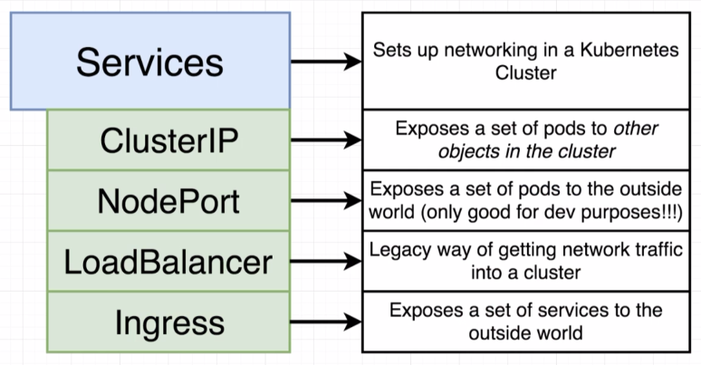

---

> 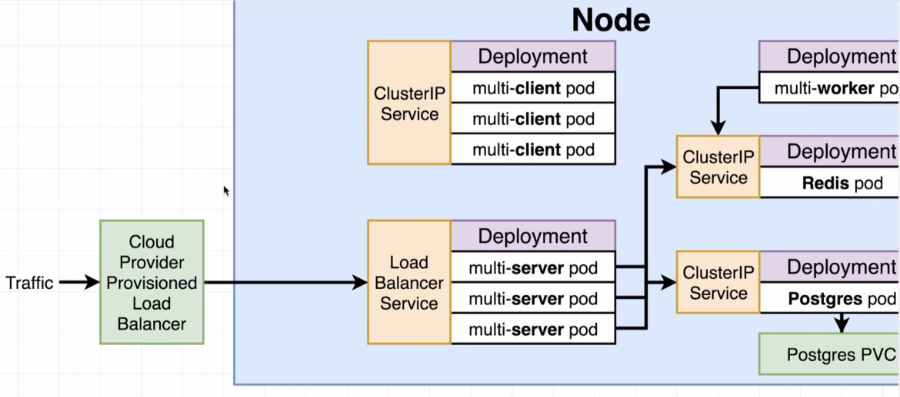

A load balancer provides access to one specific set of pods (a deployment), whereas ingress load balanced multiple deployments.

> 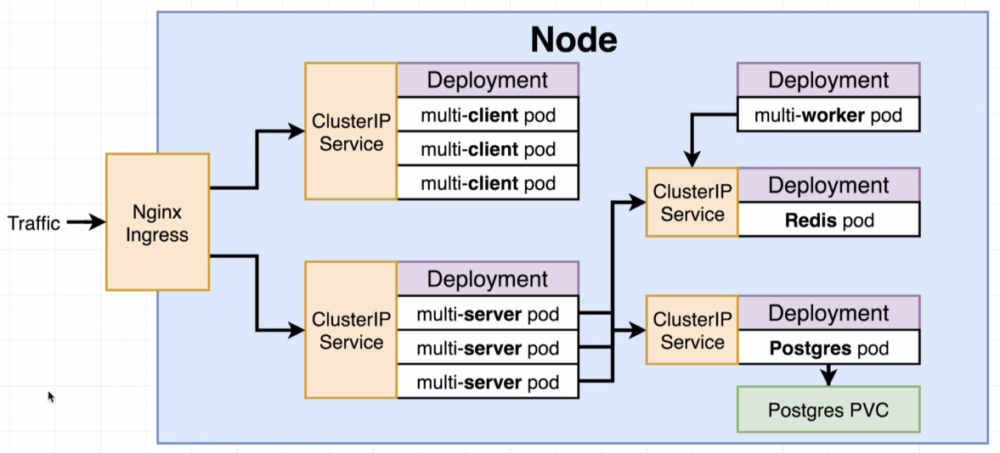

There are several Ingress implementations to choose from, such as a **nginx ingress**.

> 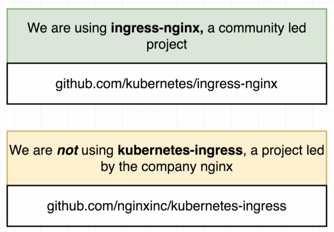

---

> 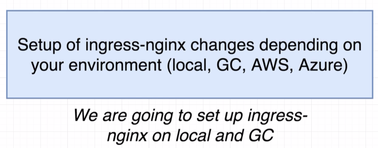

---

> 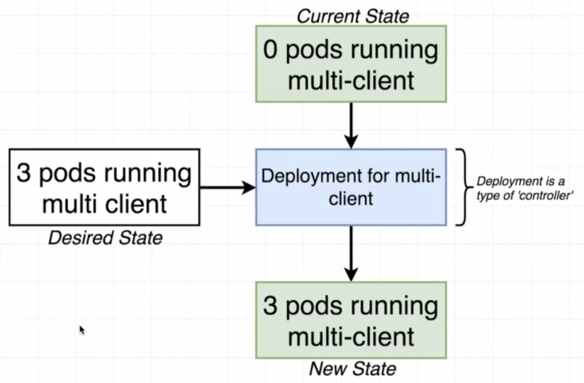

The **desired state** is declared by our **deployment configuration**. We feed the config to kubectl which in turn Kubernetes creates a deployment object.

> 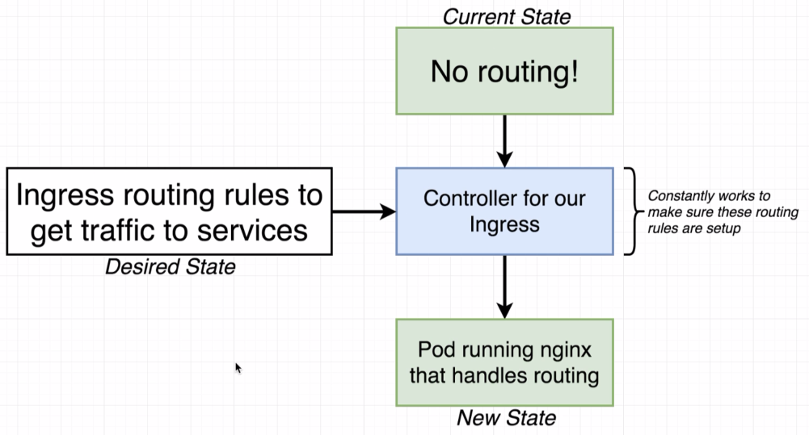

---

> 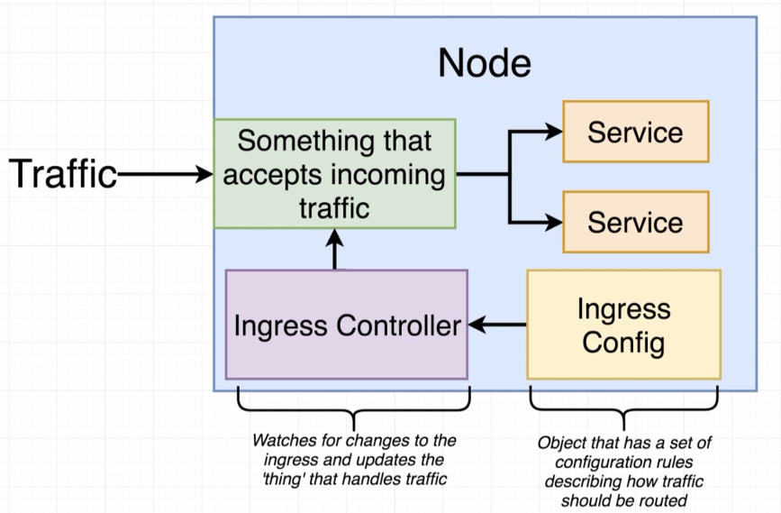

So we have to create an ingress config (another yml) that stipulates the routing rules. This is fed into kubectl which generates an object called an **ingress controller** - controllers (created from configs) contantly look at the **desired state** as given by a config and compares to the **current state** and makes adjustments to said current state to arrive at the desired state. The ingress controller sets up the necessary infrastructure, and changes accordingly.

We are going to set things up just a tad differently, where we essentially merge the **controller** and **the thing that accepts traffic**:

> 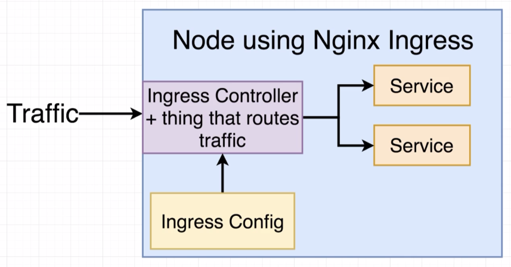

---

> 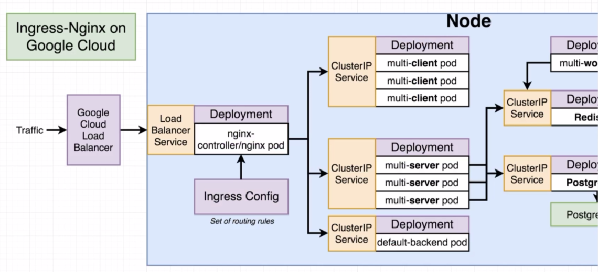

The **default-backend** is a collection of health checks.

The question at this point is **why not use a load balancer service with custom nginx?**

> 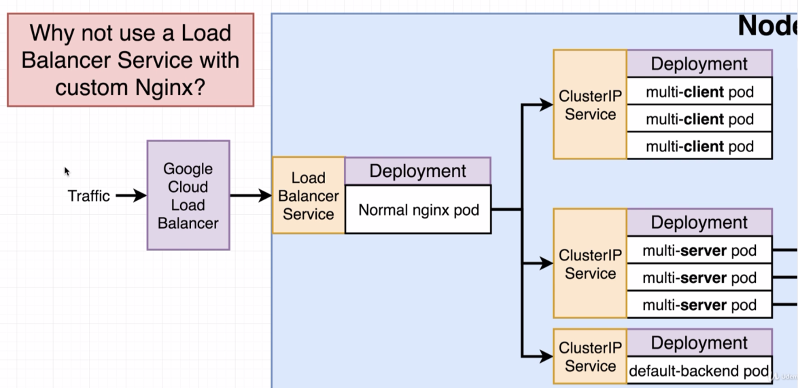

Well, the nginx-controller bypasses cluster IP services and routes traffic directly to pods e.g.

> 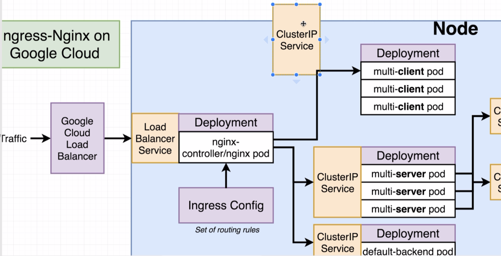

This allows for **sticky sessions** and a lot more.

The nginx-controller deployment has the following mandatory step, followed by a step according to the type of Kubernetes cluster such as minikube, docker for Mac, GCP etc.

```bash
$ kubectl apply -f https://raw.githubusercontent.com/kubernetes/ingress-nginx/master/deploy/mandatory.yaml
namespace "ingress-nginx" created
configmap "nginx-configuration" created
configmap "tcp-services" created
configmap "udp-services" created
serviceaccount "nginx-ingress-serviceaccount" created
clusterrole "nginx-ingress-clusterrole" created
role "nginx-ingress-role" created
rolebinding "nginx-ingress-role-nisa-binding" created
clusterrolebinding "nginx-ingress-clusterrole-nisa-binding" created
deployment "nginx-ingress-controller" created
```

And for Minikube:

```bash
$ minikube addons enable ingress
ingress was successfully enabled
```

> 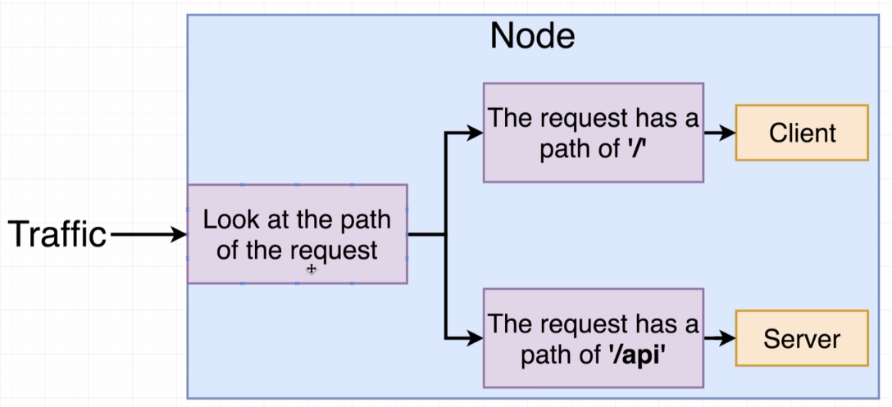

With our new [ingress-service.yml](k8s/ingress-service.yml) we can **apply** everything:

```bash
$ kubectl apply -f k8s
service "client-cluster-ip-service" unchanged
deployment "client-deployment" unchanged
persistentvolumeclaim "database-persistent-volume-claim" unchanged
ingress "ingress-service" created
service "postgres-cluster-ip-service" unchanged
deployment "postgres-deployment" unchanged
service "redis-cluster-ip-service" unchanged
deployment "redis-deployment" unchanged
service "server-cluster-ip-service" unchanged
deployment "server-deployment" unchanged
deployment "worker-deployment" unchanged
```

If you have [kubernetic](https://kubernetic.com/) installed:

> 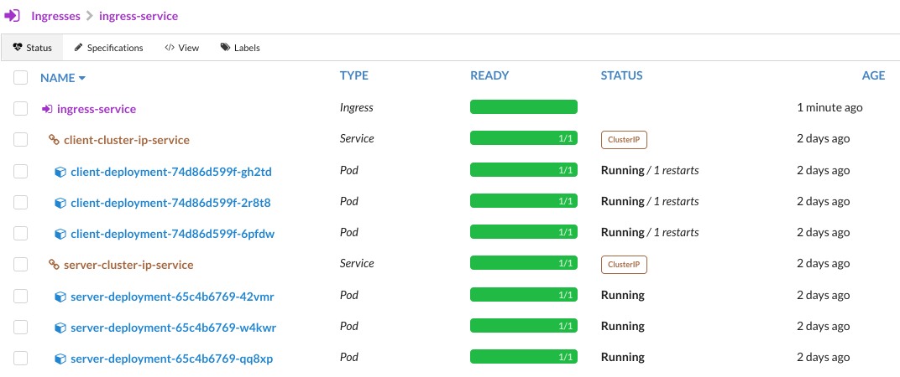

```bash
$ minikube ip
192.168.99.115
```

Upon opening up our browser (and depending on the browser) we'll receive a warning:

> 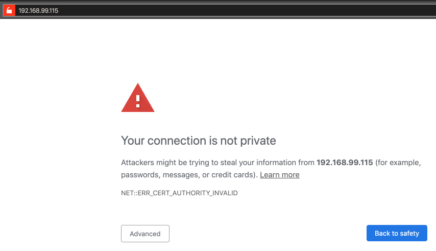

But we can proceed:

> 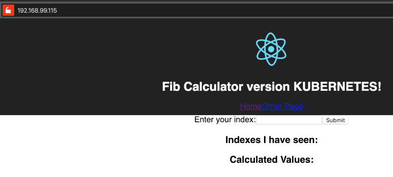

---

> 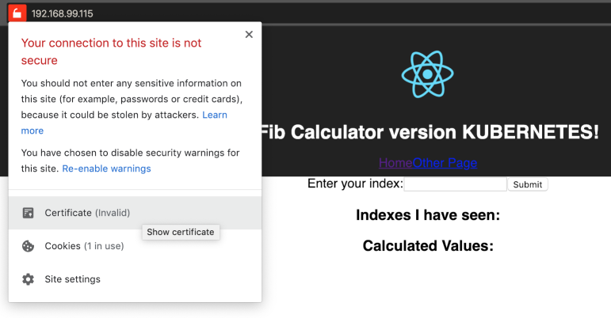

---

> 

## Minikube Dashboard

```bash
$ minikube dashboard
Enabling dashboard ...
Verifying dashboard health ...
Launching proxy ...
Verifying proxy health ...
Opening http://127.0.0.1:54483/api/v1/namespaces/kube-system/services/http:kubernetes-dashboard:/proxy/ in your default browser...
```

