# Pod

We want to take our original [multi-client](../multi/README.md) image that we were working on using Docker and Docker Compose, and now use Kubernetes. For this example, we will feed into **kubectl** two config files that *create objects*.

> 

From our two config files [client-pod.yml](client-pod.yml) and [client-node-port.yml](client-node-port.yml) what is **kind** and **apiVersion**?

> 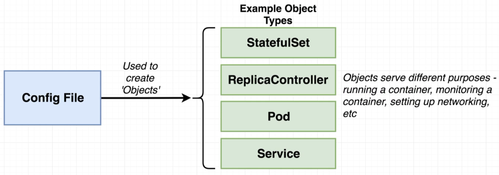
---
> 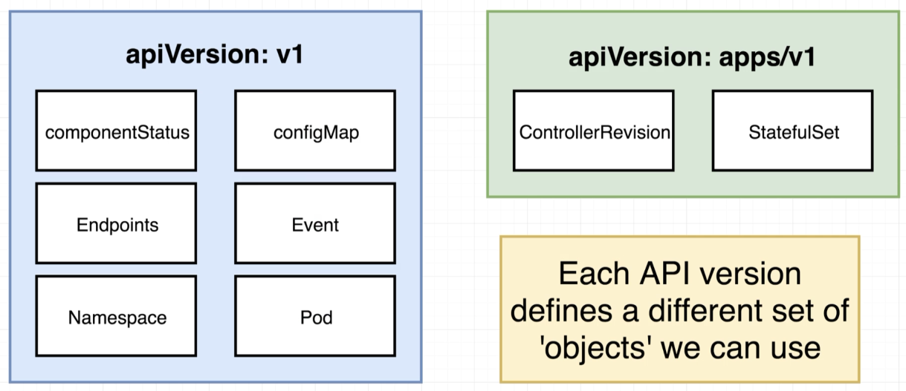

So what is a **pod**?

> 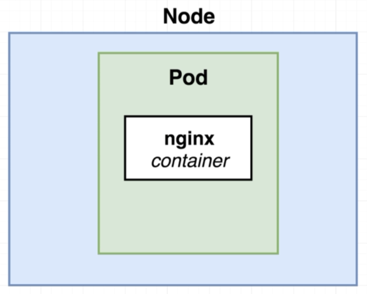

When we start up Minikube for example, a Virtual Machine is instantiated, which in this case will be our Node. A Pod has one or more containers - so at a minimum we can deploy one container housed by one Pod. The containers in a Pod are somehow dependent one another i.e. they constitute a well define grouping e.g.

> 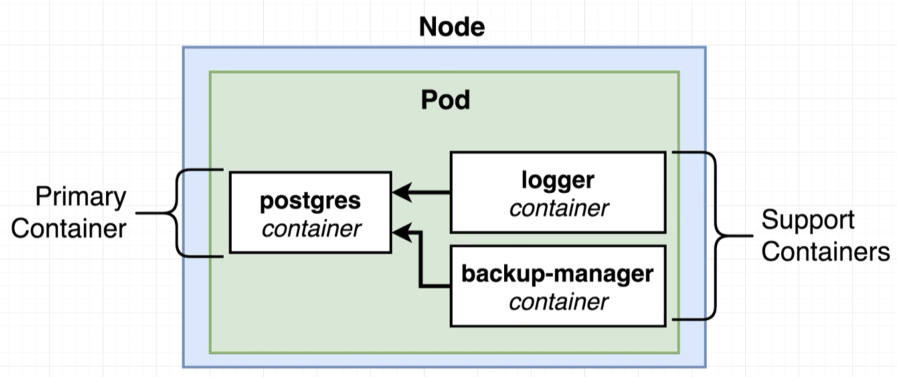

## Service

> 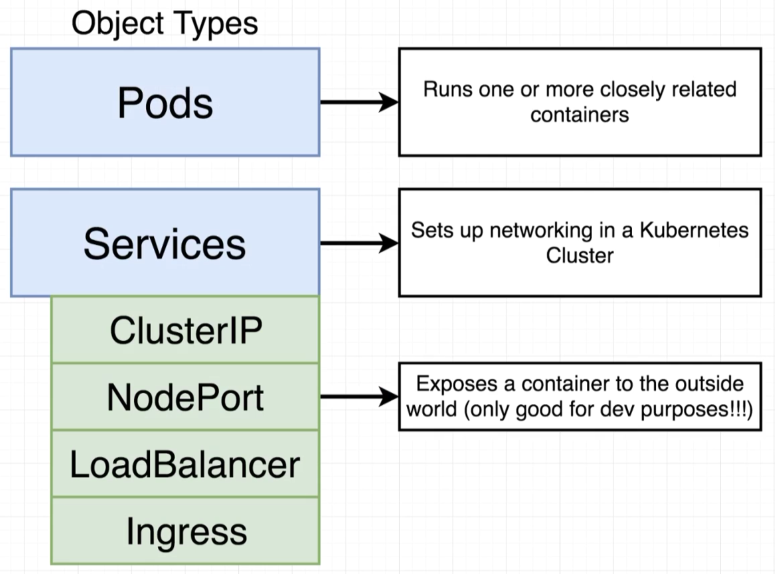

In our [example](client-node-port.yml) the "sub type" of Service we declared is **NodePort**, i.e. a NodePort Service. All of the sub types of Service expose containers. However, a NodePort is only for **development** purposes, though it does expose its container to the outside world.

> 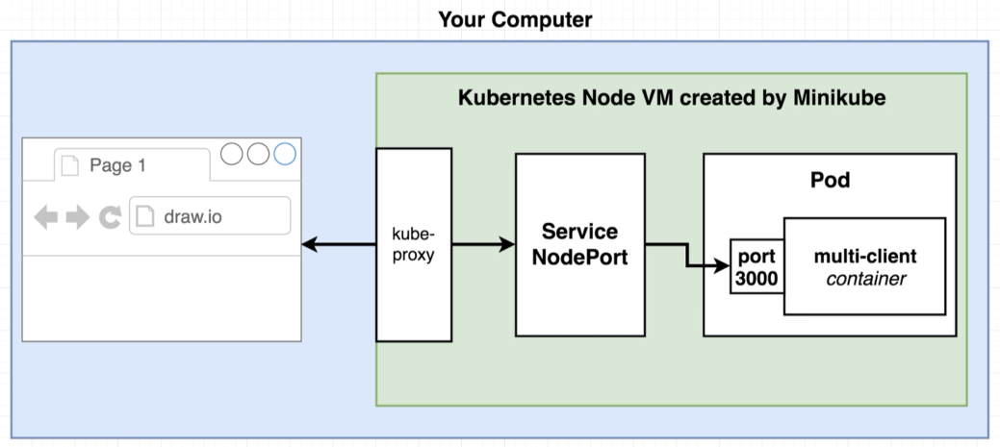
---
> 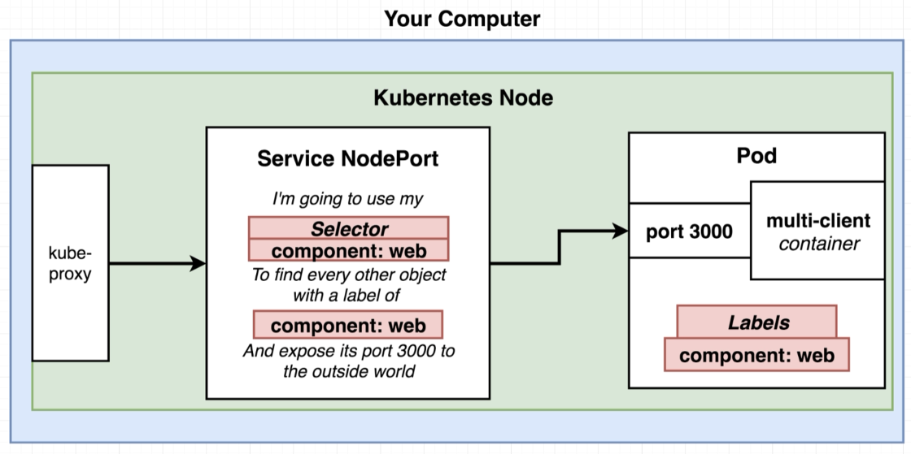
---
> 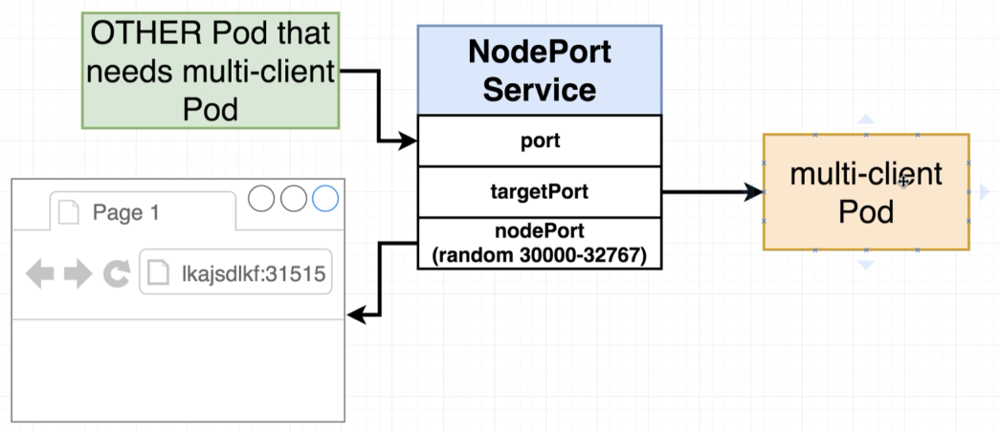

# Deploy / Run

> 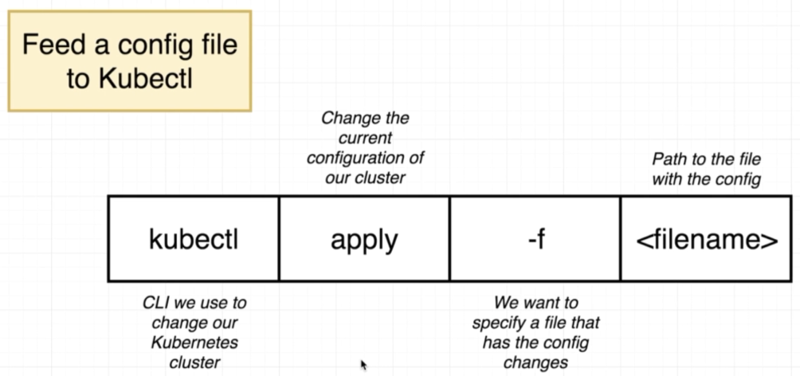

```bash
$ minikube start
Starting local Kubernetes v1.12.4 cluster...
Starting VM...
Getting VM IP address...
Moving files into cluster...
Setting up certs...
Connecting to cluster...
Setting up kubeconfig...
Stopping extra container runtimes...
Starting cluster components...
Verifying kubelet health ...
Verifying apiserver health ...Kubectl is now configured to use the cluster.
Loading cached images from config file.
```

```bash
$ ls
client-node-port.yml	client-pod.yml
```

```bash
$ kubectl apply -f client-pod.yml
pod "client-pod" created

$ kubectl apply -f client-node-port.yml
service "client-node-port" created
```

> 

```bash
$ kubectl get pods
NAME         READY     STATUS    RESTARTS   AGE
client-pod   1/1       Running   0          5m
```

```bash
$ kubectl get services
NAME               TYPE        CLUSTER-IP      EXTERNAL-IP   PORT(S)          AGE
client-node-port   NodePort    10.107.56.225   <none>        3050:31515/TCP   5m
kubernetes         ClusterIP   10.96.0.1       <none>        443/TCP          2h
```

Now ask Minikube what IP address has been assigned to the instantiated VM:

```bash
$ minikube ip
192.168.99.101
```

and now we can navigate to the multi-client UI at http://192.168.99.101:31515

## Update Existing Objects

> 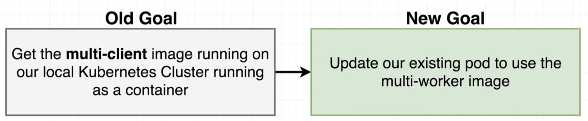

---

> 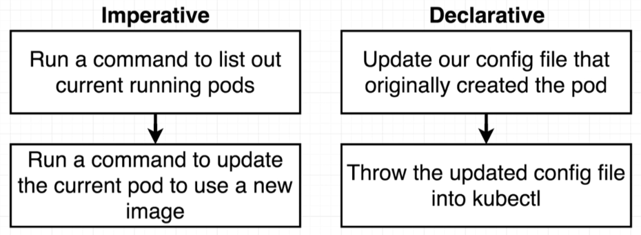

---

> 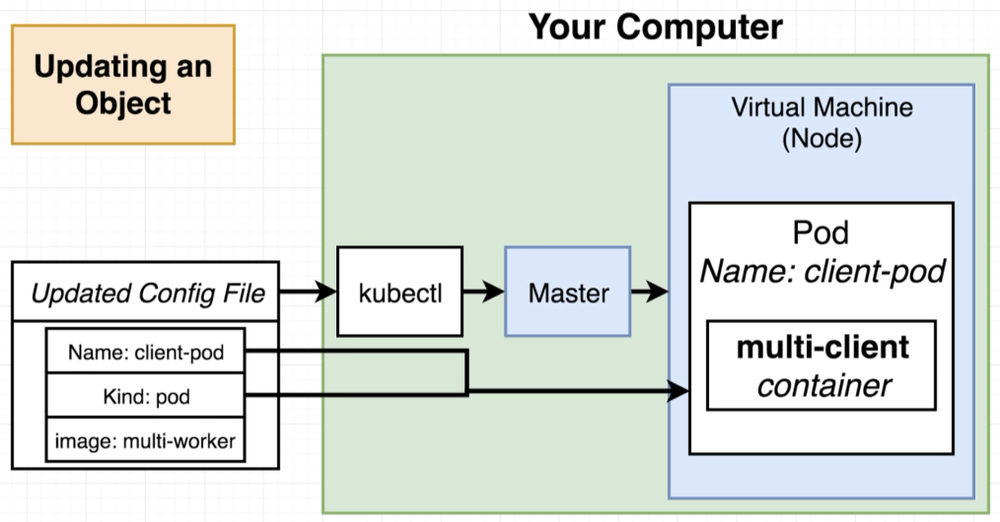

We simply change the image and reapply:

```yaml
apiVersion: v1
kind: Pod
metadata:
  name: client-pod
  labels:
    component: web
spec:
  containers:
    - name: client
      image: davidainslie/multi-client
      ports:
        - containerPort: 3000
      resources:
        limits:
          memory: 256Mi
          cpu: 250m
```

becomes:

```yaml
apiVersion: v1
kind: Pod
metadata:
  name: client-pod
  labels:
    component: web
spec:
  containers:
    - name: client
      image: davidainslie/multi-worker
      ports:
        - containerPort: 3000
      resources:
        limits:
          memory: 256Mi
          cpu: 250m
```

```bash
$ kubectl apply -f client-pod-updated.yml
pod "client-pod" configured

$ kubectl get pods
NAME         READY     STATUS              RESTARTS   AGE
client-pod   0/1       ContainerCreating   0          4m
```

> 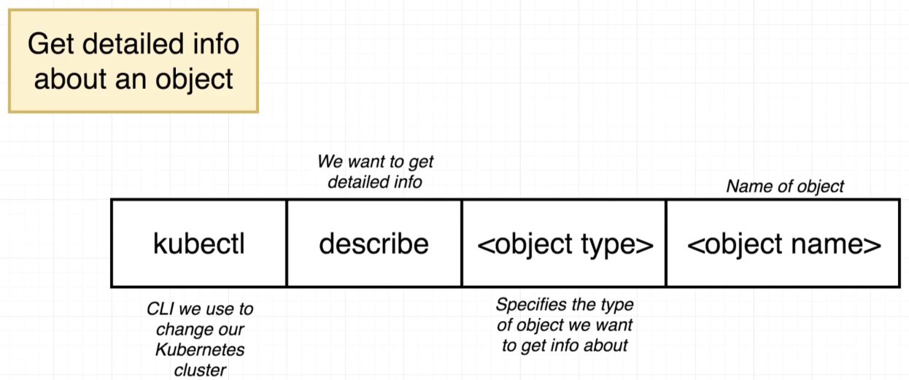

```bash
$ kubectl describe pod client-pod
Name:               client-pod
Namespace:          default
...
Containers:
  client:
    Container ID:   docker://3459d093c534f64613214a1c5605bd186e895ed35a10a4bed9f4c9473e788fd8
    Image:          davidainslie/multi-worker
...
```

Note that updating entries within a Pod's declaration are fairly limited.

> 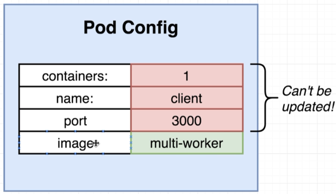

## Object Types

> 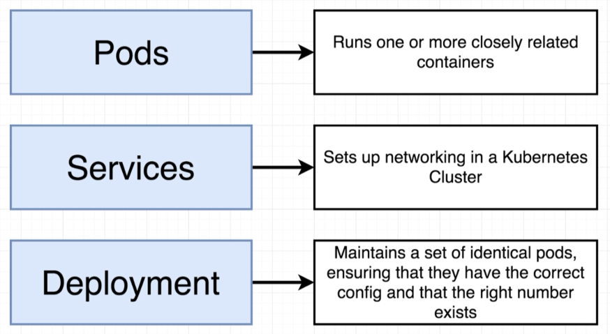

---

> 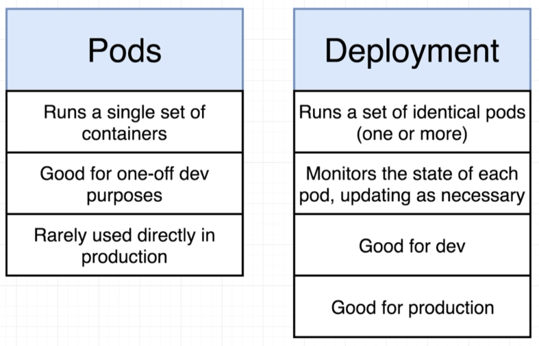

---

> 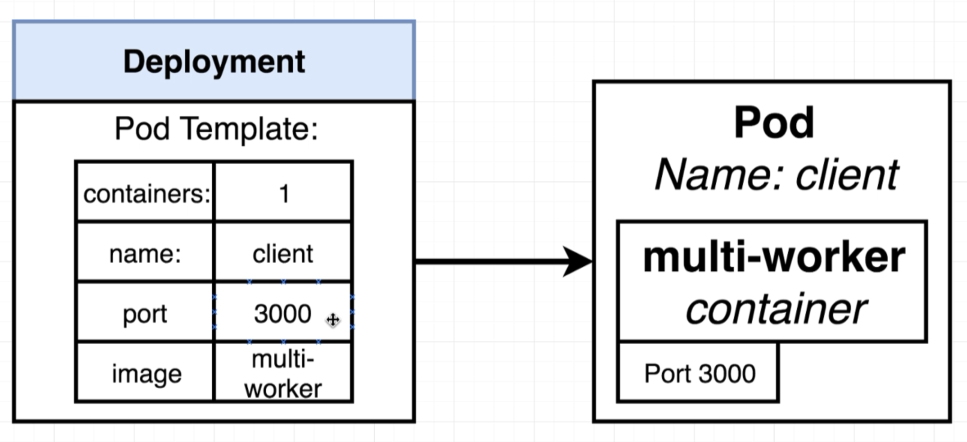