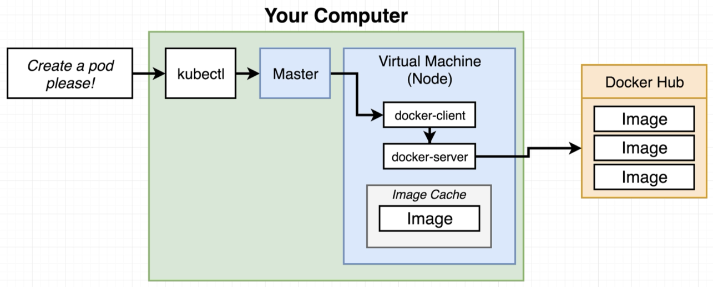

# Reconfigure Docker CLI to the VM

> 

As a sidenote, we'll actually have two different Dockers. One that we installed on our machine, and one that is inside the VM that Minikube boots up.

> 

The local **docker-client** (CLI) that talks to the local **docker-server** can be reconfigured to talk to the docker-server inside the VM.

> 

Before configuration:

```bash
$ docker ps
CONTAINER ID     IMAGE    COMMAND     CREATED    STATUS    PORTS     NAMES
```

Currently nothing running locally. What about inside the VM?

Configure:

```bash
$ eval $(minikube docker-env)
```

```bash
$ docker ps
CONTAINER ID   IMAGE                      COMMAND                  CREATED 
a75797623438   davidainslie/multi-client  "nginx -g 'daemon of…"   22 minutes ago 
715c54e77957   k8s.gcr.io/pause:3.1       "/pause"                 22 minutes ago
...
... and a lot more
```

And what is that command? Try its parts:

```bash
$ minikube docker-env
export DOCKER_TLS_VERIFY="1"
export DOCKER_HOST="tcp://192.168.99.104:2376"
export DOCKER_CERT_PATH="/Users/davidainslie/.minikube/certs"
export DOCKER_API_VERSION="1.35"
# Run this command to configure your shell:
# eval $(minikube docker-env)
```

Note that the **DOCKER_HOST** is the same as the evaluation of:

```bash
$ minikube ip
192.168.99.104
```

> 