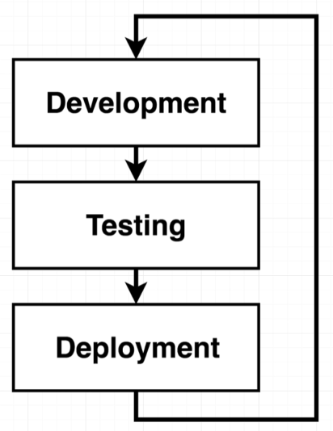
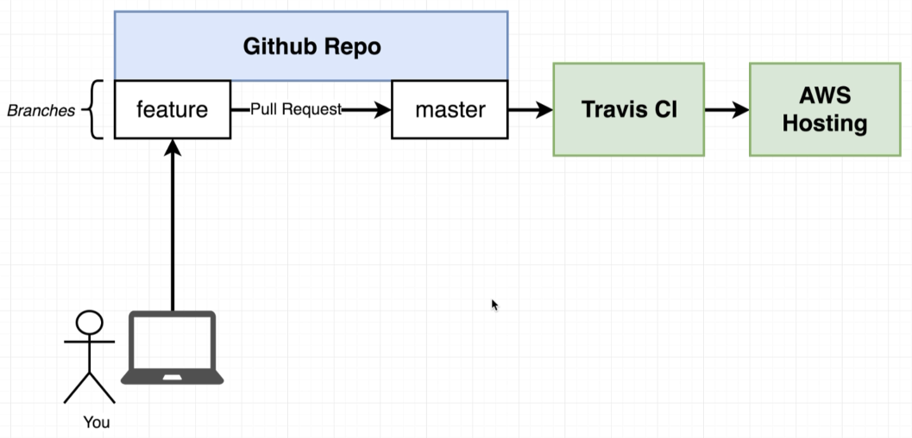
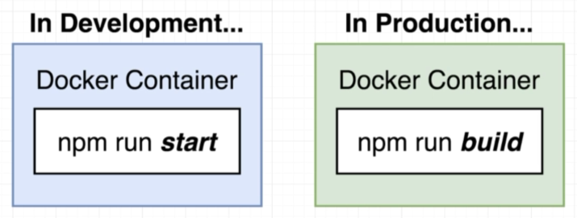
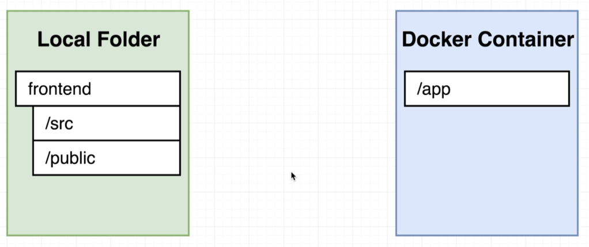
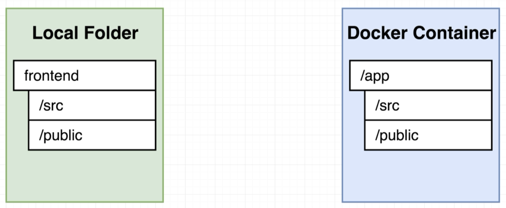
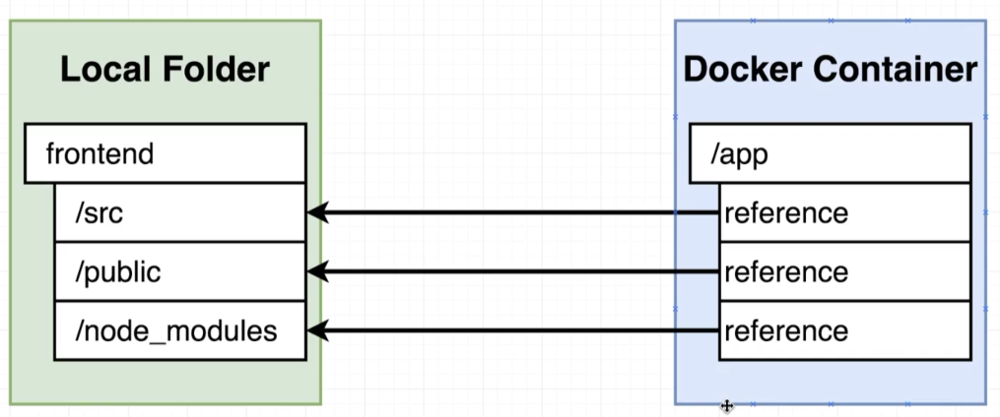
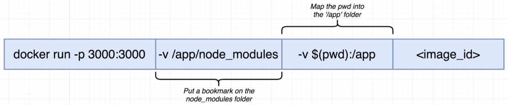
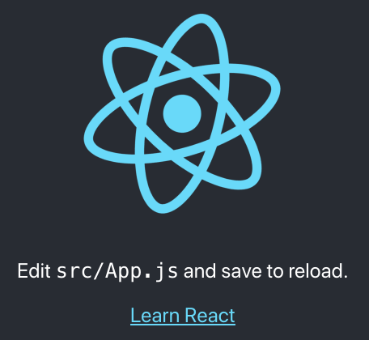
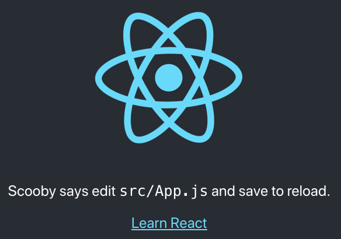

# Development Workflow - Dev to AWS Prod

> 

> 

## Application for our Pipeline

Hopefully you already went through [Setup](../../../docs/setup.md).

```bash
$ npm install -g create-react-app
```

Let's now create a noddy React app:

```bash
$ create-react-app frontend
...
  npm start
    Starts the development server.

  npm run build
    Bundles the app into static files for production.

  npm test
    Starts the test runner.
...    
```

## Dockerfile

Let's have one Dockerfile for [development](Dockerfile.dev) and another for [production](Dockerfile):

> 

## Dockerfile - Development

```bash
$ docker build -f Dockerfile.dev -t davidainslie/workflow-example .
```

Notice that we have a [.dockerignore](.dockerignore) files which avoids duplicating dependencies from the [node_modules](node_modules) directory - where this duplication occurs because of a **COPY** command in the Dockerfile that can pick up all dependencies within **node_modules**, and the fact that the Dockerfile also does a **npm install** to install all dependencies. Without this file, upon building we would see something like:

```bash
Sending build context to Docker daemon  238.7MB
```

But with our [.dockerignore](.dockerignore) we will see something more like:

```bash
Sending build context to Docker daemon    1.1MB
```

```bash
$ docker run -p 3000:3000 davidainslie/workflow-example

> frontend@0.1.0 start /app
> react-scripts start

Starting the development server...
```

```bash
$ http localhost:3000
HTTP/1.1 200 OK
...
```

## Volumes

Question! Upon changing the application source code, how can we see said changes in a running container i.e. without having to stop the instance, rebuild and restart? This can be achieved via a Volume.

> 

The docker **COPY** command gives us (where the container essential get a snapshot):

> 

Now, instead of a **COPY**, we can use a **VOLUME** that is more than just a snapshot:

> 

Just like a **port mapping** that maps a port outside the container to a port inside, a **volume mapping** maps a folder outside the container to a folder inside.

> 

e.g.

```bash
$ docker run -p 3000:3000 -v `pwd`:/app davidainslie/workflow-example
```

The above only works if all required folders expected by the container, exist locally. But what if we deleted the local **node_modules** during some development clean up? In that case the container would fail to start.

However, we can add a **volume bookmark** which only stipulates a container folder, thereby essentially ignoring what is outside, and so use said folder that was already copied into the container.

```bash
$ docker run -p 3000:3000 -v /app/node_modules -v `pwd`:/app davidainslie/workflow-example
```

Viewing in [browser](localhost:3000):

> 

and then changing the text in [App.js](frontend/src/App.js) we see the following without rebuilding and restarting:

> 

Note that is the docker logs, we'll see something like:

```bash
Compiling...
Compiled successfully!
```

