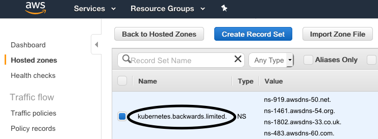
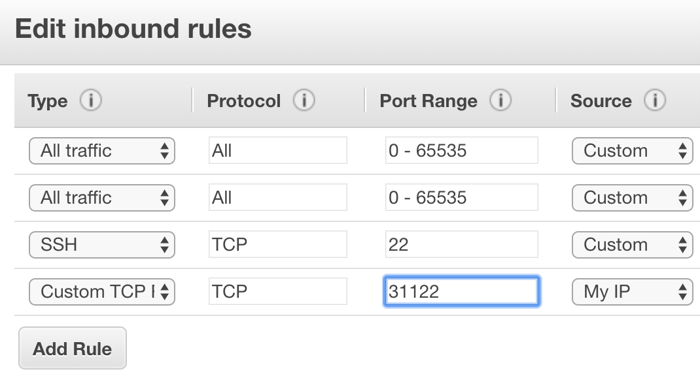

# Kops

Minikube and Docker Client are only for local testing on a one node Kubernetes cluster.

Let's have a look at a production ready cluster on [AWS](https://aws.amazon.com/) using [Kops](https://github.com/kubernetes/kops) (though there are alternatives).
Other useful documentation can be found at [Kubernetes Kops](https://kubernetes.io/docs/setup/custom-cloud/kops/) and [AWS Kops](https://aws.amazon.com/blogs/compute/kubernetes-clusters-aws-kops/).

From above, you should already have Kops and the AWS CLI installed - this will allow us to create a Kubernetes cluster on AWS (making sure you have an AWS account setup).

As a sidenote, we could create a virtual Linux environment with **Vagrant** and in there install everything and then work within that environment. If you wish to do this, follow the next optional section entitled **Kops in Virtual Environment** before proceeding with some AWS:

> 

---

> 

---

> 

---

> 


During the last step, give the new user **Administrion** permissions.

Now, to be able to run commands on AWS from the AWS CLI, either:

- Within your Kops virtual environment (see next optional section)

  ```bash
  aws configure
  ```

  and provide (from the previous AWS setup steps) the **AWS Access Key ID** and **AWS Secret Access Key**.

- Within you local environment where you may already have an AWS account configured, work with AWS [profiles](https://docs.aws.amazon.com/cli/latest/userguide/cli-multiple-profiles.html):

  Open (in an editor) file **~/.aws/credentials** and add the keys to a new profile e.g. **kops**:

  ```
  [kops]
  aws_access_key_id = ...
  aws_secret_access_key = ...
  ```

  and a corresponding entry in **~/.aws/config**:

  ```
  [profile kops]
  region = eu-west-2
  output = json
  ```

  To use a named profile when issuing an AWS command, suffix with **--profile kops**, or for a "session" it would be easier to set the profile and avoid having to always add said suffix:

  ```bash
  export AWS_PROFILE=kops
  ```

Quick note - which AWS region to choose? Why not the closest to your location by using [Cloud Ping](http://cloudping.info).

Time to go back to the AWS console and choose **S3**.

> 

---

> 

---

> 


For the next step you need a **domain name** - so just buy one (I know, what a waste of money but for anyone seriously working on this stuff, they should have a domain name).

> 

---

> 

---

> 

---

> 


Finally the name server URLs that are generated for us have to be added to whichever **domain name provider** you use. Here is a [1 & 1](https://my.1and1.co.uk) example:

> 

---

> 

---

> 

## Launch a Kubernetes cluster on AWS

Firstly, if, like myself, you have multiple AWS accounts and so multiple profiles, select the desire profile to run **kops** e.g.

```bash
export AWS_PROFILE=kops
```

and watch out for selecting the correct region e.g.

```bash
aws ec2 describe-availability-zones --region eu-west-2
```

The following command prepares your cluster:

```bash
kops create cluster \
--name kubernetes.backwards.limited \
--dns-zone kubernetes.backwards.limited \
--zones eu-west-2a \
--state s3://kops-my-kubernetes \
--node-count 2 \
--node-size t2.micro \
--master-size t2.micro
```

The result is a preview to double check before launching.

So let's launch:

```bash
kops update cluster kubernetes.backwards.limited --yes --state=s3://kops-my-kubernetes
```

## Test the Cluster

```bash
$ kubectl get nodes
NAME                                          STATUS    ROLES     AGE       VERSION
ip-172-20-35-203.eu-west-1.compute.internal   Ready     master    4m        v1.10.6
ip-172-20-37-2.eu-west-1.compute.internal     Ready     node      2m        v1.10.6
ip-172-20-60-233.eu-west-1.compute.internal   Ready     node      3m        v1.10.6

$ kubectl run hello-minikube --image=k8s.gcr.io/echoserver:1.4 --port=8080
deployment "hello-minikube" created

$ kubectl expose deployment hello-minikube --type=NodePort
service "hello-minikube" expose

$ kubectl get services
NAME             TYPE        CLUSTER-IP     EXTERNAL-IP   PORT(S)          AGE
hello-minikube   NodePort    100.64.230.8   <none>        8080:31122/TCP   3m
kubernetes       ClusterIP   100.64.0.1     <none>        443/TCP          23m
```

So we have a service deployed and exposed on our cluster.
To access the service we still have to configure firewall rules in AWS:


>

---

> 

---

> 

---

> 


```bash
$ curl 54.229.201.185:31122
CLIENT VALUES:
client_address=172.20.60.233
command=GET
...
```

Finally bring down the cluster after testing:

```bash
kops delete cluster kubernetes.backwards.limited --state=s3://kops-my-kubernetes

kops delete cluster kubernetes.backwards.limited --state=s3://kops-my-kubernetes --yes
```