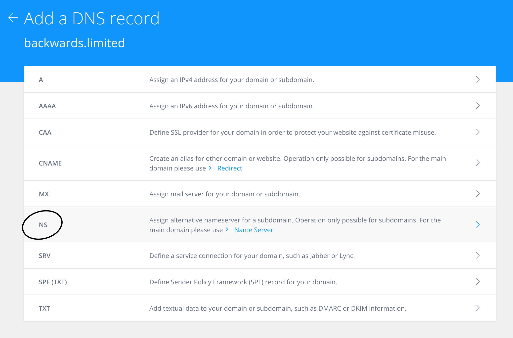

# Kops

Minikube and Docker Client are only for local testing on a one node Kubernetes cluster.

Let's have a look at a production ready cluster on [AWS](https://aws.amazon.com/) using [Kops](https://github.com/kubernetes/kops) (though there are alternatives).

From above, you should already have Kops and the AWS CLI installed - this will allow us to create a Kubernetes cluster on AWS (making sure you have an AWS account setup).

As a sidenote, we could create a virtual Linux environment with **Vagrant** and in there install everything and then work within that environment. If you wish to do this, follow the next optional section entitled **Kops in Virtual Environment** before proceeding with some AWS:

> 


> 


> 


> 


During the last step, give the new user **Administrion** permissions.

Now, to be able to run commands on AWS from the AWS CLI, either:

- Within your Kops virtual environment (see next optional section)

  ```bash
  aws configure
  ```

  and provide (from the previous AWS setup steps) the **AWS Access Key ID** and **AWS Secret Access Key**.

- Within you local environment where you may already have an AWS account configured, work with AWS [profiles](https://docs.aws.amazon.com/cli/latest/userguide/cli-multiple-profiles.html):

  Open (in an editor) file **~/.aws/credentials** and add the keys to a new profile e.g. **kops**:

  ```
  [kops]
  aws_access_key_id = ...
  aws_secret_access_key = ...
  ```

  and a corresponding entry in **~/.aws/config**:

  ```
  [profile kops]
  region = eu-west-1
  output = json
  ```

  To use a named profile when issuing an AWS command, suffix with **--profile kops**, or for a "session" it would be easier to set the profile and avoid having to always add said suffix:

  ```bash
  export AWS_PROFILE=kops
  ```

Quick note - which AWS region to choose? Why not the closest to your location by using [Cloud Ping](http://cloudping.info).

Time to go back to the AWS console and choose **S3**.

> 


> 


> 


For the next step you need a **domain name** - so just buy one (I know, what a waste of money but for anyone seriously working on this stuff, they should have a domain name).

> 


> 


> 


> 


Finally the name server URLs that are generated for us have to be added to whichever **domain name provider** you use. Here is a [1 & 1](https://my.1and1.co.uk) example:

> 


> 


> 


## Kops in Virtual Environment (Optional)

Firstly some [Vagrant](http://sourabhbajaj.com/mac-setup/Vagrant/README.html) setup which will provide a **Linux** virtual environment, no matter which OS you are running on.

If you have issues with setting up Vagrant (in the steps below as I did) this may be because of already having Vagrant configured but with incompatible library versions, firstly run:

```bash
vagrant plugin expunge
```

Now we can proceed:

```bash
cd ~

mkdir ubuntu

cd ubuntu

vagrant init ubuntu/xenial64

vagrant up

vagrant ssh-config

vagrant ssh
```

Your prompt will end up as:

```bash
vagrant@ubuntu-xenial:~$
```

At your "new" prompt we shall install Kops:

```bash
curl -LO https://github.com/kubernetes/kops/releases/download/$(curl -s https://api.github.com/repos/kubernetes/kops/releases/latest | grep tag_name | cut -d '"' -f 4)/kops-linux-amd64

chmod +x kops-linux-amd64

sudo apt-get install python-pip

sudo pip install awscli
```

When you are done with the environment, don't forget to cleanup:

```bash
vagrant halt
```