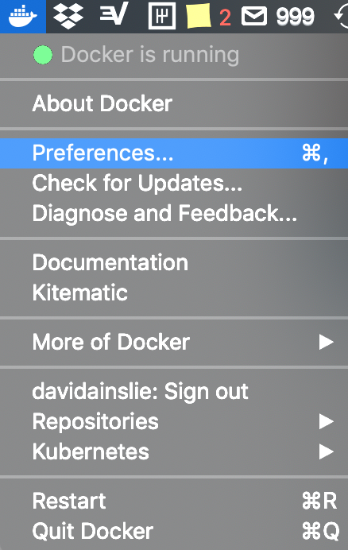
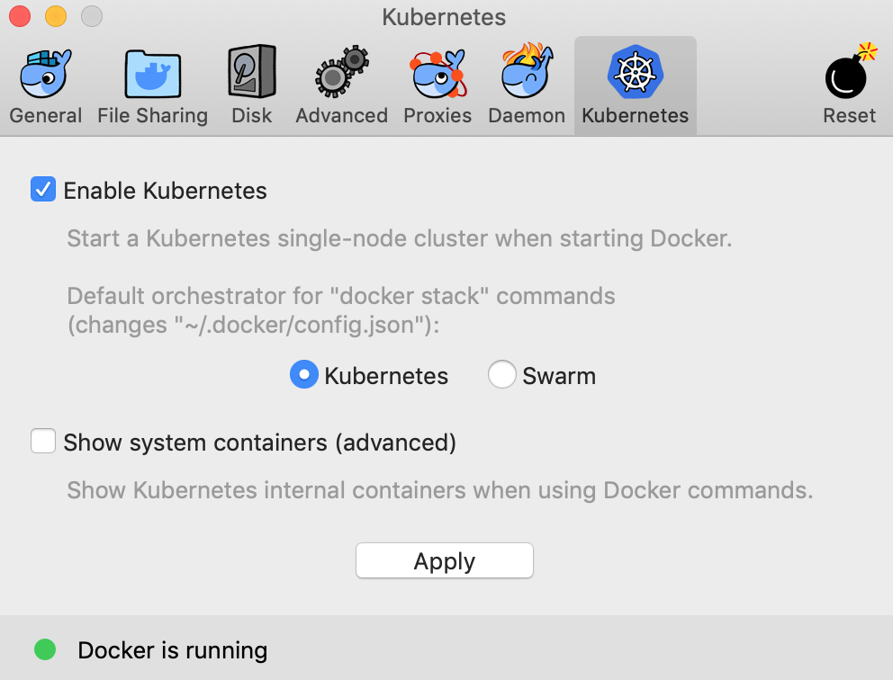

# Local Kubernetes with Docker Client

This is an alternative to Minikube using the latest [Docker Client](https://store.docker.com/editions/community/docker-ce-desktop-mac).
The following screenshots show a Kubernetes cluster being enabled locally with the Mac Docker Client:

> 


> 


Upon clicking **Apply** the first time it will take a while to download all necessaries and then you'll have a Kubernetes cluster running locally. Let's check:

```bash
kubectl get nodes
```

Now this may fail if you had Kubernetes running locally by some other means, such as Minikube. Kubernetes can have multiple **contexts** - take a look at:

```bash
kubectl config get-contexts
```

e.g. a condensed list of my contexts are:

| CURRENT | NAME               | CLUSTER                    | AUTHINFO           | NAMESPACE |
| ------- | :----------------: | :------------------------: | :----------------: | :-------: |
|         | docker-for-desktop | docker-for-desktop-cluster | docker-for-desktop |           |
| 		    | local              | default-cluster            | default-admin      |           |
| *       | minikube           | minikube                   | minikube           |           |

In the above case, we have to switch contexts:

```bash
kubectl config use-context docker-for-desktop
```

And now:

```bash
$ kubectl get nodes
NAME                 STATUS    ROLES     AGE       VERSION
docker-for-desktop   Ready     master    32m       v1.10.3
```

(P.S. You can also change the context in the Docker Client e.g. Menu bar > Kubernetes > Select a context).

Let's run the same image we used for Minikube but with a different name:

```bash
kubectl run hello-kubernetes --image=gcr.io/google_containers/echoserver:1.4 --port=8080

kubectl expose deployment hello-kubernetes --type=NodePort

kubectl get service hello-kubernetes
NAME               TYPE       CLUSTER-IP      EXTERNAL-IP   PORT(S)          AGE
hello-kubernetes   NodePort   10.99.253.209   <none>        8080:30115/TCP   3m
```

And this time we can check the deployed application on **localhost** along with the dynamically exposed port:

```bash
curl localhost:30115
```