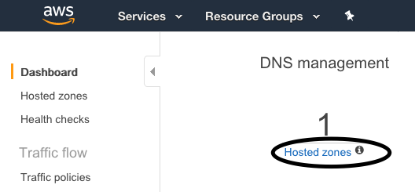

# The Complete Kubernetes Course

Following the excellent [The Complete Kubernetes Course](https://www.udemy.com/learn-devops-the-complete-kubernetes-course)

## Domain Name

For this example we are using [AWS Route 53](https://console.aws.amazon.com/route53/home#Dashboard).

> 