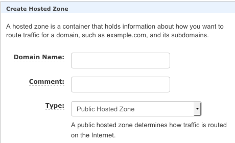
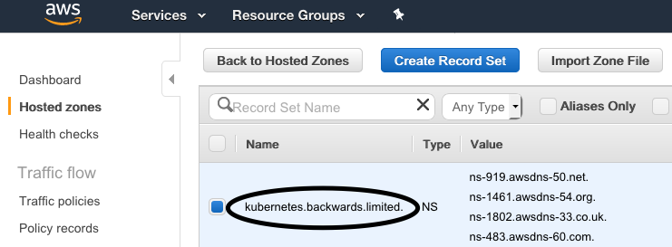

# The Complete Kubernetes Course

Following the excellent [The Complete Kubernetes Course](https://www.udemy.com/learn-devops-the-complete-kubernetes-course)

## Domain Name

As already mentioned, for this example we are using [AWS Route 53](https://console.aws.amazon.com/route53/home#Dashboard).

> 

We already created a [hosted zone](https://console.aws.amazon.com/route53/home#hosted-zones) and added the generated "name server values" into our domain name provider's portal.

> 

Now let's check everything is fine:

> 

On your Mac command line:

```bash
$ host -t NS kubernetes.backwards.limited
kubernetes.backwards.limited name server ns-483.awsdns-60.com.
kubernetes.backwards.limited name server ns-919.awsdns-50.net.
kubernetes.backwards.limited name server ns-1461.awsdns-54.org.
kubernetes.backwards.limited name server ns-1802.awsdns-33.co.uk.
```

As shown, the command result should match NS values.

If you (optionally) set up Vagrant, we can do the same in said environment - Start up Vagrant:

```bash
cd ~/ubuntu
vagrant up
vagrant ssh
sudo apt install bind9-host
host -t NS kubernetes.backwards.limited
```

The last command result should match NS values.