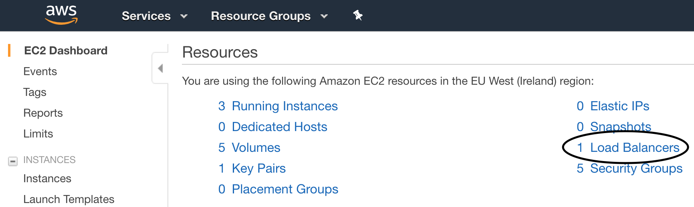
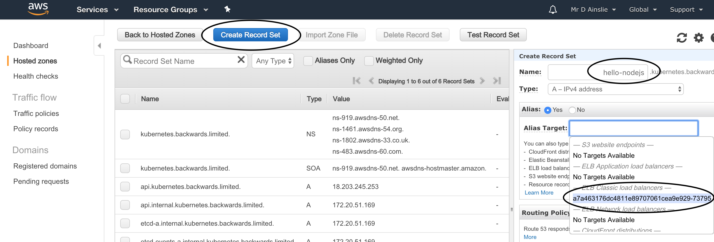

# App 1 - NodeJS Container Deployed to Kubernetes

## Build and Execute

```bash
$ docker build .
...
Successfully built 21b629e52df7

$ docker run -p 3000:3000 -t 21b629e52df7
```

```bash
$ curl localhost:3000
Hello NodeJS World
```

## Docker Registry

As Kubernetes looks up a docker image in a registry, let's push the above image to [Dockerhub](https://hub.docker.com/) or any other docker registry:

```bash
docker login --username=<your login> --password=<your password>

docker tag <image-id> <your login>/hello-nodejs

docker push <your login>/hello-nodejs
```

Note, we could have tagged the image while building to avoid doing step 2 above e.g.

```bash
docker build -t davidainslie/hello-nodejs .
```

and to build and tag a newer version (the previous command builds/tags as **latest**):

```bash
docker build -t davidainslie/hello-nodejs:1.0.1 .

docker push davidainslie/hello-nodejs
OR
docker push davidainslie/hello-nodejs:1.0.1
```

## Kubernetes Deployment

As explained before, we first need a cluster - let's just use minikube:

```bash
$ minikube start

$ kubectl get nodes
NAME       STATUS    ROLES     AGE       VERSION
minikube   Ready     master    3m        v1.10.0
```

Create a Kubernetes deployment, in this case using a **pod** definition:

```bash
$ kubectl create -f app-1-pod.yml
pod "app-1" created

$ kubectl get pods
NAME           READY     STATUS              RESTARTS   AGE
app-1          0/1       ContainerCreating   0          3s

$ kubectl describe pod app-1
Name:         app-1
...

$ kubectl logs app-1
...
> myapp@0.0.1 start /app
```

If you make a mistake along the way and wish to start again:

```bash
kubectl delete pods --all
```

## Deployment as a Service - Part 1

There are different ways to expose the deployment as a service.

- Port foward:

  ```bash
  $ kubectl port-forward app-1 8081:3000
  Forwarding from 127.0.0.1:8081 -> 3000
  
  $ curl localhost:8081
  Hello NodeJS World
  ```

- Expose service:

  ```bash
  $ kubectl expose pod app-1 --type NodePort --name app-1-service
  service "app-1-service" exposed
  
  $ minikube service app-1-service --url
  http://192.168.99.100:31740
  
  $ curl http://192.168.99.100:31740
  Hello NodeJS World
  ```

## Kubernetes Cluster Interaction

There are various ways to interact with our cluster. Here is an example of starting up another pod to then directly interact with the pod that houses our deployed service.

```bash
$ kubectl describe service app-1-service
Name:                     app-1-service
...
Endpoints:                172.17.0.7:3000
...
```

Other pods within the cluster can directly use our service's **Endpoint**.

```bash
$ kubectl run -i --tty busybox --image busybox --restart Never -- sh
/ # telnet 172.17.0.7 3000
GET /

HTTP/1.1 200 OK
...
Hello NodeJS World
```

Note that **curl** is not available within **busybox** so we just use **telent**.

## AWS ELB LoadBalancer

Up until now, we've been working on Minikube. Now to take this service into the real world.

Just as with Minikube, we need a cluster set up on our cloud provider - we already went through this so the explanations here will be more to the point.

- Launch cluster on AWS

  ```bash
  $ export AWS_PROFILE=kops
  
  $ kops create cluster \
  --name kubernetes.backwards.limited \
  --dns-zone kubernetes.backwards.limited \
  --zones eu-west-1a \
  --state s3://kops-my-kubernetes \
  --node-count 2 \
  --node-size t2.micro \
  --master-size t2.micro
  
  $ kops update cluster kubernetes.backwards.limited --yes --state=s3://kops-my-kubernetes
  
  $ kops validate cluster --state s3://kops-my-kubernetes
  Using cluster from kubectl context: kubernetes.backwards.limited
  
  Validating cluster kubernetes.backwards.limited
  
  INSTANCE GROUPS
  NAME                ROLE      MACHINETYPE    MIN    MAX   SUBNETS
  master-eu-west-1a   Master    t2.micro       1      1     eu-west-1a
  nodes               Node      t2.micro       2      2     eu-west-1a
  ```

- Deploy service

  ```bash
  $ kubectl create -f app-1-pod.yml
  pod "app-1" created
  
  $ kubectl create -f app-1-service.yml
  service "app-1-service" created
  ```

  > 

​	

 - Test service

   ```bash
   $ curl http://hello-nodejs.kubernetes.backwards.limited
   Hello NodeJS World
   ```

- Shutdown

  ```bash
  kops delete cluster kubernetes.backwards.limited --state=s3://kops-my-kubernetes
  
  kops delete cluster kubernetes.backwards.limited --state=s3://kops-my-kubernetes --yes
  ```

## Replication Controller / ReplicaSet

Let's auto scale our service via **replication controllers**. With a local **minikube** running:

```bash
$ kubectl create -f app-1-replication-controller.yml

$ kubectl get pods
NAME                            READY     STATUS    RESTARTS   AGE
app-1-controller-5ksxw   1/1    Running   0          4s
app-1-controller-h5zfq   1/1    Running   0          4s
```

In this case 2 pods will be instantiated. If we wish to bring them down:

```bash
kubectl delete -f app-1-replication-controller.yml
```

Bring down one pod and another will automatically come up:

```bash
$ kubectl delete pod app-1-controller-5ksxw

$ kubectl get pods
NAME                            READY     STATUS        RESTARTS   AGE
app-1-controller-5ksxw   1/1    Terminating   0          4m
app-1-controller-8w54v   1/1    Running       0          0s
app-1-controller-h5zfq   1/1    Running       0          4m
```

Scale up:

```bash
$ kubectl scale --replicas=5 -f app-1-replication-controller.yml

$ kubectl get pods
NAME                            READY     STATUS              RESTARTS   AGE
app-1-controller-4b9xb   1/1    Running             0          0s
app-1-controller-8w54v   1/1    Running             0          2m
app-1-controller-frplw   0/1    ContainerCreating   0          0s
app-1-controller-h5zfq   1/1    Running             0          6m
app-1-controller-lqpw7   0/1    ContainerCreating   0          0s
```

Scale again (slightly differently):

```bash
$ kubectl get rc
NAME                      DESIRED   CURRENT   READY     AGE
app-1-controller          5         5         5         8m

$ kubectl scale --replicas=1 rc/app-1-controller
NAME                            READY     STATUS        RESTARTS   AGE
app-1-controller-4b9xb          1/1       Terminating   0          3m
app-1-controller-8w54v          1/1       Terminating   0          5m
app-1-controller-frplw          1/1       Terminating   0          3m
app-1-controller-h5zfq          1/1       Running       0          10m
app-1-controller-lqpw7          1/1       Terminating   0          3m
```

And finally delete:

```bash
kubectl delete rc/app-1-controller
```

Note that **ReplicaSet** is just the next generation **Replication Controller**.

However, it is best to use a **deployment**.

## Deployment

Deploy:

```bash
$ kubectl create -f app-1-deployment.yml

$ kubectl get deployments
NAME                      DESIRED   CURRENT   UP-TO-DATE   AVAILABLE   AGE
app-1-deployment          3         3         3            3           7s

$ kubectl get replicaset
NAME                                DESIRED   CURRENT   READY     AGE
app-1-deployment-54cbb9dcd          3         3         3         1m

$ kubectl get pods --show-labels
NAME                              READY  STATUS   RESTARTS  AGE  LABELS
app-1-deployment-f7b6979dd-bljqd  1/1    Running  0         9m   app=app-1
app-1-deployment-f7b6979dd-j8s6n  1/1    Running  0         9m   app=app-1
app-1-deployment-f7b6979dd-z99wl  1/1    Running  0         9m   app=app-1
```

Expose service:

```bash
$ kubectl expose deployment app-1-deployment --type=NodePort
service "app-1-deployment" exposed

$ kubectl get services
NAME               TYPE        CLUSTER-IP      EXTERNAL-IP   PORT(S)          AGE
app-1-deployment   NodePort    10.98.179.136   <none>        3000:30455/TCP   33s
kubernetes         ClusterIP   10.96.0.1       <none>        443/TCP          40m

$ kubectl describe service app-1-deployment
Name:                     app-1-deployment
Namespace:                default
Labels:                   app=app-1
Annotations:              <none>
Selector:                 app=app-1
Type:                     NodePort
IP:                       10.98.179.136
Port:                     <unset>  3000/TCP
TargetPort:               3000/TCP
NodePort:                 <unset>  30455/TCP
Endpoints:                172.17.0.7:3000,172.17.0.8:3000,172.17.0.9:3000
Session Affinity:         None
External Traffic Policy:  Cluster
Events:                   <none>
```

and check the app/service:

```bash
$ http $(minikube service app-1-deployment --url)
HTTP/1.1 200 OK
Connection: keep-alive
Content-Length: 18
Content-Type: text/html; charset=utf-8
Date: Mon, 05 Nov 2018 11:08:56 GMT
ETag: W/"12-vI1WomQOBH5Oo8OGm4j3tKeWkGI"
X-Powered-By: Express

Hello NodeJS World
```

Rollout a new version:

```bash
$ kubectl set image deployment/app-1-deployment app-1=davidainslie/hello-nodejs:1.0.1
deployment "app-1-deployment" image updated
```

Rollout status:

```bash
$ kubectl rollout status deployment/app-1-deployment
deployment "app-1-deployment" successfully rolled out
```

and again check the service to (hopefully) see a new message:

```bash
$ http $(minikube service app-1-deployment --url)
HTTP/1.1 200 OK
Connection: keep-alive
Content-Length: 24
Content-Type: text/html; charset=utf-8
Date: Mon, 05 Nov 2018 11:21:55 GMT
ETag: W/"18-Ryncjbdh8wfos2XOKZDpa8YBfqg"
X-Powered-By: Express

Hello Again NodeJS World
```

Rollout history:

```bash
$ kubectl rollout history deployment/app-1-deployment
deployments "app-1-deployment"
REVISION  CHANGE-CAUSE
1         <none>
2         <none>
```

Rollback to previous version:

```bash
$ kubectl rollout undo deployment/app-1-deployment
deployment "app-1-deployment"

$ kubectl get pods
NAME                               READY     STATUS        RESTARTS   AGE
app-1-deployment-598d76fd-758sw    1/1       Terminating   0          5m
app-1-deployment-598d76fd-nmzdp    1/1       Terminating   0          5m
app-1-deployment-598d76fd-t9bnm    1/1       Terminating   0          5m
app-1-deployment-f7b6979dd-mffv9   1/1       Running       0          6s
app-1-deployment-f7b6979dd-rm78x   1/1       Running       0          10s
app-1-deployment-f7b6979dd-wvs52   1/1       Running       0          2s
```

and again check the service message shows the original:

```bash
$ http $(minikube service app-1-deployment --url)
HTTP/1.1 200 OK
Connection: keep-alive
Content-Length: 18
Content-Type: text/html; charset=utf-8
Date: Mon, 05 Nov 2018 11:27:32 GMT
ETag: W/"12-vI1WomQOBH5Oo8OGm4j3tKeWkGI"
X-Powered-By: Express

Hello NodeJS World
```

Or rollback to specific version:

```bash
kubectl rollout undo deployment/app-1-deployment --to-revision=1
```

## Deployment as a Service - Part 2

Part 1 showed **port forwarding** which is fine for testing. Let's instead have a **service yaml**, first of all with a static **node port**:

```yaml
apiVersion: v1
kind: Service
metadata:
  name: app-1-service
spec:
  selector:
    app: app-1
  type: NodePort
  ports:
    - port: 31001
      nodePort: 31001
      targetPort: app-port
      protocol: TCP
```

Now deploy and expose service:

```bash
$ kubectl create -f app-1-deployment.yml
deployment "app-1-deployment" created

$ kubectl create -f app-1-nodeport-service.yml
service "app-1-service" created

$ http $(minikube service app-1-service --url)
HTTP/1.1 200 OK
...
Hello NodeJS World
```

Delete the service and then alter **service** so that an available **node port** is automatically generated:

```bash
$ kubectl delete service app-1-service
service "app-1-service" deleted
```

```yaml
apiVersion: v1
kind: Service
metadata:
  name: app-1-service
spec:
  selector:
    app: app-1
  type: NodePort
  ports:
    - port: 80
      targetPort: app-port
      protocol: TCP
```

```bash
$ kubectl create -f app-1-nodeport-service.yml
service "app-1-service" created

$ kubectl get services
NAME               TYPE        CLUSTER-IP      EXTERNAL-IP   PORT(S)          AGE
app-1-service      NodePort    10.111.64.174   <none>        80:30368/TCP     8s

$ minikube service app-1-service --url
http://192.168.99.100:30368

$ http http://192.168.99.100:30368
HTTP/1.1 200 OK
...
Hello NodeJS World
```

## Node Selector

How about deploying a pod to a node with desired attributes? Here is a configuration that declares a required **node selector**:

```yaml
apiVersion: apps/v1
kind: Deployment
metadata:
  name: app-1-deployment
spec:
  replicas: 3
  revisionHistoryLimit: 100
  selector:
    matchLabels:
      app: app-1
  template:
    metadata:
      labels:
        app: app-1
    spec:
      containers:
        - name: app-1
          image: davidainslie/hello-nodejs
          ports:
            - name: app-port
              containerPort: 3000
      nodeSelector:
        hardware: high-spec
```

Let's deploy and see what goes wrong:

```bash
$ kubectl create -f app-1-node-selector-deployment.yml
deployment "app-1-deployment" created

$ kubectl get pods
NAME                               READY     STATUS    RESTARTS   AGE
app-1-deployment-84d4f9679-6dpvr   0/1       Pending   0          17s
app-1-deployment-84d4f9679-9sj25   0/1       Pending   0          17s
app-1-deployment-84d4f9679-tpr45   0/1       Pending   0          17s

$ kubectl describe pod app-1-deployment-84d4f9679-6dpvr
Name:           app-1-deployment-84d4f9679-6dpvr
...
Events:
  Type     Reason            Age               From               Message
  ----     ------            ----              ----               -------
  Warning  FailedScheduling  0s (x10 over 2m)  default-scheduler  0/1 nodes are available: 1 node(s) didn't match node selector.
```

To resolve, label our (one and only) node that is named **minikube**  - indeed minikube only ever has one node:

```bash
$ kubectl label nodes minikube hardware=high-spec
node "minikube" labeled

$ kubectl get nodes --show-labels
NAME       STATUS    ROLES     AGE       VERSION   LABELS
minikube   Ready     master    2h        v1.10.0   beta.kubernetes.io/arch=amd64,beta.kubernetes.io/os=linux,hardware=high-spec,kubernetes.io/hostname=minikube,node-role.kubernetes.io/master=
```

and soon after our deployment will be up:

```bash
$ kubectl get pods
NAME                               READY     STATUS    RESTARTS   AGE
app-1-deployment-84d4f9679-6dpvr   1/1       Running   0          11m
app-1-deployment-84d4f9679-9sj25   1/1       Running   0          11m
app-1-deployment-84d4f9679-tpr45   1/1       Running   0          11m
```

