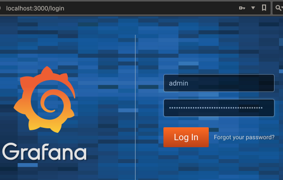

# Resource Monitoring

Originally [Heapster](https://github.com/kubernetes/heapster) was used in conjunction with the likes of **InfluxDB** and **Grafana** for **container cluster monitoring** and **performance analysis**. This has been deprecated in favour of [metrics server](https://github.com/kubernetes-incubator/metrics-server).

You can clone the repository and get all the yaml files under the directory **deploy/1.8+**.

## Example on Minikube

Note, I've never actually accessed metrics this way - but the next section works.

Within this directory:

```bash
$ minikube start

$ minikube addons enable metrics-server

$ kubectl create -f .
clusterrole "system:aggregated-metrics-reader" created
clusterrolebinding "metrics-server:system:auth-delegator" created
rolebinding "metrics-server-auth-reader" created
apiservice "v1beta1.metrics.k8s.io" created
serviceaccount "metrics-server" created
deployment "metrics-server" created
service "metrics-server" created
clusterrole "system:metrics-server" created
clusterrolebinding "system:metrics-server" created
```

Before any metrics are produced we need "something", so we'll start some service (any service should do):

```bash
$ kubectl run up-and-running-for-metrics --image=k8s.gcr.io/echoserver:1.4 --port=8080
deployment "up-and-running-for-metrics" created

$ kubectl expose deployment up-and-running-for-metrics --type=LoadBalancer
service "up-and-running-for-metrics" exposed

$ http $(minikube service up-and-running-for-metrics --url)
```

and hopefully we'll get some metrics:

```bash
$ kubectl top node
```

For whatever reason, the above gives me the following error:

```bash
Error from server (NotFound): the server could not find the requested resource (get services http:heapster:)
```

## Example on Minikube with Helm, Prometheus, Grafana

Hopefully you have Helm installed having followed the setup documentation.

Watch out as some of the output from the following commands are important and are used later.

```bash
$ minikube start

$ helm repo update

$ helm init

$ kubectl get pods --all-namespaces=true

$ helm install --name prometheus stable/prometheus
...
NOTES:
The Prometheus server can be accessed via port 80 on the following DNS name from within your cluster:
prometheus-server.default.svc.cluster.local

Get the Prometheus server URL by running these commands in the same shell:
  export POD_NAME=$(kubectl get pods --namespace default -l "app=prometheus,component=server" -o jsonpath="{.items[0].metadata.name}")
  kubectl --namespace default port-forward $POD_NAME 9090

The Prometheus alertmanager can be accessed via port 80 on the following DNS name from within your cluster:
prometheus-alertmanager.default.svc.cluster.local

Get the Alertmanager URL by running these commands in the same shell:
  export POD_NAME=$(kubectl get pods --namespace default -l "app=prometheus,component=alertmanager" -o jsonpath="{.items[0].metadata.name}")
  kubectl --namespace default port-forward $POD_NAME 9093

The Prometheus PushGateway can be accessed via port 9091 on the following DNS name from within your cluster:
prometheus-pushgateway.default.svc.cluster.local

Get the PushGateway URL by running these commands in the same shell:
  export POD_NAME=$(kubectl get pods --namespace default -l "app=prometheus,component=pushgateway" -o jsonpath="{.items[0].metadata.name}")
  kubectl --namespace default port-forward $POD_NAME 9091

$ kubectl get pods --all-namespaces=true

$ helm install --name grafana stable/grafana

$ kubectl get pods --all-namespaces=true
```

To access prometheus in browser:

```bash
$ export POD_NAME=$(kubectl get pods --namespace default -l "app=prometheus,component=server" -o jsonpath="{.items[0].metadata.name}")

$ kubectl --namespace default port-forward $POD_NAME 9090
Forwarding from 127.0.0.1:9090 -> 9090
```

Open up browser at: http://localhost:9090/targets

Now, lookup admin password for logging into Grafana

```bash
$ kubectl get secret --namespace default grafana -o jsonpath="{.data.admin-password}" | base64 --decode ; echo
Tl8iM26UV2FG4ravCwMIWfDgKYelNNO8r5VM6006
```

To access grafana in browser:

```bash
$ export POD_NAME=$(kubectl get pods --namespace default -l "app=grafana" -o jsonpath="{.items[0].metadata.name}")

$ kubectl --namespace default port-forward $POD_NAME 3000
Forwarding from 127.0.0.1:3000 -> 3000
```

Open up browser at: http://localhost:3000

> 

Click add a **datasource** and enter in the url for prometheus we got above.

From above, we provide: http://prometheus-server.default.svc.cluster.local