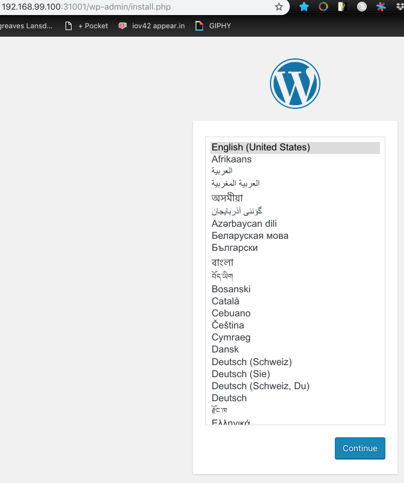

# Secrets

- Secrets using files:

  ```bash
  $ echo -n "user" > ./user
  $ echo -n "password" > ./password

  $ kubectl create secret generic my-credentials --from-file=./user --from-file=./password
  secret "my-credentials" created
  ```

- Secrets from SSH key or SSL certificate:

  ```bash
  kubectl create secret generic my-credentials --from-file=ssh-private=~/.ssh/id_rsa --ssl-cert=ssl-cert=my-ssl-cert.crt
  ```

- Secrets using yaml

  Secrets to be added to yaml need to be in **base 64**:

  ```bash
  $ echo -n "user" | base64
  dXNlcg==
  
  $ echo -n "password" | base64
  cGFzc3dvcmQ=
  ```

  Add to a **Secret** definition (named maybe my-secret.yml):

  ```yaml
  apiVersion: v1
  kind: Secret
  metadata:
    name: my-credentials
  type: Opaque
  data:
    user: dXNlcg==
    password: cGFzc3dvcmQ=
  ```

  then **create**:

  ```bash
  $ kubectl create -f my-secret.yml
  secret "my-credentials" created
  ```

## Deploy Secrets Simple

```bash
$ minikube start

$ kubectl create -f app-3-simple-secrets.yml
secret "my-credentials" created

$ kubectl create -f app-3-simple-deployment.yml
deployment "app-3" created

$ kubectl get pods
NAME                    READY     STATUS    RESTARTS   AGE
app-3-7bb8cd657-564z8   1/1       Running   0          47s
app-3-7bb8cd657-d8wlc   1/1       Running   0          47s
app-3-7bb8cd657-qf7c6   1/1       Running   0          47s

$ kubectl describe pod app-3-7bb8cd657-564z8
Name:           app-3-7bb8cd657-564z8
...
    Mounts:
      /etc/credentials from credentials-volume (ro)
...
Volumes:
  credentials-volume:
    Type:        Secret (a volume populated by a Secret)
    SecretName:  my-credentials
    Optional:    false
...

$ kubectl exec -it app-3-7bb8cd657-564z8 -- /bin/bash
root@app-3-7bb8cd657-564z8:/app# ls -las /etc/credentials
...
0 lrwxrwxrwx 1 root root   31 Nov  5 17:08 ..data -> ..2018_11_05_17_08_14.093506560
0 lrwxrwxrwx 1 root root   15 Nov  5 17:08 password -> ..data/password
0 lrwxrwxrwx 1 root root   11 Nov  5 17:08 user -> ..data/user

userroot@app-3-7bb8cd657-564z8:/app# more /etc/credentials/user
user

userroot@app-3-7bb8cd657-564z8:/app# more /etc/credentials/password
password

userroot@app-3-7bb8cd657-564z8:/app# mount
...
tmpfs on /etc/credentials type tmpfs (ro,relatime)
```

Finally we can remove **secrets** in similar fashion to **deployments**:

```bash
$ kubectl get secrets
NAME                  TYPE                                  DATA      AGE
default-token-74ttt   kubernetes.io/service-account-token   3         6h
my-credentials        Opaque                                2         17m

$ kubectl delete secret my-credentials
secret "my-credentials" deleted

$ kubectl get secrets
NAME                  TYPE                                  DATA      AGE
default-token-74ttt   kubernetes.io/service-account-token   3         6h

$ kubectl delete deployments --all
```

## Deploy Secrets including Environment Variables

```bash
$ minikube start

$ kubectl create -f app-3-secrets.yml
secret "wordpress-secrets" created

$ kubectl create -f app-3-deployment.yml
deployment "app-3" created

$ kubectl create -f app-3-service.yml
service "app-3-service" created

$ minikube service app-3-service --url
http://192.168.99.100:31001
```

> 