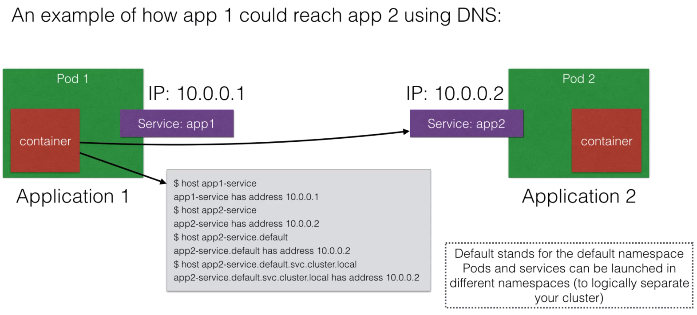
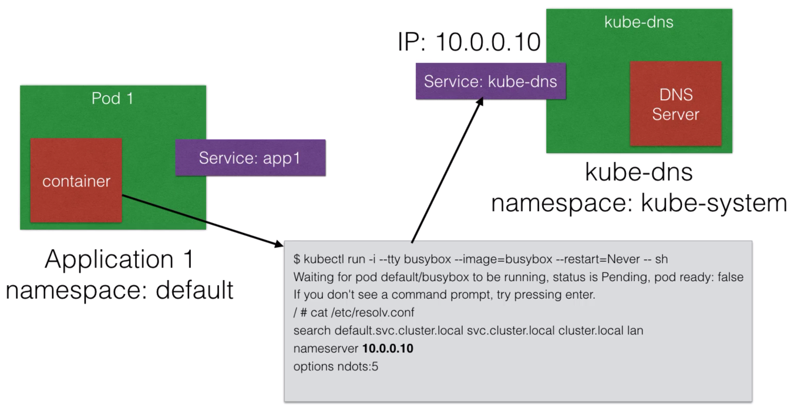

# App 5 - DNS

> 


> 


So let's have a service in one pod, connecting to another service in another pod.

We start up a database service (mysql) in one pod, and connect to it a webapp (nodejs) from another pod:

```bash
$ minikube start

$ kubectl create -f database-secrets.yml
secret "database-secrets" created

$ kubectl create -f database.yml
pod "database" created

$ kubectl create -f database-service.yml
service "database-service" created

$ kubectl create -f webapp.yml
deployment "webapp-deployment" created

$ kubectl create -f webapp-service.yml
service "webapp-service" created
```

And finally we check the service:

```bash
$ http $(minikube service webapp-service --url)
HTTP/1.1 200 OK
...
Hello World! You are visitor number 1

$ http $(minikube service webapp-service --url)
HTTP/1.1 200 OK
...
Hello World! You are visitor number 2
```

Let's double check the database:

```bash
$ kubectl exec database -it -- mysql -u root -p
Enter password: rootpassword
...
mysql> show databases;
+--------------------+
| Database           |
+--------------------+
| ...                |
| helloworld         |
| ...                |
+--------------------+

mysql> use helloworld;

mysql> show tables;
+----------------------+
| Tables_in_helloworld |
+----------------------+
| visits               |
+----------------------+

mysql> select * from visits;
+----+---------------+
| id | ts            |
+----+---------------+
|  1 | 1541850428789 |
|  2 | 1541850560796 |
+----+---------------+
```

Let's also check the DNS (even though it obviously works if we got this far):

```bash
$ kubectl run -i --tty busybox --image=busybox --restart=Never -- sh
If you don't see a command prompt, try pressing enter.
/ # nslookup webapp-service
```