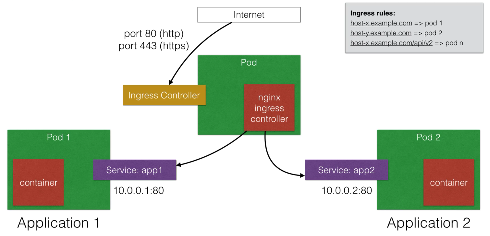

# Ingress

- Ingress allows inbound connections to the cluster
- Ingress is an alternative to **Loadbalancer** and **nodePorts**
  - Ingress allows you to expose services that need to be accessible from outside the cluster
- With ingress, you can run your own **ingress controller** (basically a loadbalancer) within a cluster
- There are default ingress controllers or you can write your own

>


You can create ingress rules using the **ingress object**:

```yaml
# An Ingress with 2 hosts and 3 endpoints
apiVersion: extensions/v1beta1
kind: Ingress
metadata:
  name: my-ingress-rules
spec:
  rules:
    - host: webapp-v1.example.com
      http:
        paths:
          - path: /
            backend:
              serviceName: webapp-v1
              servicePort: 80
    - host: webapp-v2.example.com
      http:
        paths:
        - path: /
          backend:
            serviceName: webapp-v2
            servicePort: 80
```

## Example

We'll use an existing [ingress controller](https://raw.githubusercontent.com/kubernetes/ingress-nginx/master/deploy/mandatory.yaml).

```bash
$ kubectl create -f ingress.yml
ingress "my-ingress-rules" created

$ kubectl create -f nginx-ingress-controller.yml
daemonset "nginx-ingress-controller" created
configmap "nginx-configuration" created
configmap "tcp-services" created
configmap "udp-services" created
serviceaccount "nginx-ingress-serviceaccount" created
clusterrole "nginx-ingress-clusterrole" created
role "nginx-ingress-role" created
rolebinding "nginx-ingress-role-nisa-binding" created
clusterrolebinding "nginx-ingress-clusterrole-nisa-binding" created

$ kubectl create -f echoservice.yml
replicationcontroller "echoheaders" created
service "echoheaders-default" created
```

and our apps:

```bash
$ kubectl create -f webapp-v1.yml
deployment "webapp-v1-deployment" created
service "webapp-v1" created

$ kubectl create -f webapp-v2.yml
deployment "webapp-v2-deployment" created
service "webapp-v2" created
```

```bash
$ kubectl get pods
NAME                                    READY     STATUS    RESTARTS   AGE
echoheaders-fhwfw                       1/1       Running   0          15m
webapp-v1-deployment-644b89755b-7l85p   1/1       Running   0          3m
webapp-v2-deployment-67b846788c-5p8x8   1/1       Running   0          3m

$ kubectl get services
NAME                  TYPE        CLUSTER-IP       EXTERNAL-IP   PORT(S)        AGE
echoheaders-default   NodePort    10.104.87.114    <none>        80:30302/TCP   15m
kubernetes            ClusterIP   10.96.0.1        <none>        443/TCP        1h
webapp-v1             NodePort    10.107.144.247   <none>        80:30303/TCP   4m
webapp-v2             NodePort    10.100.117.179   <none>        80:30304/TCP   3m
```

```bash
$ curl $(minikube ip) -H 'Host: webapp-v1.example.com'
Hello Again NodeJS World!

$ curl $(minikube ip) -H 'Host: webapp-v2.example.com'
I said, Hello World!
```

