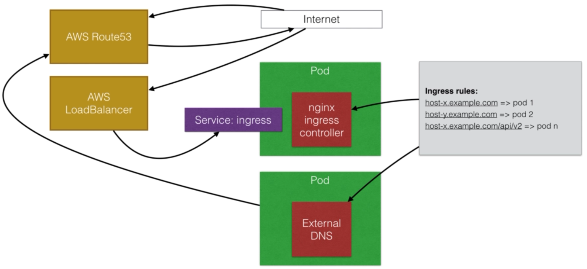

# External DNS

>


- [External DNS](https://github.com/kubernetes-incubator/external-dns) is a tool that will automatically create the necessary DNS records in your external DNS server, such as Route53
- For every hostname that you use in ingress, it will create a new record to send traffic to your loadbalancer
- The major DNS providers are supported, such as Google CloudDNS, Route53, AzureDNS

## Example on AWS

Get cluster up:

```bash
$ export AWS_PROFILE=kops

$ kops create cluster \
--name kubernetes.backwards.limited \
--dns-zone kubernetes.backwards.limited \
--zones eu-west-2a \
--state s3://kops-my-kubernetes \
--node-count 2 \
--node-size t2.micro \
--master-size t2.micro

$ kops update cluster kubernetes.backwards.limited --yes --state=s3://kops-my-kubernetes
```

Apply all configurations:

```bash
$ kubectl apply -f .

$ kubectl get services
NAME                 TYPE         CLUSTER-IP     EXTERNAL-IP   PORT(S)
echoheaders-default  NodePort     100.65.84.87   <none>        80:30302/TCP
helloworld-v1        NodePort     100.66.254.37  <none>        80:30303/TCP
helloworld-v2        NodePort     100.71.247.135 <none>        80:30304/TCP
ingress-nginx        LoadBalancer 100.66.5.23    a5edbee28e517 80:30539/TCP,443:30939/TCP
kubernetes           ClusterIP    100.64.0.1     <none>        443/TCP

$ kubectl get service ingress-nginx -o wide
NAME          TYPE         CLUSTER-IP  EXTERNAL-IP             PORT(S)
ingress-nginx LoadBalancer 100.66.5.23 a5edbee28e51711e8b4380649735a199-282817696.eu-west-2.elb.amazonaws.com                                       80:30539/TCP,443:30939/TCP
```

And check our services:

```bash
$ http helloworld-v1.kubernetes.backwards.limited
HTTP/1.1 200 OK
Connection: keep-alive
Content-Length: 24
Content-Type: text/html; charset=utf-8
Date: Sat, 10 Nov 2018 18:51:32 GMT
ETag: W/"18-Ryncjbdh8wfos2XOKZDpa8YBfqg"
Server: nginx/1.13.12
X-Powered-By: Express

Hello Again NodeJS World

$ http helloworld-v2.kubernetes.backwards.limited
HTTP/1.1 200 OK
Connection: keep-alive
Content-Length: 20
Content-Type: text/html; charset=utf-8
Date: Sat, 10 Nov 2018 18:51:42 GMT
ETag: W/"14-ViZn8mpmOTrBKcvzR6fWax7f8LQ"
Server: nginx/1.13.12
X-Powered-By: Express

I said, Hello World!
```

Don't forget to tear everything down:

```bash
kops delete cluster kubernetes.backwards.limited --state=s3://kops-my-kubernetes

kops delete cluster kubernetes.backwards.limited --state=s3://kops-my-kubernetes --yes
```

