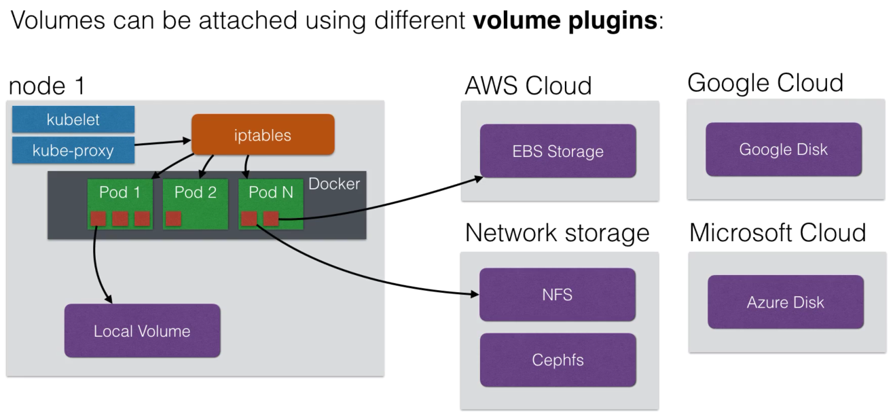
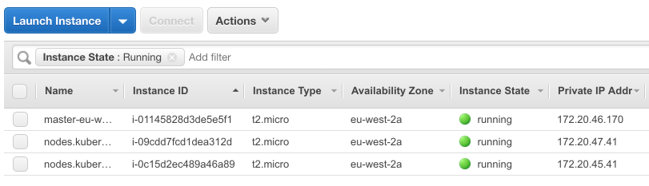
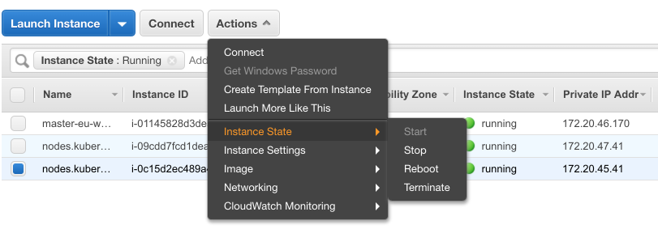
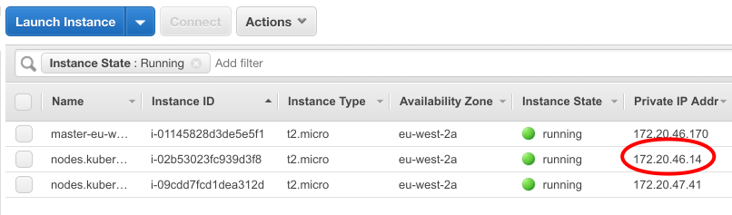
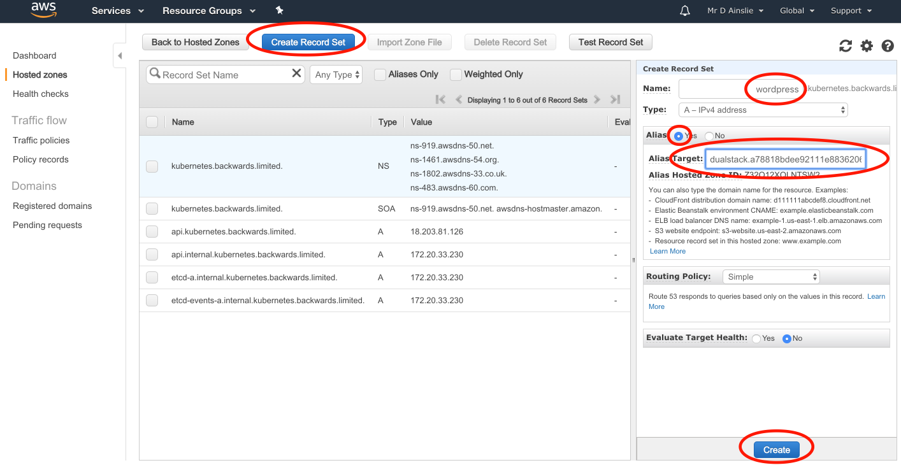
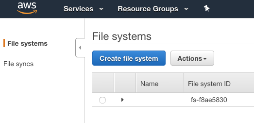
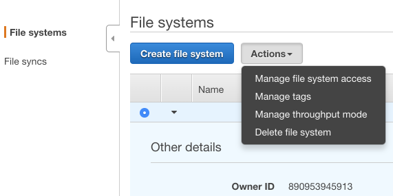

# Volumes

> 

To use volumes you must first create the volume e.g.

```bash
$ aws ec2 create-volume --size 1 --region eu-west-2 --availability-zone eu-west-2a --volume-type gp2
{
  "VolumeId": "vol-066883388229944ee",
  ...
}
```

Size is in **gb**, and **gp2** stands for **general purpose**.

To use a volume, create a pod with a volume definition:

```yaml
spec:
  containers:
    - name: my-app
      image: davidainslie/blah
      volumeMounts:
        - mountPath: /my-vol
          name: my-volume
      ...
  volumes:
    - name: my-volume
      awsElasticBlockStore:
        volumeID: vol-066883388229944ee
```

## Example with AWS

As per the [kops](../../../docs/kops.md) documentation:

```bash
$ export AWS_PROFILE=kops

$ kops create cluster \
--name kubernetes.backwards.limited \
--dns-zone kubernetes.backwards.limited \
--zones eu-west-2a \
--state s3://kops-my-kubernetes \
--node-count 2 \
--node-size t2.micro \
--master-size t2.micro

$ kops update cluster kubernetes.backwards.limited --yes --state=s3://kops-my-kubernetes
```

Just check the cluster:

```bash
kops validate cluster --state=s3://kops-my-kubernetes
```

We have a cluster up an running on AWS, now create a volume:

```bash
$ aws ec2 create-volume --size 1 --region eu-west-2 --availability-zone eu-west-2a --volume-type gp2 --tag-specifications "ResourceType=volume, Tags=[{Key=KubernetesCluster, Value=kubernetes.backwards.limited}]"

{
    "AvailabilityZone": "eu-west-2a",
    "CreateTime": "2018-11-15T13:03:26.000Z",
    "Encrypted": false,
    "Size": 1,
    "SnapshotId": "",
    "State": "creating",
    "VolumeId": "vol-0ea1c3c9ea3c74112",
    "Iops": 100,
    "Tags": [
        {
            "Key": "KubernetesCluster",
            "Value": "kubernetes.backwards.limited"
        }
    ],
    "VolumeType": "gp2"
}
```

Let's create a deployment that uses said volume:

```bash
$ kubectl create -f app-9-with-volume-deployment.yml
deployment "app-9-deployment" created

$ kubectl get pods
NAME                                READY     STATUS    RESTARTS   AGE
app-9-deployment-754d99f4f9-fdbrs   1/1       Running   0          53s

$ kubectl describe pod app-9-deployment-754d99f4f9-fdbrs
Name:           app-9-deployment-754d99f4f9-fdbrs
Namespace:      default
Node:           ip-172-20-45-41.eu-west-2.compute.internal/172.20.45.41
...
Volumes:
  myvolume:
    Type:       AWSElasticBlockStore (a Persistent Disk resource in AWS)
    VolumeID:   vol-0ea1c3c9ea3c74112
    ...
```

Let's test the persistent volume:

```bash
$ kubectl exec app-9-deployment-754d99f4f9-fdbrs -it -- bash
```

```basic
root@app-9-deployment-754d99f4f9-fdbrs:/app# ls -las /myvol
total 24
 4 drwxr-xr-x 3 root root  4096 Nov 15 13:11 .
 4 drwxr-xr-x 1 root root  4096 Nov 15 13:11 ..
16 drwx------ 2 root root 16384 Nov 15 13:11 lost+found

root@app-9-deployment-754d99f4f9-fdbrs:/app# echo "test" > /myvol/myvol.txt

root@app-9-deployment-754d99f4f9-fdbrs:/app# echo "test2" > /test.txt

root@app-9-deployment-754d99f4f9-fdbrs:/app# ls /myvol
lost+found  myvol.txt

root@app-9-deployment-754d99f4f9-fdbrs:/app# ls /test.txt
/test.txt

root@app-9-deployment-754d99f4f9-fdbrs:/app# exit
```

Note the current picture of our nodes on AWS:

> 

Let's take down one of the nodes, in this case the last one 172.20.45.41.

> 

Eventually it will be replaced by a new node - The Kubernetes management magic kicks in.

> 

As before, let's jump onto to the node where we should see the volume still existing but the **test.txt** file should no longer be available as it was not part of the volume:

```bash
$ kubectl get pods
NAME                                READY     STATUS    RESTARTS   AGE
app-9-deployment-754d99f4f9-8ljfz   1/1       Running   0          1h

$ kubectl exec app-9-deployment-754d99f4f9-8ljfz -it -- bash
```

```basic
root@app-9-deployment-754d99f4f9-8ljfz:/app# ls -las /myvol
total 28
 4 drwxr-xr-x 3 root root  4096 Nov 15 13:19 .
 4 drwxr-xr-x 1 root root  4096 Nov 15 13:44 ..
16 drwx------ 2 root root 16384 Nov 15 13:11 lost+found
 4 -rw-r--r-- 1 root root     5 Nov 15 13:19 myvol.txt

root@app-9-deployment-754d99f4f9-8ljfz:/app# ls -las /test.txt
ls: cannot access /test.txt: No such file or directory
```

Finally, don't forget to cleanup by deleting the volume (though only after deleting the pod) and then tearing down the cluster:

```bash
$ kubectl delete -f app-9-with-volume-deployment.yml

$ aws ec2 delete-volume --volume-id vol-0ea1c3c9ea3c74112

$ kops delete cluster kubernetes.backwards.limited --state=s3://kops-my-kubernetes

$ kops delete cluster kubernetes.backwards.limited --state=s3://kops-my-kubernetes --yes
```

## Auto Provisioning Volume

To use auto provisioned volumes, we need a **storage class** e.g.

```yaml
apiVersion: storage.k8s.io/v1
kind: StorageClass
metadata:
	name: standard
provisioner: kubernetes.io/aws-ebs
parameters:
	type: gp2
```

Then create a volume claim e.g.

```yaml
apiVersion: v1
kind: PersistentVolumeClaim
metadata:
	name: myclaim
	annotations:
		volume.beta.kubernetes.io/storage-class: "standard"
spec:
	accessModes:
		- ReadWriteOnce
	resources:
    requests:
      storage: 2Gi
```

And finally we can use the volume e.g.

```yaml
apiVersion: v1
kind: Pod
metadata:
	name: mypod
spec:
	containers:
		- name: myfrontend
			image: nginx
			volumeMounts:
				- mountPath: "/var/www/html"
					name: mypd
	volumes:
  	- name: mypd
  		persistentVolumeClaim:
  			claimName: myclaim
```

## Example of using Auto Provisioning Volume

Quick note - currently EFS is not supported in the London region, so let's go to Ireland.

It's a wordpress service. There are a bunch of yamls one being [wordpress-web.yml](wordpress-web.yml) that uses a NFS volume and here we also have to manually create an EFS file system on AWS for saving images in wordpress:

```bash
$ export AWS_PROFILE=ireland

$ aws s3 mb s3://ireland-kubernetes --region eu-west-1

$ export KOPS_STATE_STORE=s3://ireland-kubernetes

$ kops create cluster \
--name kubernetes.backwards.limited \
--dns-zone kubernetes.backwards.limited \
--zones eu-west-1a \
--state s3://ireland-kubernetes \
--node-count 2 \
--node-size t2.micro \
--master-size t2.micro

$ kops update cluster kubernetes.backwards.limited --yes

$ kops validate cluster
```

```bash
$ aws efs create-file-system --creation-token 2
{
    "OwnerId": "890953945913",
    "CreationToken": "2",
    "FileSystemId": "fs-f8ae5830",
    "CreationTime": 1542309474.0,
    "LifeCycleState": "creating",
    "NumberOfMountTargets": 0,
    "SizeInBytes": {
        "Value": 0
    },
    "PerformanceMode": "generalPurpose",
    "Encrypted": false,
    "ThroughputMode": "bursting"
}
```

where the token just has to be unique (you can choose 1, then 2 and so on).

```bash
$ aws efs create-mount-target --file-system-id fs-f8ae5830 --subnet-id ACQUIRE NEXT? --security-groups ACQUIRE NEXT?
```

```bash
$ aws ec2 describe-instances
{
    "Reservations": [
        {
            "Groups": [],
            "Instances": [
                {
                    ...
                    "KeyName": "kubernetes.kubernetes.backwards.limited-e0:03:a4:2d:58:1b:59:2d:30:57:8f:19:9d:98:2d:4c",
                    ...
                    "SubnetId": "subnet-0b8925bde7cb9a30a",
                    ...
                    "SecurityGroups": [
                        {
                            "GroupName": "nodes.kubernetes.backwards.limited",
                            "GroupId": "sg-07ea722f4a851a0f7"
                        }
                    ]
```

or even better, if you can work out how to use **jq** to query the output!!!

```bash
$ aws efs create-mount-target --file-system-id fs-f8ae5830 --subnet-id subnet-0b8925bde7cb9a30a --security-groups sg-07ea722f4a851a0f7

{
    "OwnerId": "890953945913",
    "MountTargetId": "fsmt-499ac780",
    "FileSystemId": "fs-f8ae5830",
    "SubnetId": "subnet-0b8925bde7cb9a30a",
    "LifeCycleState": "creating",
    "IpAddress": "172.20.56.33",
    "NetworkInterfaceId": "eni-00f00d172b303a06c"
}
```

...finally copy the above **FileSystemId** into [wordpress-web.yml](wordpress-web.yml) e.g. we replace the following bold text and region information:

server: eu-west-1a.**fs-5714e89e**.efs.eu-west-1.amazonaws.com

And let's go for it:

```bash
$ kubectl create -f storage.yml
storageclass "standard" created

$ kubectl create -f pv-claim.yml
persistentvolumeclaim "db-storage" created

$ kubectl create -f wordpress-secrets.yml
secret "wordpress-secrets" created

$ kubectl create -f wordpress-db.yml
replicationcontroller "wordpress-db" created

$ kubectl create -f wordpress-db-service.yml
service "wordpress-db" created

$ kubectl get pvc
NAME       STATUS VOLUME                                CAPACITY ACCESS STORAGECLASS
db-storage Bound  pvc-c93a8d15-e91f-11e8-8362-062325275012 2Gi     RWO    standard

$ kubectl get pods
NAME                 READY     STATUS    RESTARTS   AGE
wordpress-db-vcgz2   1/1       Running   0          6m

$ kubectl create -f wordpress-web.yml
deployment "wordpress-deployment" created

$ kubectl create -f wordpress-web-service.yml
service "wordpress" created
```

We can (if desired) create our required dns in AWS Route 53 e.g.

> 

and go to said dns in your browser:

> 


Saving images in wordpress with EFS volume does not initially work until we hack the command starting wordpress:

```bash
kubectl edit deploy/wordpress-deployment
```

Add these lines right after **containers**:

```yaml
- command:
	- bash
	- -c
	- chown www-data:www-data /var/www/html/wp-content/uploads && docker-entrypoint.sh apache2-foreground
```

Of course don't forget to bring everything down:

```bash
$ kops delete cluster kubernetes.backwards.limited

$ kops delete cluster kubernetes.backwards.limited --yes
```

including manually deleting the EFS:

> 

> 