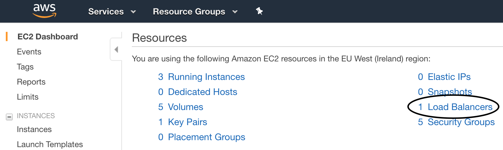
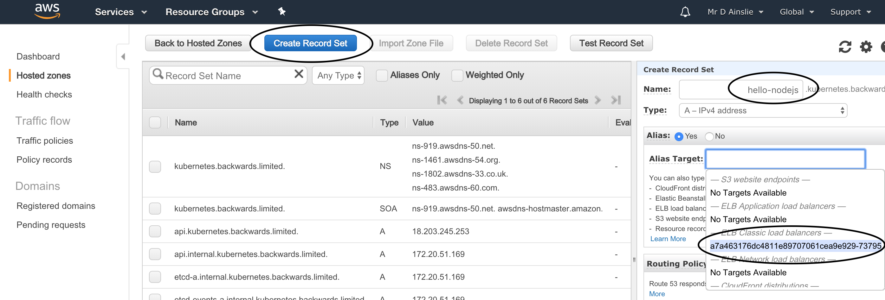

# Hello NodeJS Container Deployed to Kubernetes

## Build and Execute

```bash
$ docker build .
...
Successfully built 21b629e52df7

$ docker run -p 3000:3000 -t 21b629e52df7
```

```bash
$ curl localhost:3000
Hello NodeJS World
```

## Docker Registry

As Kubernetes looks up a docker image in a registry, let's push the above image to [Dockerhub](https://hub.docker.com/) or any other docker registry:

```bash
docker login --username=<your login> --password=<your password>

docker tag <image-id> <your login>/hello-nodejs

docker push <your login>/hello-nodejs
```

Note, we could have tagged the image while building to avoid doing step 2 above e.g.

```bash
docker build -t <your login>/hello-nodejs .
```

## Kubernetes Deployment

As explained before, we first need a cluster - let's just use minikube:

```bash
$ minikube start

$ kubectl get nodes
NAME       STATUS    ROLES     AGE       VERSION
minikube   Ready     master    3m        v1.10.0
```

Create a Kubernetes deployment, in this case using a **pod** definition:

```bash
$ kubectl create -f hello-nodejs-pod.yml
pod "hello-nodejs" created

$ kubectl get pods
NAME           READY     STATUS              RESTARTS   AGE
hello-nodejs   0/1       ContainerCreating   0          3s

$ kubectl describe pod hello-nodejs
Name:         hello-nodejs
...

$ kubectl logs hello-nodejs
...
> myapp@0.0.1 start /app
```

If you make a mistake along the way and wish to start again:

```bash
kubectl delete pods --all
```

## Deployment as a Service

There are different ways to expose the deployment as a service.

- Port foward:

  ```bash
  $ kubectl port-forward hello-nodejs 8081:3000
  Forwarding from 127.0.0.1:8081 -> 3000
  
  $ curl localhost:8081
  Hello NodeJS World
  ```

- Expose service:

  ```bash
  $ kubectl expose pod hello-nodejs --type NodePort --name hello-nodejs-service
  service "hello-nodejs-service" exposed
  
  $ minikube service hello-nodejs-service --url
  http://192.168.99.100:31740
  
  $ curl http://192.168.99.100:31740
  Hello NodeJS World
  ```

## Kubernetes Cluster Interaction

There are various ways to interact with our cluster. Here is an example of starting up another pod to then directly interact with the pod that houses our deployed service.

```bash
$ kubectl describe service hello-nodejs-service
Name:                     hello-nodejs-service
...
Endpoints:                172.17.0.7:3000
...
```

Other pods within the cluster can directly use our service's **Endpoint**.

```bash
$ kubectl run -i --tty busybox --image busybox --restart Never -- sh
/ # telnet 172.17.0.7 3000
GET /

HTTP/1.1 200 OK
...
Hello NodeJS World
```

Note that **curl** is not available within **busybox** so we just use **telent**.

## AWS ELB LoadBalancer

Up until now, we've been working on Minikube. Now to take this service into the real world.

Just as with Minikube, we need a cluster set up on our cloud provider - we already went through this so the explanations here will be more to the point.

- Launch cluster on AWS

  ```bash
  $ export AWS_PROFILE=kops
  
  $ kops create cluster \
  --name kubernetes.backwards.limited \
  --dns-zone kubernetes.backwards.limited \
  --zones eu-west-1a \
  --state s3://kops-my-kubernetes \
  --node-count 2 \
  --node-size t2.micro \
  --master-size t2.micro
  
  $ kops update cluster kubernetes.backwards.limited --yes --state=s3://kops-my-kubernetes
  
  $ kops validate cluster --state s3://kops-my-kubernetes
  Using cluster from kubectl context: kubernetes.backwards.limited
  
  Validating cluster kubernetes.backwards.limited
  
  INSTANCE GROUPS
  NAME                ROLE      MACHINETYPE    MIN    MAX   SUBNETS
  master-eu-west-1a   Master    t2.micro       1      1     eu-west-1a
  nodes               Node      t2.micro       2      2     eu-west-1a
  ```

- Deploy service

  ```bash
  $ kubectl create -f hello-nodejs-pod.yml
  pod "hello-nodejs" created
  
  $ kubectl create -f hello-nodejs-service.yml
  service "hello-nodejs-service" created
  ```

  > 

​	

 - Test service

   ```bash
   $ curl http://hello-nodejs.kubernetes.backwards.limited
   Hello NodeJS World
   ```

- Shutdown

  ```bash
  kops delete cluster kubernetes.backwards.limited --state=s3://kops-my-kubernetes
  
  kops delete cluster kubernetes.backwards.limited --state=s3://kops-my-kubernetes --yes
  ```

## Replication Controller / ReplicaSet

Let's auto scale our service via **replication controllers**. With a local **minikube** running:

```bash
$ kubectl create -f hello-nodejs-replication-controller.yml

$ kubectl get pods
NAME                            READY     STATUS    RESTARTS   AGE
hello-nodejs-controller-5ksxw   1/1       Running   0          4s
hello-nodejs-controller-h5zfq   1/1       Running   0          4s
```

In this case 2 pods will be instantiated. If we wish to bring them down:

```bash
kubectl delete -f hello-nodejs-replication-controller.yml
```

Bring down one pod and another will automatically come up:

```bash
$ kubectl delete pod hello-nodejs-controller-5ksxw

$ kubectl get pods
NAME                            READY     STATUS        RESTARTS   AGE
hello-nodejs-controller-5ksxw   1/1       Terminating   0          4m
hello-nodejs-controller-8w54v   1/1       Running       0          0s
hello-nodejs-controller-h5zfq   1/1       Running       0          4m
```

Scale up:

```bash
$ kubectl scale --replicas=5 -f hello-nodejs-replication-controller.yml

$ kubectl get pods
NAME                            READY     STATUS              RESTARTS   AGE
hello-nodejs-controller-4b9xb   1/1       Running             0          0s
hello-nodejs-controller-8w54v   1/1       Running             0          2m
hello-nodejs-controller-frplw   0/1       ContainerCreating   0          0s
hello-nodejs-controller-h5zfq   1/1       Running             0          6m
hello-nodejs-controller-lqpw7   0/1       ContainerCreating   0          0s
```

Scale again (slightly differently):

```bash
$ kubectl get rc
NAME                      DESIRED   CURRENT   READY     AGE
hello-nodejs-controller   5         5         5         8m

$ kubectl scale --replicas=1 rc/hello-nodejs-controller
NAME                            READY     STATUS        RESTARTS   AGE
hello-nodejs-controller-4b9xb   1/1       Terminating   0          3m
hello-nodejs-controller-8w54v   1/1       Terminating   0          5m
hello-nodejs-controller-frplw   1/1       Terminating   0          3m
hello-nodejs-controller-h5zfq   1/1       Running       0          10m
hello-nodejs-controller-lqpw7   1/1       Terminating   0          3m
```

And finally delete:

```bash
kubectl delete rc/hello-nodejs-controller
```

Note that **ReplicaSet** is just the next generation **Replication Controller**.

However, it is best to use a **deployment**.

## Deployment

Deploy:

```bash
$ kubectl create -f hello-nodejs-deployment.yml

$ kubectl get deployments
NAME                      DESIRED   CURRENT   UP-TO-DATE   AVAILABLE   AGE
hello-nodejs-deployment   3         3         3            3           7s

$ kubectl get replicaset
NAME                                DESIRED   CURRENT   READY     AGE
hello-nodejs-deployment-54cbb9dcd   3         3         3         1m

$ kubectl get pods
NAME                                      READY     STATUS    RESTARTS   AGE
hello-nodejs-deployment-54cbb9dcd-5cvdq   1/1       Running   0          1m
hello-nodejs-deployment-54cbb9dcd-m4p4h   1/1       Running   0          1m
hello-nodejs-deployment-54cbb9dcd-p7j5n   1/1       Running   0          1m
```

Rollout a new version:

```bash
kubectl set image deployment/hello-nodejs-deployment hello-nodejs=hello-nodejs:2
```

Rollout status:

```bash
kubectl rollout status deployment/hello-nodejs-deployment
```

Rollback to previous version:

```bash
kubectl rollout undo deployment/hello-nodejs-deployment
```

or rollback to specific version:

```bash
kubectl rollout undo deployment/hello-nodejs-deployment --to-revision=1
```

