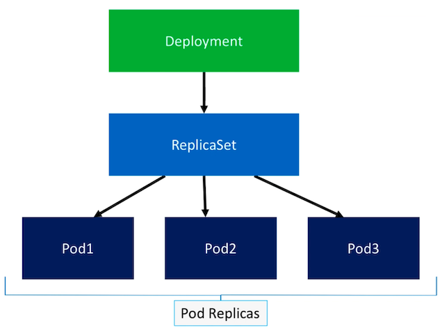
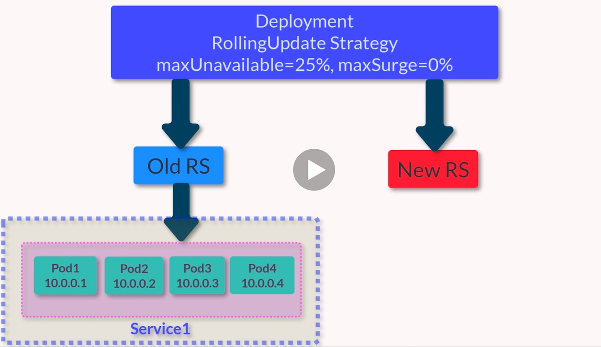

# Deployments



- A Deployment object exists to **reliably rollout** new software versions.
- You can also easily rollback to any of the previous versions.
- A Deployment spec contains a **strategy** field, this dictates **how old pods are replaced by new ones when a rollout is triggered**.
- The Deployment **triggers a rollout** when its **pod template is changed** (scaling a Deployment does NOT trigger a rollout).

## Deployment Strategies

- Recreate strategy - kills and recreates Pods.
  - Deployment updates its ReplicaSet to use the new image.
  - Deployment kills all existing Pods.
  - ReplicaSet (detecting Pod number is below threshold) recreates new Pods with the new version of the image.
  - This rollout results in some **service downtime**.
- RollingUpdate (default).
  - Deployment can **update** the **running application** while it's **still receiving traffic** with **zero downtime**.
  - Instead of kill all and recreate it works by **incrementally updating** existing Pod instances with new ones.
    - So, create new Pods with updated software.
    - Ensure they are healthy and then remove some old Pods - The Deployment controller uses **readiness checks** to determine if **new Pods are healthy**.
    - Continue until all existing Pods have been replaced with new ones.
  - NOTE during rolling update both **old and new software versions will be running concurrently**. These differing versions must be **version compatible** for the rolling update to work.
  - Rolling updates are **versioned** and **enables a deployment rollback**.
    - Deployment keeps its rollout history.
    - Allowing for a Deployment update to be reverted to a previous stable version.

## Rolling Update

RollingUpdate strategy where e.g.:

- maxUnavailable = 25% (default) or = 1 i.e. 1 Pod out of 4, so I Pod will be unavailable during update and it will be unavailable by what the **readiness** probe returns.
- maxSurge = 0% where 100% would mean that during an update there would not be less Pods as stipulated by the deployment.

During an update there will be a second ReplicaSet (New RS) to allow the original, now old, ReplicatSet (Old RS) to scale down e.g.



---


Once the new Pod (Pod5) has acknowledged it is ready (via its **readiness** probe), another Pod in Old RS will be scaled down and another booted in New RS.


and so on until:


There is also **minReadySeconds** - the boot up time of your application: Kubernetes waits on this time before the next pod creation, which could be part of a **canary** release.

## Deployment Specification

We'll use [pod-nginx-multi-deploy.yaml](../k8s/deployments/pod-nginx-multi-deploy.yaml):

```bash
kubernetes-backwards/kubernetes-mastery-on-aws/k8s/deployments at ☸️ backwards.k8s.local
➜ kc apply -f pod-nginx-multi-deploy.yaml
deployment.apps/nginx created

➜ kc get deployments
NAME    READY   UP-TO-DATE   AVAILABLE   AGE
nginx   4/4     4            4           95s

➜ kc get replicasets
NAME              DESIRED   CURRENT   READY   AGE
nginx-dc96cb5d6   4         4         4       3m45s

➜ kc get pods --show-labels
NAME                   READY  STATUS    RESTARTS   AGE    LABELS
nginx-dc96cb5d6-49bwx  2/2    Running   0          4m21s  app=nginx,pod-template-hash=dc96cb5d6,tier=frontend
nginx-dc96cb5d6-q48m9  2/2    Running   0          4m21s  app=nginx,pod-template-hash=dc96cb5d6,tier=frontend
nginx-dc96cb5d6-rvphg  2/2    Running   0          4m21s  app=nginx,pod-template-hash=dc96cb5d6,tier=frontend
nginx-dc96cb5d6-t5mv2  2/2    Running   0          4m21s  app=nginx,pod-template-hash=dc96cb5d6,tier=frontend
```

**pod-template-hash** is added by the deployment controller to every ReplicaSet which uses this label to identity its Pod replicas.

```bash
kubernetes-backwards/kubernetes-mastery-on-aws/k8s/deployments at ☸️ backwards.k8s.local
➜ kc describe deploy/nginx
Name:                   nginx
Namespace:              default
...
RollingUpdateStrategy:  25% max unavailable, 25% max surge
...
Conditions:
  Type           Status  Reason
  ----           ------  ------
  Available      True    MinimumReplicasAvailable
  Progressing    True    NewReplicaSetAvailable
OldReplicaSets:  <none>
NewReplicaSet:   nginx-dc96cb5d6 (4/4 replicas created)
Events:
  Type    Reason             Age   From                   Message
  ----    ------             ----  ----                   -------
  Normal  ScalingReplicaSet  10m   deployment-controller  Scaled up replica set nginx-dc96cb5d6 to 4
```

Notice the **OldReplicaSets** and **NewReplicaSet** used when updating.

## Update Deployment to Trigger Rollout

Edit the above manifest to update the nginx version to 1.14.0 - I'll use Visual Studio code:

```bash
kubernetes-backwards/kubernetes-mastery-on-aws/k8s/deployments at ☸️ backwards.k8s.local
➜ code pod-nginx-multi-deploy.yaml
```

Then **apply** this update with the option **--record** to "record" the rollout command in the **history**. We'll also (immediately) **pause** the rollout to exam the rollout **status**:

```bash
kubernetes-backwards/kubernetes-mastery-on-aws/k8s/deployments at ☸️ backwards.k8s.local
➜ kc apply -f pod-nginx-multi-deploy.yaml --record
deployment.apps/nginx configured

➜ kc rollout pause deploy/nginx
deployment.apps/nginx paused

➜ kc rollout status deploy/nginx
Waiting for deployment "nginx" rollout to finish: 2 out of 4 new replicas have been updated...

➜ kc get deployments
NAME    READY   UP-TO-DATE   AVAILABLE   AGE
nginx   5/4     2            5           2m22s
```

At this point only 2 Pods are running with the new version - and currently there are 5 Pods running.

And to see that there are indeed 2 ReplicaSets now running:

```bash
kubernetes-backwards/kubernetes-mastery-on-aws/k8s/deployments at ☸️ backwards.k8s.local
➜ kc get rs
NAME              DESIRED   CURRENT   READY   AGE
nginx-dc96cb5d6   3         3         3       4m10s
nginx-f57c96df    2         2         2       3m7s
```

Next **resume** the **rollout**:

```bash
kubernetes-backwards/kubernetes-mastery-on-aws/k8s/deployments at ☸️ backwards.k8s.local
➜ kc rollout resume deploy/nginx
deployment.apps/nginx resumed

➜ kc rollout status deploy/nginx
Waiting for deployment "nginx" rollout to finish: 3 of 4 updated replicas are available...
deployment "nginx" successfully rolled out

➜ kc get rs
NAME              DESIRED   CURRENT   READY   AGE
nginx-dc96cb5d6   0         0         0       8m2s
nginx-f57c96df    4         4         4       6m59s
```

And more details showing the updated nginx version:

```bash
kubernetes-backwards/kubernetes-mastery-on-aws/k8s/deployments at ☸️ backwards.k8s.local
➜ kc get rs -o wide
NAME            ...   CONTAINERS       IMAGES
nginx-dc96cb5d6       nginx,git-sync   nginx:1.13.8,openweb/git-sync:0.0.1
nginx-f57c96df        nginx,git-sync   nginx:1.14.0,openweb/git-sync:0.0.1
```

Let's see the rollout events:

```bash
kubernetes-backwards/kubernetes-mastery-on-aws/k8s/deployments at ☸️ backwards.k8s.local
➜ kc describe deploy/nginx
...
OldReplicaSets:  <none>
NewReplicaSet:   nginx-f57c96df (4/4 replicas created)
Events:
  Type    Reason             Age    From                   Message
  ----    ------             ----   ----                   -------
  Normal  ScalingReplicaSet  12m    deployment-controller  Scaled up replica set nginx-dc96cb5d6 to 4
  Normal  ScalingReplicaSet  11m    deployment-controller  Scaled up replica set nginx-f57c96df to 1
  Normal  ScalingReplicaSet  11m    deployment-controller  Scaled down replica set nginx-dc96cb5d6 to 3
  Normal  ScalingReplicaSet  11m    deployment-controller  Scaled up replica set nginx-f57c96df to 2
  Normal  ScalingReplicaSet  6m30s  deployment-controller  Scaled down replica set nginx-dc96cb5d6 to 1
  Normal  ScalingReplicaSet  6m30s  deployment-controller  Scaled up replica set nginx-f57c96df to 4
  Normal  ScalingReplicaSet  6m23s  deployment-controller  Scaled down replica set nginx-dc96cb5d6 to 0
```

## Rollback

```bash
kubernetes-backwards/kubernetes-mastery-on-aws/k8s/deployments at ☸️ backwards.k8s.local
➜ kc rollout history deploy/nginx
deployment.apps/nginx
REVISION  CHANGE-CAUSE
1         <none>
2         kubectl apply --filename=pod-nginx-multi-deploy.yaml --record=true
```

To rollback to the previous revision: 

```bash
kubernetes-backwards/kubernetes-mastery-on-aws/k8s/deployments at ☸️ backwards.k8s.local
➜ kc rollout undo deploy/nginx
```

and to a specific revision:

```bash
kubernetes-backwards/kubernetes-mastery-on-aws/k8s/deployments at ☸️ backwards.k8s.local
➜ kc rollout undo deploy/nginx --to-revision=1
deployment.apps/nginx rolled back

kubernetes-backwards/kubernetes-mastery-on-aws/k8s/deployments at ☸️ backwards.k8s.local
➜ kc rollout status deploy/nginx
Waiting for deployment "nginx" rollout to finish: 2 out of 4 new replicas have been updated...
Waiting for deployment "nginx" rollout to finish: 2 out of 4 new replicas have been updated...
Waiting for deployment "nginx" rollout to finish: 2 out of 4 new replicas have been updated...
Waiting for deployment "nginx" rollout to finish: 2 out of 4 new replicas have been updated...
Waiting for deployment "nginx" rollout to finish: 2 out of 4 new replicas have been updated...
Waiting for deployment "nginx" rollout to finish: 3 out of 4 new replicas have been updated...
Waiting for deployment "nginx" rollout to finish: 3 out of 4 new replicas have been updated...
Waiting for deployment "nginx" rollout to finish: 3 out of 4 new replicas have been updated...
Waiting for deployment "nginx" rollout to finish: 3 out of 4 new replicas have been updated...
Waiting for deployment "nginx" rollout to finish: 3 out of 4 new replicas have been updated...
Waiting for deployment "nginx" rollout to finish: 1 old replicas are pending termination...
Waiting for deployment "nginx" rollout to finish: 1 old replicas are pending termination...
Waiting for deployment "nginx" rollout to finish: 1 old replicas are pending termination...
Waiting for deployment "nginx" rollout to finish: 3 of 4 updated replicas are available...
deployment "nginx" successfully rolled out
```

```bash
kubernetes-backwards/kubernetes-mastery-on-aws/k8s/deployments at ☸️ backwards.k8s.local took 18s
➜ kc rollout history deploy/nginx
deployment.apps/nginx
REVISION  CHANGE-CAUSE
2         kubectl apply --filename=pod-nginx-multi-deploy.yaml --record=true
3         <none>
```

## Scaling a Deployment

```bash
kubernetes-backwards/kubernetes-mastery-on-aws/k8s/deployments at ☸️ backwards.k8s.local
➜ kc scale deploy/nginx --replicas=6
deployment.apps/nginx scaled

➜ kc get deploy/nginx
NAME    READY   UP-TO-DATE   AVAILABLE   AGE
nginx   6/6     6            6           83m
```

Or edit the manifest and apply.

## Delete Deployment

```bash
kubernetes-backwards/kubernetes-mastery-on-aws/k8s/deployments at ☸️ backwards.k8s.local
➜ kc delete deploy/nginx
deployment.apps "nginx" deleted
```

