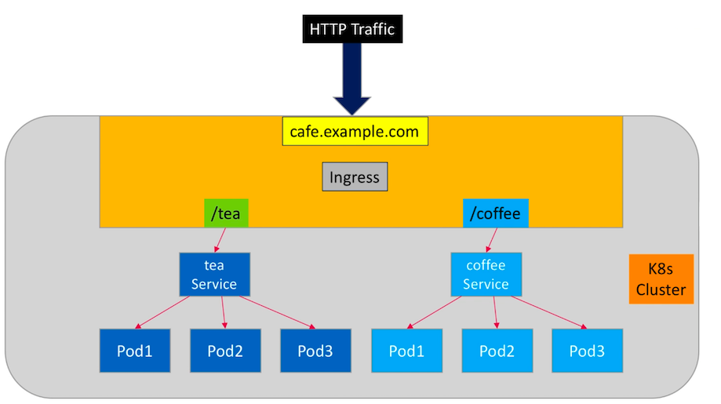
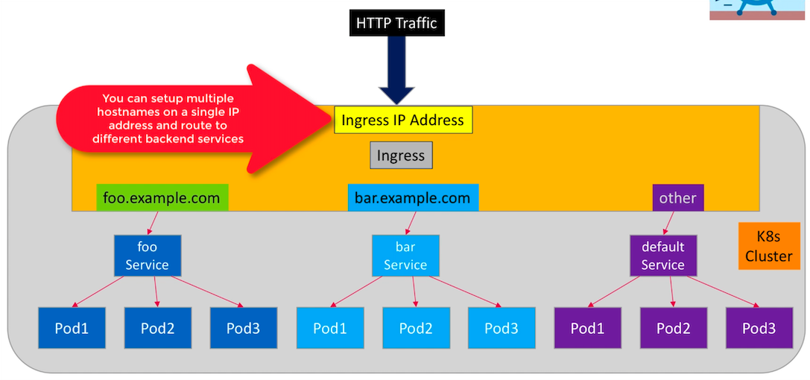

# Ingress

Ingress API objects can manage external access to **HTTP services** running in the cluster. Ingress can provide services such as:

- Externally reachable URLs for your k8s services - path based routing
- Layer 7 load balancing - also known as ALB (application load balancing)
- SSL termination
- Name based virtual hosting - host based routing

**Path based routing**:

**Host based routing**:

Ingress requires an **Ingress Controller** which is a daemon process responsible for managing ingress resources:

The nginx Ingress Controller is deployed as a k8s Pod - the Pod also runs a nginx server. It is the nginx server that does the load balancing and content based routing.