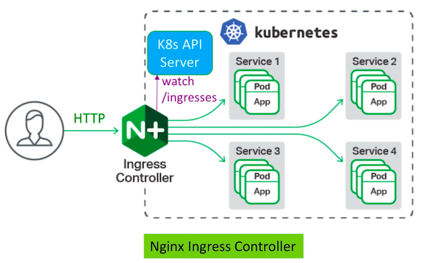

# Ingress

Ingress API objects can manage external access to **HTTP services** running in the cluster. Ingress can provide services such as:

- Externally reachable URLs for your k8s services - path based routing
- Layer 7 load balancing - also known as ALB (application load balancing)
- SSL termination
- Name based virtual hosting - host based routing

**Path based routing**:


**Host based routing**:


Ingress requires an **Ingress Controller** which is a daemon process responsible for managing ingress resources:



The nginx Ingress Controller is deployed as a k8s Pod - the Pod also runs a nginx server. It is the nginx server that does the load balancing and content based routing.

## Deploy the Nginx Ingress Controller

First create a **namespace** and **service account**:

```bash
kubernetes-backwards/kubernetes-mastery-on-aws/k8s/ingress at ☸️ backwards.k8s.local
➜ kc create ns nginx-ingress
namespace/nginx-ingress created

➜ kc create serviceaccount nginx-ingress -n nginx-ingress
serviceaccount/nginx-ingress created
```

Now create a ConfigMap which our Ingress Controller will use:

```bash
kubernetes-backwards/kubernetes-mastery-on-aws/k8s/ingress at ☸️ backwards.k8s.local
➜ kc create configmap nginx-config -n nginx-ingress
configmap/nginx-config created
```

The data in the ConfigMap is dynamically created by the Ingress Controller - we just have to tell the Ingress Controller to use this ConfigMap.

The nginx Ingress Controller also needs a **Secret** for **TLS**:

```bash
kubernetes-backwards/kubernetes-mastery-on-aws/k8s/ingress at ☸️ backwards.k8s.local
➜ kc create secret tls default-server-secret --key=key.pem --cert=cert.pem -n nginx-ingress
secret/default-server-secret created
```

Next create the nginx Ingress Controller Deployment with [nginx-ingress.yaml](../k8s/ingress/nginx-ingress.yaml):

```bash
kubernetes-backwards/kubernetes-mastery-on-aws/k8s/ingress at ☸️ backwards.k8s.local
➜ kc apply -f nginx-ingress.yaml
```

Now we must expose (externally) this Ingress Controller with a Service. We will create a LoadBalancer Service:

```bash
kubernetes-backwards/kubernetes-mastery-on-aws/k8s/ingress at ☸️ backwards.k8s.local
➜ aws iam list-server-certificates
```

to get the ARN we uploaded in the **services** section and update the file [ingress-aws-elb.yaml](../k8s/ingress/ingress-aws-elb.yaml):

```yaml
kind: Service
apiVersion: v1
metadata:
  name: nginx-ingress
  namespace: nginx-ingress
  annotations:
    service.beta.kubernetes.io/aws-load-balancer-ssl-cert: <Paste Your Cert's ARN here>
    service.beta.kubernetes.io/aws-load-balancer-backend-protocol: http
    service.beta.kubernetes.io/aws-load-balancer-ssl-ports: "443"
spec:
  type: LoadBalancer
  ports:
    - port: 443 # Terminate SSL at the ELB and send http traffic to the ingress
      targetPort: 80
      protocol: TCP
      name: https
  selector:
    app: nginx-ingress
```

and apply:

```bash
kubernetes-backwards/kubernetes-mastery-on-aws/k8s/ingress at ☸️ backwards.k8s.local
➜ kc apply -f ingress-aws-elb.yaml
```

We can now access Ingress Controller via the DNS name of the ELB load balancer:

```bash
kubernetes-backwards/kubernetes-mastery-on-aws/k8s/ingress at ☸️ backwards.k8s.local
➜ kc get svc -n nginx-ingress
```

## Name Based Virtual Hosting using an Ingress

