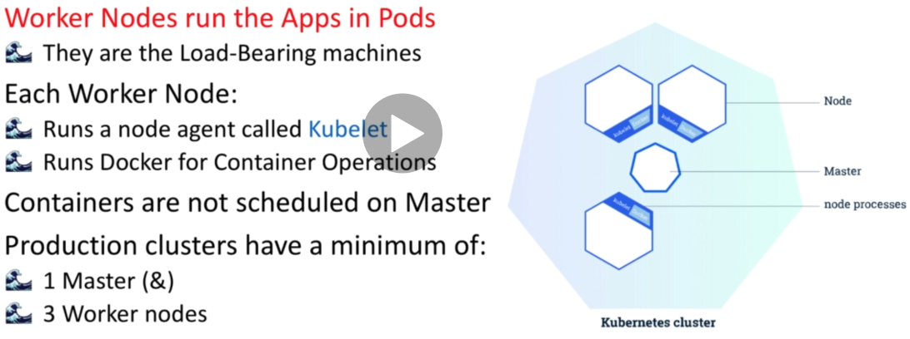

# Introduction

## Kubernetes

- Kubernetes is an open source platform for managing containerised applications
- Kubernetes manages a highly available cluster of computers designed to work as a single unit
- The Kubernetes master exposes APIs and schedules application containers to run on worker nodes
- The worker nodes are responsible for running the application containers
- The worker nodes have Docker and Kubelet installed

## Kubernetes on AWS

This is just one approach to create/managing a Kubernetes cluster on AWS. Locally (on our laptop) we will create an Ubuntu VM and from there create a cluster on AWS - this can be done with tools such as **conjure-up** and **juju**.

## Kubernetes Cluster

---

---

---

---

Note the **cloud connector** allowing Kubernetes to be essentially plugged into a cloud provider such as AWS or GCP.