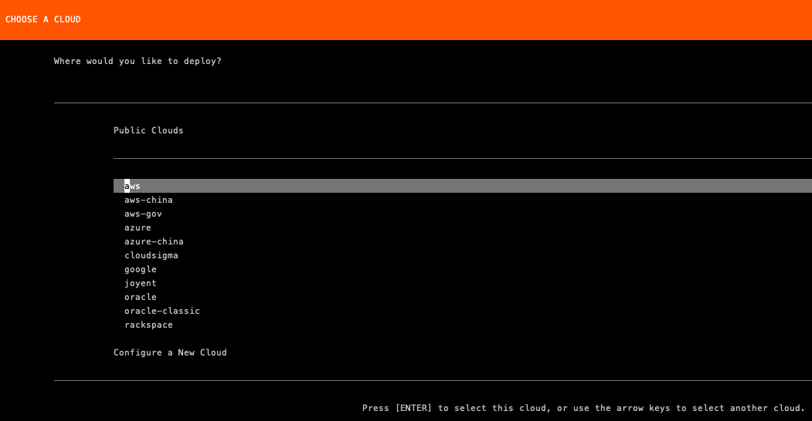

# Kubernetes Cluster Manager VM

Let's create a VM (locally) to be used to remotely manager a Kubernetes cluster (in our case, on AWS):

```bash
kubernetes-backwards/kubernetes-mastery-on-aws
➜ mkdir k8s

kubernetes-backwards/kubernetes-mastery-on-aws
➜ cd k8s
```

```bash
kubernetes-backwards/kubernetes-mastery-on-aws/k8s
➜ vagrant init ubuntu/xenial64
A `Vagrantfile` has been placed in this directory. You are now
ready to `vagrant up` your first virtual environment!
```

The following will download everything required to boot an **ubuntu/xenial64** VM:

```bash
kubernetes-backwards/kubernetes-mastery-on-aws/k8s
➜ vagrant box add ubuntu/xenial64
==> box: Loading metadata for box 'ubuntu/xenial64'
    box: URL: https://vagrantcloud.com/ubuntu/xenial64
==> box: Adding box 'ubuntu/xenial64' (v20200311.0.0) for provider: virtualbox
    box: Downloading: https://vagrantcloud.com/ubuntu/boxes/xenial64/versions/20200311.0.0/providers/virtualbox.box
    box: Download redirected to host: cloud-images.ubuntu.com
==> box: Successfully added box 'ubuntu/xenial64' (v20200311.0.0) for 'virtualbox'!
```

Now edit the vagrant file (with any editor such as Vim, Sublime, VS Code etc):

```bash
kubernetes-backwards/kubernetes-mastery-on-aws/k8s
➜ code Vagrantfile
```

where we want to duplicate and change the following :

```ruby
# config.vm.network "forwarded_port", guest: 80, host: 8080
```

to

```ruby
config.vm.network "forwarded_port", guest: 8001, host: 8001
```

which configures Vagrant to forward this port from your machine to the guest VM.

Now we can bring up the VM:

```bash
kubernetes-backwards/kubernetes-mastery-on-aws/k8s
➜ vagrant up --provider virtualbox
...
```

Let's just double check the VM is up:

```bash
kubernetes-backwards/kubernetes-mastery-on-aws/k8s
➜ vagrant status
Current machine states:

default                   running (virtualbox)

The VM is running. To stop this VM, you can run `vagrant halt` to
shut it down forcefully, or you can run `vagrant suspend` to simply
suspend the virtual machine. In either case, to restart it again,
simply run `vagrant up`.
```

We can now SSH into this VM:

```bash
kubernetes-backwards/kubernetes-mastery-on-aws/k8s
➜ vagrant ssh
Welcome to Ubuntu 16.04.6 LTS (GNU/Linux 4.4.0-174-generic x86_64)

 * Documentation:  https://help.ubuntu.com
 * Management:     https://landscape.canonical.com
 * Support:        https://ubuntu.com/advantage


0 packages can be updated.
0 updates are security updates.

New release '18.04.4 LTS' available.
Run 'do-release-upgrade' to upgrade to it.


vagrant@ubuntu-xenial:~$
```

Let's do a **package update** to get our VM up to date:

```bash
vagrant@ubuntu-xenial:~$ sudo apt-get update
...
```

Now update the **time synchronisation** to avoid a cloud provider revoking any API calls when it detects out of synch clocks.

```bash
vagrant@ubuntu-xenial:~$ sudo apt-get install ntp ntpdate ntpstat
...
```

Now set up **ntp** by first stopping ntp:

```bash
vagrant@ubuntu-xenial:~$ sudo service ntp stop
```

Then:

```bash
vagrant@ubuntu-xenial:~$ sudo ntpdate time.nist.gov
17 Mar 15:42:39 ntpdate[3544]: adjust time server 132.163.97.1 offset 0.002725 sec
```

```bash
vagrant@ubuntu-xenial:~$ sudo service ntp status
```

```bash
vagrant@ubuntu-xenial:~$ sudo service ntp start
```

```bash
vagrant@ubuntu-xenial:~$ ntpstat
synchronised to NTP server (85.199.214.100) at stratum 2
   time correct to within 196 ms
   polling server every 64 s
```

(keep running that last command until we see **synchronised**)

Now we want to check AWS connectivity. Install AWS CLI:

```bash
vagrant@ubuntu-xenial:~$ sudo apt-get install python-pip
```

```bash
vagrant@ubuntu-xenial:~$ pip install awscli --user
```

```bash
vagrant@ubuntu-xenial:~$ aws configure
AWS Access Key ID [None]: *****
AWS Secret Access Key [None]: *****
Default region name [None]: eu-west-2
Default output format [None]: json
```

```bash
vagrant@ubuntu-xenial:~$ aws ec2 describe-regions
{
    "Regions": [
        ...
        {
            "OptInStatus": "opt-in-not-required",
            "Endpoint": "ec2.eu-west-1.amazonaws.com",
            "RegionName": "eu-west-1"
        },
        ...
    ]
}
```

and we are connected.

## Deploy Kubernetes Cluster on AWS

We shall use [conjure-up](https://conjure-up.io/):

```bash
vagrant@ubuntu-xenial:~$ sudo snap install conjure-up --classic
```

Let's "conjure up" a Kubernetes cluster by going through a bunch of prompts:

```bash
vagrant@ubuntu-xenial:~$ conjure-up kubernetes
```


---



---


---


At this point, you may want to double check pricing for your region:


---


---


Next we do not need a **sudo** password:

