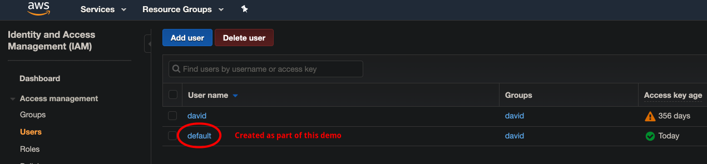

# Kubernetes Cluster Manager

Make sure you followed the **setup** in the root documentation of this repository e.g. you will need do have done the following:

```bash
brew install awscli
brew install kubernetes-cli
brew install kubectl
brew install conjure-up
brew cask install virtualbox
brew cask install docker
brew install bat
```

Also, make sure you have created a user in the AWS IAM web console, ending up with something like:



Add your user to your AWS profile. Lets first take a look at all profiles (using **bat** which is a nicer **cat**):

```bash
kubernetes-backwards/kubernetes-mastery-on-aws/k8s
➜ bat ~/.aws/credentials
───────┬───────────────────────────────────────────────────────────────────────────────────────
       │ File: /Users/davidainslie/.aws/credentials
───────┼───────────────────────────────────────────────────────────────────────────────────────
   1   │ [default]
   2   │ aws_access_key_id = *****
   3   │ aws_secret_access_key = *****
   4   │
   5   │ [kops]
   6   │ aws_access_key_id = *****
   7   │ aws_secret_access_key = *****
   8   │
   9   │ [devops]
  10   │ aws_access_key_id = *****
  11   │ aws_secret_access_key = *****
───────┴───────────────────────────────────────────────────────────────────────────────────────
```

```bash
kubernetes-backwards/kubernetes-mastery-on-aws/k8s
➜ bat ~/.aws/config
───────┬───────────────────────────────────────────────────────────────────────────────────────
       │ File: /Users/davidainslie/.aws/config
───────┼───────────────────────────────────────────────────────────────────────────────────────
   1   │ [default]
   2   │ region = eu-west-2
   3   │ output = json
   4   │
   5   │ [profile kops]
   6   │ region = eu-west-2
   7   │ output = json
   8   │
   9   │ [profile devops]
  10   │ region = eu-west-2
  11   │ output = json
───────┴───────────────────────────────────────────────────────────────────────────────────────
```

To use a named profile, add the `--profile profile-name` option to your command e.g.

```bash
kubernetes-backwards/kubernetes-mastery-on-aws/k8s
➜ aws ec2 describe-instances --profile default
{
    "Reservations": []
}
```

To use a named profile for multiple commands:

```bash
kubernetes-backwards/kubernetes-mastery-on-aws/k8s
➜ export AWS_PROFILE=default
```

```bash
kubernetes-backwards/kubernetes-mastery-on-aws/k8s
➜ aws ec2 describe-instances
{
    "Reservations": []
}
```

## Deploy Kubernetes Cluster on AWS

