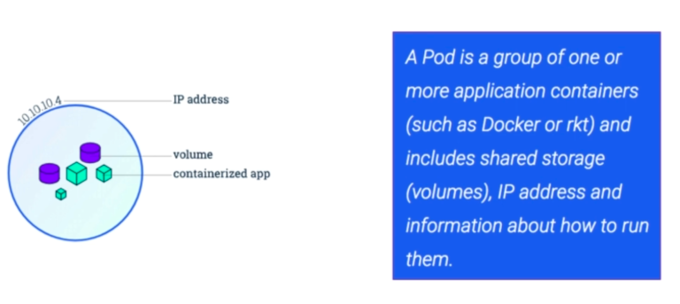

# Pods

Clone the course [yaml](https://github.com/naveenjoy/k8s-yaml):

```bash
kubernetes-backwards/kubernetes-mastery-on-aws/k8s/course-yaml at ☸️ backwards.k8s.local
➜ git clone https://github.com/naveenjoy/k8s-yaml.git
```

## Kubectl

A sidebar...

**Imperative command** example:

```bash
kubectl run nginx --image nginx
```

**Imperative object configuration** examples:

```bash
kubectl create -f nginx.yaml

kubectl delete -f nginx.yaml

kubectl replace -f nginx.yaml
```

Replace (update) can be problematic - all updates must be reflected in the yaml file or they will be lost.

**Declarative object configurations** example:

```bash
kubectl apply -f nginx.yaml  # Apply a single configuration file

kubectl apply -f configs/    # Apply all configuration files inside the directory

kubectl apply -R -f configs/ # Recursively apply all configuration files inside the directory
```

Here, operations are **automatically detected** per object by kubectl.

Now, if you were to apply the following:

```bash
kubectl apply -f nginx-deploy.yaml # A kind of Deployment
```

we can then get the live object configuration with:

```bash
kubectl get -f nginx-deploy.yaml -o yaml
```

As well as **apply** the other command that you may use to change fields of a live object is **scale** e.g.

```bash
kubectl scale nginx --replicas=4 # Scale the number of Pod replicas in a ReplicaSet
```

But of course, this is an imperative command so be careful - after using it, you may want to update the **manifest** (which is another name for configuration file).

And how to delete on object?

```bash
kubectl delete -f nginx-deploy.yaml
```

## What is a Pod?



Think of a Pod as an **environment** that **containers run in** and persists until it is deleted. Containers within a Pod **share** its **IP address** and **port space** - Containers inside a Pod communicate using the **localhost** IP address. Containers running in different Pods communicate using the Pod's unique IP address.

Pods can specify a set of **shared storage volumes** - all containers in the Pod can access these shared volumes. Kubernetes supports several types of volumes e.g.

- **emptyDir**: Data is **erased** when the Pod is removed
- **awsElasticBlockStore (AWS EBS)**: Data is **preserved** when the Pod is removed.
- **cephfs (CephFS volume)**: Data is **preserved** when the Pod is removed and also supports **multiple writers**

<u>Pods do not by themselves self-heal within Kubernetes.</u>

**Controllers** are responsible for pod replication, software roll-outs and self-healing i.e. they make Pods durable. Examples of controllers are:

- Deployment
- StatefulSet
- DaemonSet

## Create

Take a look at [pod-nginx.yaml](../k8s/pods/pod-nginx.yaml):

```yaml
apiVersion: v1                # The API version (v1 currently)
kind: Pod                     # The Kind of API resource
metadata:       
  name: nginx                 # Name of this Pod that must be unique within the namespace
spec:                         # Specification of Pod's contents - list of containers to run
  containers:                 # Start the container listing this way
    - name: nginx             # Nickname for the container in this Pod. Must be unique.
      image: nginx:1.7.9      # Name of the Docker image that Kubernetes will pull.
      ports:
        - containerPort: 80   # The port used by the container.
                              # This port is accessible from all cluster nodes. 
                              # In k8s you don't publish container ports like you do in Docker. 
      resources:
        limits:
          memory: 256Mi
          cpu: 250m
```

The following will launch one pod running nginx:

```bash
kubernetes-backwards/kubernetes-mastery-on-aws/k8s/pods at ☸️ backwards.k8s.local
➜ kc apply -f pod-nginx.yaml
pod/nginx created
```

```bash
kubernetes-backwards/kubernetes-mastery-on-aws/k8s/pods at ☸️ backwards.k8s.local
➜ kc get pods
NAME    READY   STATUS    RESTARTS   AGE
nginx   1/1     Running   0          39s
```

To view the complete live pod configuration:

```bash
kubernetes-backwards/kubernetes-mastery-on-aws/k8s/pods at ☸️ backwards.k8s.local
➜ kc get pods -o yaml
```

```bash
kubernetes-backwards/kubernetes-mastery-on-aws/k8s/pods at ☸️ backwards.k8s.local
➜ kc get pods nginx -o wide
NAME   READY  STATUS   RESTARTS  AGE   IP           NODE
nginx  1/1    Running  0         10m   100.96.2.3   ip-172-20-48-119.eu-west-2.compute.internal
```

```bash
kubernetes-backwards/kubernetes-mastery-on-aws/k8s/pods at ☸️ backwards.k8s.local
➜ kc describe pods nginx
```

