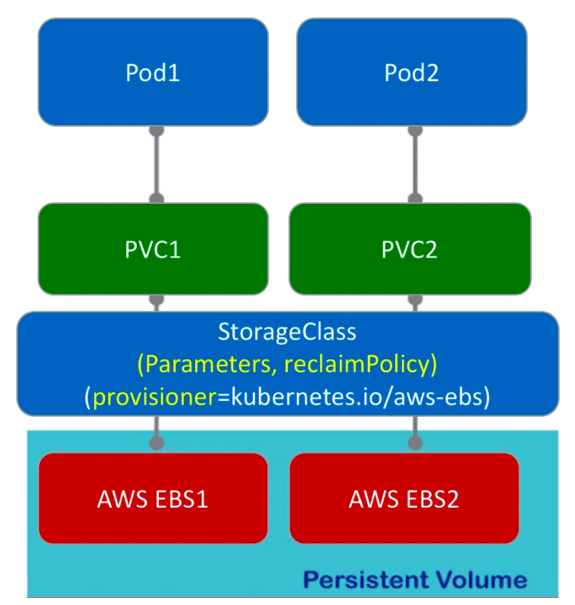
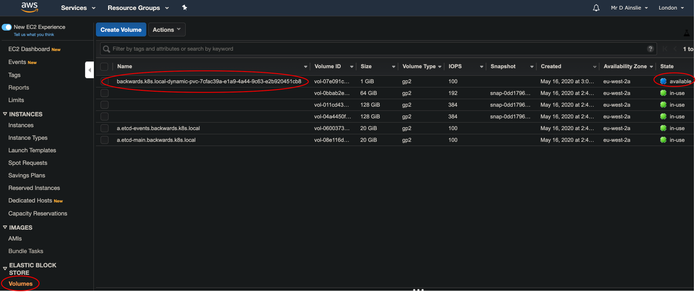
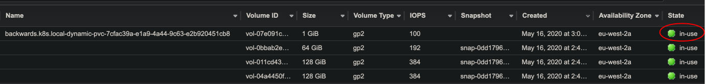
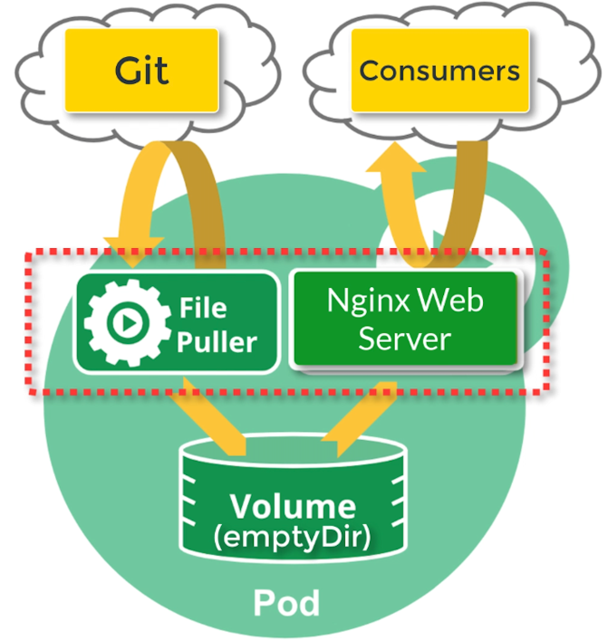

# Pods

Clone the course [yaml](https://github.com/naveenjoy/k8s-yaml):

```bash
kubernetes-backwards/kubernetes-mastery-on-aws/k8s/course-yaml at ☸️ backwards.k8s.local
➜ git clone https://github.com/naveenjoy/k8s-yaml.git
```

The manifest we'll be following along with is:

```bash
kubernetes-backwards/kubernetes-mastery-on-aws/k8s/pods at ☸️ backwards.k8s.local
➜ ls -las
...
16 -rw-r--r--   1 davidainslie  staff  4474  9 May 22:29 pod-nginx.yaml
```

## Kubectl

A sidebar...

**Imperative command** example:

```bash
kubectl run nginx --image nginx
```

**Imperative object configuration** examples:

```bash
kubectl create -f nginx.yaml

kubectl delete -f nginx.yaml

kubectl replace -f nginx.yaml
```

Replace (update) can be problematic - all updates must be reflected in the yaml file or they will be lost.

**Declarative object configurations** example:

```bash
kubectl apply -f nginx.yaml  # Apply a single configuration file

kubectl apply -f configs/    # Apply all configuration files inside the directory

kubectl apply -R -f configs/ # Recursively apply all configuration files inside the directory
```

Here, operations are **automatically detected** per object by kubectl.

Now, if you were to apply the following:

```bash
kubectl apply -f nginx-deploy.yaml # A kind of Deployment
```

we can then get the live object configuration with:

```bash
kubectl get -f nginx-deploy.yaml -o yaml
```

As well as **apply** the other command that you may use to change fields of a live object is **scale** e.g.

```bash
kubectl scale nginx --replicas=4 # Scale the number of Pod replicas in a ReplicaSet
```

But of course, this is an imperative command so be careful - after using it, you may want to update the **manifest** (which is another name for configuration file).

And how to delete on object?

```bash
kubectl delete -f nginx-deploy.yaml
```

## What is a Pod?


Think of a Pod as an **environment** that **containers run in** and persists until it is deleted. Containers within a Pod **share** its **IP address** and **port space** - Containers inside a Pod communicate using the **localhost** IP address. Containers running in different Pods communicate using the Pod's unique IP address.

Pods can specify a set of **shared storage volumes** - all containers in the Pod can access these shared volumes. Kubernetes supports several types of volumes e.g.

- **emptyDir**: Data is **erased** when the Pod is removed
- **awsElasticBlockStore (AWS EBS)**: Data is **preserved** when the Pod is removed.
- **cephfs (CephFS volume)**: Data is **preserved** when the Pod is removed and also supports **multiple writers**

<u>Pods do not by themselves self-heal within Kubernetes.</u>

**Controllers** are responsible for pod replication, software roll-outs and self-healing i.e. they make Pods durable. Examples of controllers are:

- Deployment
- StatefulSet
- DaemonSet

## Create

Take a look at [pod-nginx.yaml](../k8s/pods/pod-nginx.yaml):

```yaml
apiVersion: v1                # The API version (v1 currently)
kind: Pod                     # The Kind of API resource
metadata:       
  name: nginx                 # Name of this Pod that must be unique within the namespace
spec:                         # Specification of Pod's contents - list of containers to run
  containers:                 # Start the container listing this way
    - name: nginx             # Nickname for the container in this Pod. Must be unique.
      image: nginx:1.7.9      # Name of the Docker image that Kubernetes will pull.
      ports:
        - containerPort: 80   # The port used by the container.
                              # This port is accessible from all cluster nodes. 
                              # In k8s you don't publish container ports like you do in Docker. 
      resources:
        limits:
          memory: 256Mi
          cpu: 250m
```

The following will launch one pod running nginx:

```bash
kubernetes-backwards/kubernetes-mastery-on-aws/k8s/pods at ☸️ backwards.k8s.local
➜ kc apply -f pod-nginx.yaml
pod/nginx created
```

```bash
kubernetes-backwards/kubernetes-mastery-on-aws/k8s/pods at ☸️ backwards.k8s.local
➜ kc get pods
NAME    READY   STATUS    RESTARTS   AGE
nginx   1/1     Running   0          39s
```

To view the complete live pod configuration:

```bash
kubernetes-backwards/kubernetes-mastery-on-aws/k8s/pods at ☸️ backwards.k8s.local
➜ kc get pods -o yaml
```

```bash
kubernetes-backwards/kubernetes-mastery-on-aws/k8s/pods at ☸️ backwards.k8s.local
➜ kc get pods/nginx -o wide
NAME   READY  STATUS   RESTARTS  AGE   IP           NODE
nginx  1/1    Running   0        2m26s 100.96.1.4   ip-172-20-33-58.eu-west-2.compute.internal
```

```bash
kubernetes-backwards/kubernetes-mastery-on-aws/k8s/pods at ☸️ backwards.k8s.local
➜ kc describe pods nginx
```

## Port forward

Currently the nginx pod is only accessible on the IP address 100.96.1.4 within the cluster. We can access this pod from outside the cluster via **port forwarding**.

kubectl can create a secure tunnel from some local environment it is running on (such as a VM) to the Kubernetes cluster and forward a local port on said local environment to a port on the pod. Let's forward the local port of 8080 to the port of 80 on the pod.

```bash
kubernetes-backwards/kubernetes-mastery-on-aws/k8s/pods at ☸️ backwards.k8s.local
➜ kc port-forward pods/nginx 8080:80
Forwarding from 127.0.0.1:8080 -> 80
Forwarding from [::1]:8080 -> 80
```

Let's also send the above command to the background by first hitting **Ctl-Z** and the typing in **bg**:

```bash
^Z
zsh: suspended  kubectl port-forward pods/nginx 8080:80

kubernetes-backwards/kubernetes-mastery-on-aws/k8s/pods at ☸️ backwards.k8s.local took 1m 28s
✦ ➜ bg
[1]  + continued  kubectl port-forward pods/nginx 8080:80
```

And we can access nginx with **httpie**, **curl** or **web browser**:

```bash
kubernetes-backwards/kubernetes-mastery-on-aws/k8s/pods at ☸️ backwards.k8s.local
✦ ➜ http localhost:8080
Handling connection for 8080
HTTP/1.1 200 OK
...
<body>
<h1>Welcome to nginx!</h1>
```

## Run command inside (nginx) Container

```bash
kubernetes-backwards/kubernetes-mastery-on-aws/k8s/pods at ☸️ backwards.k8s.local took 2s
➜ kc exec -it pod/nginx -- /bin/bash
root@nginx:/# ls
bin  boot  dev	etc  home  lib	lib64  media  mnt  opt	proc  root  run ...
```

When there are multiple containers within a pod e.g.

```bash
➜ kc exec -it pod/nginx --container nginx -- /bin/bash
```

## View Pods environment variables

```bash
kubernetes-backwards/kubernetes-mastery-on-aws/k8s/pods at ☸️ backwards.k8s.local
➜ kc exec pod/nginx -- env

PATH=/usr/local/sbin:/usr/local/bin:/usr/sbin:/usr/bin:/sbin:/bin
HOSTNAME=nginx
KUBERNETES_PORT_443_TCP_ADDR=100.64.0.1
KUBERNETES_SERVICE_HOST=100.64.0.1
KUBERNETES_SERVICE_PORT=443
KUBERNETES_SERVICE_PORT_HTTPS=443
KUBERNETES_PORT=tcp://100.64.0.1:443
KUBERNETES_PORT_443_TCP=tcp://100.64.0.1:443
KUBERNETES_PORT_443_TCP_PROTO=tcp
KUBERNETES_PORT_443_TCP_PORT=443
NGINX_VERSION=1.7.9-1~wheezy
HOME=/root
```

And lots of other ways such as:

```bash
kubernetes-backwards/kubernetes-mastery-on-aws/k8s/pods at ☸️ backwards.k8s.local
➜ kc exec pod/nginx -- hostname
nginx

➜ kc exec pod/nginx -- hostname -f
nginx
```

## Copy files from/to (nginx) Container

Copy the nginx index.html from the Pod into our local environment:

```bash
kubernetes-backwards/kubernetes-mastery-on-aws/k8s/pods at ☸️ backwards.k8s.local
➜ kc cp nginx:usr/share/nginx/html/index.html index.html

➜ ls -las
...
8 -rw-r--r--   1 davidainslie  staff  612  2 May 23:06 index.html
```

Edit the file e.g. adding a **h2** with **Kubernetes**, and copy the file back to the pod:

```bash
kubernetes-backwards/kubernetes-mastery-on-aws/k8s/pods at ☸️ backwards.k8s.local
➜ kc cp index.html nginx:usr/share/nginx/html/index.html
```

Let's check if the copy was successful:

```bash
kubernetes-backwards/kubernetes-mastery-on-aws/k8s/pods at ☸️ backwards.k8s.local
➜ kc exec nginx -- cat /usr/share/nginx/html/index.html
...
<body>
<h1>Welcome to nginx!</h1>
<h2>Kubernetes</h2>
```

## Labels

```bash
kubernetes-backwards/kubernetes-mastery-on-aws/k8s/pods at ☸️ backwards.k8s.local
➜ kc get pods --show-labels
NAME    READY   STATUS    RESTARTS   AGE   LABELS
nginx   1/1     Running   0          84s   <none>
```

Add a label:

```bash
kubernetes-backwards/kubernetes-mastery-on-aws/k8s/pods at ☸️ backwards.k8s.local
➜ kc label pod/nginx "tier=frontend"
```

We can again "show labels", but we can get a slightly different view with:

```bash
kubernetes-backwards/kubernetes-mastery-on-aws/k8s/pods at ☸️ backwards.k8s.local
➜ kc get pods -L tier
NAME    READY   STATUS    RESTARTS   AGE     TIER
nginx   1/1     Running   0          5m10s   frontend
```

Let's filter by label:

```bash
kubernetes-backwards/kubernetes-mastery-on-aws/k8s/pods at ☸️ backwards.k8s.local
➜ kc get pods --selector="tier=frontend"
NAME    READY   STATUS    RESTARTS   AGE
nginx   1/1     Running   0          7m33s
```

or an equivalent command is:

```bash
kubernetes-backwards/kubernetes-mastery-on-aws/k8s/pods at ☸️ backwards.k8s.local
➜ kc get pods -l "tier=frontend"
NAME    READY   STATUS    RESTARTS   AGE
nginx   1/1     Running   0          8m47s
```

Another way for the above filter:

```bash
kubernetes-backwards/kubernetes-mastery-on-aws/k8s/pods at ☸️ backwards.k8s.local
➜ kc get pods --selector="tier!=backend"
NAME    READY   STATUS    RESTARTS   AGE
nginx   1/1     Running   0          10m
```

```bash
kubernetes-backwards/kubernetes-mastery-on-aws/k8s/pods at ☸️ backwards.k8s.local
➜ kc get pods --selector="tier in (frontend, backend)"
NAME    READY   STATUS    RESTARTS   AGE
nginx   1/1     Running   0          16m
```

```bash
kubernetes-backwards/kubernetes-mastery-on-aws/k8s/pods at ☸️ backwards.k8s.local
➜ kc get pods --selector="tier notin (tier1, tier2)"
NAME    READY   STATUS    RESTARTS   AGE
nginx   1/1     Running   0          17m
```

```bash
kubernetes-backwards/kubernetes-mastery-on-aws/k8s/pods at ☸️ backwards.k8s.local
➜ kc get pods --selector="tier"
NAME    READY   STATUS    RESTARTS   AGE
nginx   1/1     Running   0          18m
```

Let's remove the above label:

```bash
kubernetes-backwards/kubernetes-mastery-on-aws/k8s/pods at ☸️ backwards.k8s.local took 2s
➜ kc label pod/nginx "tier-"
pod/nginx labeled

➜ kc get pods --show-labels
NAME    READY   STATUS    RESTARTS   AGE   LABELS
nginx   1/1     Running   0          12m   <none>
```

We can still select (filter) for a non-existing key e.g.

```bash
kubernetes-backwards/kubernetes-mastery-on-aws/k8s/pods at ☸️ backwards.k8s.local
➜ kc get pods --selector='!tier'
NAME    READY   STATUS    RESTARTS   AGE
nginx   1/1     Running   0          22m
```

**Noting we have to use single quotes - as yet, I do not know.**

Now follows an example of a Pod manifest with labels:

```yaml
apiVersion: v1               # The API version (v1 currently)
kind: Pod                    # The Kind of API resource
metadata:                    # Describes the Pod and its labels
  name: nginx            # Name of this Pod. A Pod's name must be unique within the namespace
  labels: # Optional. Labels are key:value pairs. Use is to group and target sets of pods.
    tier: frontend       # Tag your pods with identifying attributes that are meaningful
    app: nginx
spec:                   # Specification of Pod's contents e.g. A list of containers it will run
  containers:                # Start the container listing this way
    - name: nginx      # A nickname for the container in this Pod. Must be unique with this Pod
      image: nginx:1.7.9     # Name of the Docker image that Kubernetes will pull
      ports:
        - containerPort: 80  # The port used by the container. Accessible from all nodes.                               
      resources:
        limits:
          memory: 256Mi
          cpu: 250m
```

To **relabel** you have to include **--overwrite** e.g.

```bash
kubernetes-backwards/kubernetes-mastery-on-aws/k8s/pods at ☸️ backwards.k8s.local
➜ kc label pod/nginx "app=mynginx" --overwrite
```

## Update

```bash
kubernetes-backwards/kubernetes-mastery-on-aws/k8s/pods at ☸️ backwards.k8s.local
➜ kc describe pod/nginx
Name:         nginx
...
Containers:
  nginx:
    Container ID:   docker://21a2d45d1a3ffb5b43a7f0975f813ca073414769a535cf2054062f7935e44461
    Image:          nginx:1.7.9
```

By apply a manifest with a newer version of our (nginx) image, we update the software e.g.

```bash
kubernetes-backwards/kubernetes-mastery-on-aws/k8s/pods at ☸️ backwards.k8s.local
➜ kc apply -f pod-nginx-upgrade.yaml
pod/nginx configured
```

```bash
kubernetes-backwards/kubernetes-mastery-on-aws/k8s/pods at ☸️ backwards.k8s.local took 50s
➜ kc describe pod/nginx
Name:         nginx
...
Containers:
  nginx:
    Container ID:   docker://aceb0d80462f9cb6e889a4b6892eec8a6f149c88e0c3445e9296d0daf4ff173f
    Image:          nginx:latest
```

## Log

With nginx Pod running let's first generate some logging:

```bash
kubernetes-backwards/kubernetes-mastery-on-aws/k8s/pods at ☸️ backwards.k8s.local
➜ kc port-forward pods/nginx 8080:80
Forwarding from 127.0.0.1:8080 -> 80
Forwarding from [::1]:8080 -> 80
^Z
zsh: suspended  kubectl port-forward pods/nginx 8080:80

kubernetes-backwards/kubernetes-mastery-on-aws/k8s/pods at ☸️ backwards.k8s.local took 7s
➜ bg
[1]  + continued  kubectl port-forward pods/nginx 8080:80

kubernetes-backwards/kubernetes-mastery-on-aws/k8s/pods at ☸️ backwards.k8s.local
➜ http localhost:8080
Handling connection for 8080
HTTP/1.1 200 OK
...
```

and we'll have a log:

```bash
kubernetes-backwards/kubernetes-mastery-on-aws/k8s/pods at ☸️ backwards.k8s.local
➜ kc logs pods/nginx
127.0.0.1 - - [05/May/2020:21:25:41 +0000] "GET / HTTP/1.1" 200 612 "-" "HTTPie/2.1.0" "-"
```

and to follow the logs:

```bash
kubernetes-backwards/kubernetes-mastery-on-aws/k8s/pods at ☸️ backwards.k8s.local
➜ kc logs -f pods/nginx
127.0.0.1 - - [05/May/2020:21:25:41 +0000] "GET / HTTP/1.1" 200 612 "-" "HTTPie/2.1.0" "-"
```

To see logs from a **previous instantiation of a Pod**:

```bash
kubernetes-backwards/kubernetes-mastery-on-aws/k8s/pods at ☸️ backwards.k8s.local
➜ kc logs --previous pods/nginx
```

## Annotate

**Labels** hold **identifying** information while **annotations** hold **non-identifying** information. The primary purpose of annotations is to assist **tools** and **libraries**. Let's add some annotations to our (nginx) pod:

```bash
kubernetes-backwards/kubernetes-mastery-on-aws/k8s/pods at ☸️ backwards.k8s.local
➜ kc annotate pods/nginx build=two builder=joe
pod/nginx annotated
```

```bash
kubernetes-backwards/kubernetes-mastery-on-aws/k8s/pods at ☸️ backwards.k8s.local
➜ kc get pods/nginx -o yaml
apiVersion: v1
kind: Pod
metadata:
  annotations:
    build: two
    builder: joe
    kubectl.kubernetes.io/last-applied-configuration: |
      {"apiVersion":"v1","kind":"Pod","metadata":{"annotations":{},"labels":{"app":"nginx","tier":"frontend"},"name":"nginx","namespace":"default"},"spec":{"containers":[{"image":"nginx:latest","name":"nginx","ports":[{"containerPort":80}],"resources":{"limits":{"cpu":"250m","memory":"256Mi"}}}]}}
...
```

We see the new annotations (and a useful one that shows how k8s performs an update via a diff).

To just see the annotations, use a **jsonpath**:

```bash
kubernetes-backwards/kubernetes-mastery-on-aws/k8s/pods at ☸️ backwards.k8s.local
➜ kc get pods/nginx -o jsonpath='{.metadata.annotations}'
map[build:two builder:joe kubectl.kubernetes.io/last-applied-configuration:{"apiVersion":"v1","kind":"Pod","metadata":{"annotations":{},"labels":{"app":"nginx","tier":"frontend"},"name":"nginx","namespace":"default"},"spec":{"containers":[{"image":"nginx:latest","name":"nginx","ports":[{"containerPort":80}],"resources":{"limits":{"cpu":"250m","memory":"256Mi"}}}]}}
]
```

Let's **overwrite** one of our new annotations:

```bash
kubernetes-backwards/kubernetes-mastery-on-aws/k8s/pods at ☸️ backwards.k8s.local
➜ kc annotate pods/nginx build=3 --overwrite
```

and to remove said annotations:

```bash
kubernetes-backwards/kubernetes-mastery-on-aws/k8s/pods at ☸️ backwards.k8s.local
➜ kc annotate pods/nginx "build-"
```

## Delete

```bash
kubernetes-backwards/kubernetes-mastery-on-aws/k8s/pods at ☸️ backwards.k8s.local
➜ kc delete pods/nginx
```

By default k8s initiates a graceful shutdown over 30 seconds. Upon receiving a **delete** k8s first sends a **TERM signal** to the Pod application. After 30 seconds a **kill signal** will be sent.

## Resources

- Resource **requests** are **guaranteed** by Kubernetes
- Resource **limits** are the maximum amount of CPU and Memory a container can use


```bash
kubernetes-backwards/kubernetes-mastery-on-aws/k8s/pods at ☸️ backwards.k8s.local
➜ kc apply -f pod-nginx.yaml
pod/nginx created

➜ kc describe pods/nginx
Name:         nginx
...
Containers:
  nginx:
    ...
    Limits:
      cpu:     1
      memory:  512Mi
    Requests:
      cpu:        500m
      memory:     64Mi
...
QoS Class:       Burstable
```

## Liveness and Readiness probes

By using a **liveness probe** Kubelet can detect whether a process is healthy and functioning well. Most common way to check for liveness is with **HTTP GET**, though you could execute a command or open a TCP socket to the container on a specific port.

A **readiness probe** is used to detect whether a container is **ready** to receive traffic through Kubernetes **services**. A readiness probe tells Kubernetes **not to send traffic to containers until the probe is successful**.

## Volumes

A Docker container's file system is **ephemeral**. Without a **Volume**, after restart a container will start with a clean state.

A **Volume** provides persistent storage to the Pod.

## emptyDir Volume

Take a look at [emptydir manifest](../k8s/pods/pod-nginx-emptydir.yaml).

**emptyDir** Volume type: Data stored in an emptyDir Volume only lasts for the **life of the Pod**. Data **will not** persist when the Pod is terminated and recreated. Primary use-cases of an emptyDir Volume:

- As a data cache
- As a shared storage space that syncs remotely with a Git repository
- As a temporary file sharing space between a Pod's containers

```bash
kubernetes-backwards/kubernetes-mastery-on-aws/k8s/pods at ☸️ backwards.k8s.local
➜ kc describe pod/nginx
Name:         nginx
...
Containers:
  nginx:
    ...
    Mounts:
      /usr/share/nginx/html from www-data (rw)
      /var/run/secrets/kubernetes.io/serviceaccount from default-token-6z97t (ro)
...
Volumes:
  www-data:
    Type:       EmptyDir (a temporary directory that shares a pod's lifetime)
...    
```

Let's check/test the Volume:

```bash
kubernetes-backwards/kubernetes-mastery-on-aws/k8s/pods at ☸️ backwards.k8s.local
➜ kc port-forward nginx 8080:80 &

➜ echo "nginx server running on an AWS Kubernetes cluster" > index.html

➜ kc cp index.html pod/nginx:/usr/share/nginx/html/index.html

➜ curl http://localhost:8080
```

We can **exec** onto the pod to take a look at the mount:

```bash
➜ kc exec -it pod/nginx -- /bin/bash

root@nginx:/# cat /proc/mounts
...
/dev/nvme0n1p1 /user/share/nginx/html
```

## hostPath Volume

The **hostPath** Volume **mounts a file or directory** from the host node's filesystem into the Pod.

Any arbitrary location on the node can be mounted into the container e.g. running **cAdvisor** in a container needs access to **/sys** directory.

Take a look at [hostpath manifest](../k8s/pods/pod-ubuntu-hostpath.yaml).

```bash
kubernetes-backwards/kubernetes-mastery-on-aws/k8s/pods at ☸️ backwards.k8s.local
➜ kc apply -f pod-ubuntu-hostpath.yaml
pod/hostpath-test created

➜ kc exec -it pod/hostpath-test -- /bin/bash
root@hostpath-test:/# ls /var/run/docker.sock
/var/run/docker.sock
```

Now we'll use **curl** to talk to Docker to list containers:

```bash
root@hostpath-test:/# apt-get update && apt-get install -y curl
```

```bash
root@hostpath-test:/# curl --unix-socket /var/run/docker.sock -H 'Content-Type: application/json' http://localhost/containers/json

[{"Id":"4edef502a2cce579e500c1493bc810ed11dad7c3b4131d5074f13fb8d85d9d56","Names":["/k8s_ubuntu_hostpath-test_default_a43a19c2-6e1c-44e7-9324-a11efb54ae5f_0"],"Image":"ubuntu@sha256:db6697a61d5679b7ca69dbde3dad6be0d17064d5b6b0e9f7be8d456ebb337209","ImageID":"sha256:005d2078bdfab5066ae941cea93f644f5fd25521849c870f4e1496f4526d1d5b","Command":"/bin/bash -c -- 'while true; do sleep 10; done;'","Created":1589122950,"Ports":[],"Labels":{"annotation.io.kubernetes.container.hash":"81bad010","annotation.io.kubernetes.container.restartCount":"0","annotation.io.kubernetes.container.terminationMessagePath":"/dev/termination-log","annotation.io.kubernetes.container.terminationMessagePolicy":"File","annotation.io.kubernetes.pod.terminationGracePeriod":"30","io.kubernetes.container.logpath":"/var/log/pods/default_hostpath-test_a43a19c2-6e1c-44e7-9324-a11efb54ae5f/ubuntu/0.log","io.kubernetes.container.name":"ubuntu","io.kubernetes.docker.type":"container","io.kubernetes.pod.name":"hostpath-test","io.kubernetes.pod.namespace":"default","io.kubernetes.pod.uid":"a43a19c2-6e1c-44e7-9324-a11efb54ae5f","io.kubernetes.sandbox.id":"b902509005a9d8ca83a23c26424baedda160ec211d61f90a692a626a61795ac9"},"State":"running","Status":"Up 6 minutes","HostConfig":{"NetworkMode":"container:b902509005a9d8ca83a23c26424baedda160ec211d61f90a692a626a61795ac9"}
...
```

## AWS Dynamic Persistent EBS Volume

- The **awsElasticBlockStore** volume type mounts an **AWS EBS** volume into the Pod
- The AWS EBS volume can persist data independent of a Pod's lifetime
- An EBS volume can be **pre-populated** with data
- The data can be **handed off** between Pods as they move from one k8s node (i.e. an EC2 instance) to another

To provision an EBS volume **dynamically** for your Pod, you'll need to first create an object of kind **StorageClass**.

Next, refer to the StorageClass inside an object of kind **PersistentVolumeClaim**. The PVC will use the StorageClass to dynamically provision the EBS volume.



So first create the StorageClass using [aws-ebs-storageclass.yaml](../k8s/pods/aws-ebs-storageclass.yaml):

```yaml
apiVersion: storage.k8s.io/v1
kind: StorageClass
metadata:
  name: standard-aws-ebs            # Users request a particular Storage class
provisioner: kubernetes.io/aws-ebs  # Determines the volume plugin used for provisioning PVs
parameters:
  type: gp2                         # General purpose SSD backed Volume Type in AWS EBS
reclaimPolicy: Delete               # Set to either Delete (default) or Retain
```

```bash
kubernetes-backwards/kubernetes-mastery-on-aws/k8s/pods at ☸️ backwards.k8s.local
➜ kc apply -f aws-ebs-storageclass.yaml
storageclass.storage.k8s.io/standard-aws-ebs created
```

```bash
kubernetes-backwards/kubernetes-mastery-on-aws/k8s/pods at ☸️ backwards.k8s.local
➜ kc get sc
NAME               PROVISIONER             AGE
default            kubernetes.io/aws-ebs   48m
gp2 (default)      kubernetes.io/aws-ebs   48m
standard-aws-ebs   kubernetes.io/aws-ebs   34s
```

```bash
kubernetes-backwards/kubernetes-mastery-on-aws/k8s/pods at ☸️ backwards.k8s.local
➜ kc describe sc standard-aws-ebs
Name:            standard-aws-ebs
IsDefaultClass:  No
Annotations:     kubectl.kubernetes.io/last-applied-configuration={"apiVersion":"storage.k8s.io/v1","kind":"StorageClass","metadata":{"annotations":{},"name":"standard-aws-ebs"},"parameters":{"type":"gp2"},"provisioner":"kubernetes.io/aws-ebs","reclaimPolicy":"Delete"}

Provisioner:           kubernetes.io/aws-ebs
Parameters:            type=gp2
AllowVolumeExpansion:  <unset>
MountOptions:          <none>
ReclaimPolicy:         Delete
VolumeBindingMode:     Immediate
Events:                <none>
```

Now we need to create a Persistent Volume Claim where our manifest is [aws-ebs-persistent-volume-claim.yaml](../k8s/pods/aws-ebs-persistent-volume-claim.yaml):

```yaml
apiVersion: v1
kind: PersistentVolumeClaim
metadata:
	# This claim results in an AWS SSD Persistent Disk being automatically provisioned
  name: aws-ebs-claim
spec:
	# Volume can be mounted as read-write by a single node (only option supported in AWS EBS)
  accessModes:
    - ReadWriteOnce
  # This links this PersistentVolumeClaim Object to the AWS Storage Class
	# This name must match the AWS Storage Class
	storageClassName: standard-aws-ebs
  resources:
    requests:
    	# 1GB volume is requested from AWS
      storage: 1Gi
```

Note when replicating a stateful Pod (such as MySql) they will require their own unique PersistentVolumeClaim object. So you will need a PersistentVolumeClaim template to be used by each **replica** - this is used in conjunction with a **StatefulSet**.

```bash
kubernetes-backwards/kubernetes-mastery-on-aws/k8s/pods at ☸️ backwards.k8s.local
➜ kc apply -f aws-ebs-persistent-volume-claim.yaml
persistentvolumeclaim/aws-ebs-claim created
```

```
kubernetes-backwards/kubernetes-mastery-on-aws/k8s/pods at ☸️ backwards.k8s.local
➜ kc get pvc
NAME            STATUS   VOLUME                                     CAPACITY   STORAGECLASS
aws-ebs-claim   Bound    pvc-7cfac39a-e1a9-4a44-9c63-e2b920451cb8   1Gi        standard-aws-ebs
```

and we can also see said volume in AWS console:



```bash
kubernetes-backwards/kubernetes-mastery-on-aws/k8s/pods at ☸️ backwards.k8s.local
➜ kc describe pvc aws-ebs-claim
Name:          aws-ebs-claim
Namespace:     default
StorageClass:  standard-aws-ebs
Status:        Bound
Volume:        pvc-7cfac39a-e1a9-4a44-9c63-e2b920451cb8
Labels:        <none>
Annotations:   pv.kubernetes.io/bind-completed: yes
               pv.kubernetes.io/bound-by-controller: yes
               volume.beta.kubernetes.io/storage-provisioner: kubernetes.io/aws-ebs
Finalizers:    [kubernetes.io/pvc-protection]
Capacity:      1Gi
Access Modes:  RWO
VolumeMode:    Filesystem
Mounted By:    <none>
Events:
  Type    Reason                 Age    From                         Message
  ----    ------                 ----   ----                         -------
  Normal  ProvisioningSucceeded  6m29s  persistentvolume-controller  Successfully provisioned volume pvc-7cfac39a-e1a9-4a44-9c63-e2b920451cb8 using kubernetes.io/aws-ebs
```

So now we want to mount this (available) volume into our Pod, where the pod manifest using the pvc is [pod-nginx-volume-ebs-dynamic.yaml](../k8s/pods/pod-nginx-volume-ebs-dynamic.yaml):

```yaml
apiVersion: v1
kind: Pod
metadata:
  name: nginx
  labels:
    tier: frontend
    app:  nginx
  annotations:
    description: Nginx container with an AWS EBS Persistent Volume
spec:
  volumes:
    - name: aws-ebs              # Name of the AWS EBS Volume 
      persistentVolumeClaim:     # Pods access dynamic AWS storage by using claim as a volume
        claimName: aws-ebs-claim # Must match name of AWS Persistent Volume Claim we created
  containers:
    - name: nginx
      image: nginx:1.13.8
      volumeMounts:
        - mountPath: /usr/share/nginx/html # Mount path within the container
          name: aws-ebs                    # Name must match the AWS EBS volume name
      ports:
        - containerPort: 80
      resources:
        requests:
          cpu: "500m"
          memory: "64Mi"
        limits:
          cpu: "1"
          memory: "512Mi"
```

```bash
kubernetes-backwards/kubernetes-mastery-on-aws/k8s/pods at ☸️ backwards.k8s.local
➜ kc apply -f pod-nginx-volume-ebs-dynamic.yaml
pod/nginx created
```

```bash
kubernetes-backwards/kubernetes-mastery-on-aws/k8s/pods at ☸️ backwards.k8s.local
➜ kc describe pod/nginx
Name:         nginx
...
Volumes:
  aws-ebs:
    Type:       PersistentVolumeClaim (a reference to a PersistentVolumeClaim
...    
Events:
  Message
  -------
  AttachVolume.Attach succeeded for volume "pvc-7cfac39a-e1a9-4a44-9c63-e2b920451cb8"
```

and now we see the volume "in use":



To test the persistence we can copy a new index.html into the pod:

```bash
kubernetes-backwards/kubernetes-mastery-on-aws/k8s/pods at ☸️ backwards.k8s.local
➜ kc cp index.html nginx:/usr/share/nginx/html/index.html

➜ kc port-forward nginx 8080:80 &
[1] 30712
Forwarding from 127.0.0.1:8080 -> 80
Forwarding from [::1]:8080 -> 80

➜ http localhost:8080
HTTP/1.1 200 OK
...
nginx server running on an AWS Kubernetes cluster
```

We delete and then recreate the Pod:

```bash
kubernetes-backwards/kubernetes-mastery-on-aws/k8s/pods at ☸️ backwards.k8s.local
➜ kc delete pod/nginx
pod "nginx" deleted

➜ kc apply -f pod-nginx-volume-ebs-dynamic.yaml
pod/nginx created

# Kill previous port fowarding
➜ pkill kc

➜ kc port-forward nginx 8080:80 &
[2] 31504

➜ http localhost:8080
HTTP/1.1 200 OK
...
nginx server running on an AWS Kubernetes cluster
```

Finally we can cleanup:

```bash
kubernetes-backwards/kubernetes-mastery-on-aws/k8s/pods at ☸️ backwards.k8s.local
➜ kc delete pod/nginx
pod "nginx" deleted

➜ kc delete pvc/aws-ebs-claim
persistentvolumeclaim "aws-ebs-claim" deleted
```

and the claim will have gone in the AWS console.

And lastly:

```bash
kubernetes-backwards/kubernetes-mastery-on-aws/k8s/pods at ☸️ backwards.k8s.local
➜ kc delete sc/standard-aws-ebs
storageclass.storage.k8s.io "standard-aws-ebs" deleted
```

## Volume Sharing with Multi-Container Pod



We create the above with [pod-nginx-multi.yaml](../k8s/pods/pod-nginx-multi.yaml):

```yaml
apiVersion: v1
kind: Pod
metadata:
  name: nginx
  labels:
    tier: frontend
    app:  nginx
  annotations:
    description: Multiple containers in pod sharing a volume
spec:
  volumes:                                 # Define the volumes available to your containers
    - name: www-data-share                 # Name of the Volume 
      emptyDir: {}                         # EmptyDir type for sharing data between containers
  containers:
    # First container in the Pod
    - name: nginx
      image: nginx:1.13.8
      volumeMounts:
        - mountPath: /usr/share/nginx/html # Mount path inside the container
          name: www-data-share             # Name must match the volume name defined above
          readOnly: true                   # nginx can only read data from this volume
      ports:
        - containerPort: 80
    # Second Container - Syncs a Git Repo
    - name: git-sync
      image: openweb/git-sync:0.0.1
      volumeMounts:
        - mountPath: /usr/share/nginx/html  # Mount path within the second container
          name: www-data-share              # The same volume is mounted by both containers
      env:
        - name: GIT_SYNC_REPO               # GIT Repo to Sync 
          value: "https://github.com/naveenjoy/naveenjoy.github.io.git"
        - name: GIT_SYNC_DEST               # Destination is the shared volume
          value: "/usr/share/nginx/html" 
        - name: GIT_SYNC_BRANCH             # Sync the master branch
          value: "master"
        - name: GIT_SYNC_REV
          value: "FETCH_HEAD"
        - name: GIT_SYNC_WAIT               # Sync every 10 seconds
          value: "10"
```

```bash
kubernetes-backwards/kubernetes-mastery-on-aws/k8s/pods at ☸️ backwards.k8s.local
➜ kc apply -f pod-nginx-multi.yaml
```

To view the logs of just one container (such as git-sync):

```bash
kubernetes-backwards/kubernetes-mastery-on-aws/k8s/pods at ☸️ backwards.k8s.local
➜ kc get all
NAME        READY   STATUS    RESTARTS   AGE
pod/nginx   2/2     Running   0          11s

➜ kc logs -f pod/nginx --container git-sync
2020/05/17 14:22:18 clone "https://github.com/naveenjoy/naveenjoy.github.io.git": Cloning into '/usr/share/nginx/html'...
2020/05/17 14:22:19 fetch "master": From https://github.com/naveenjoy/naveenjoy.github.io
 * branch            master     -> FETCH_HEAD
2020/05/17 14:22:19 reset "FETCH_HEAD": HEAD is now at 1bf64e0 Delete img.png
2020/05/17 14:22:19 wait 10 seconds
2020/05/17 14:22:29 done
2020/05/17 14:22:29 fetch "master": From https://github.com/naveenjoy/naveenjoy.github.io
...
```

And we can see if the web server does indeed pick up files pulled by the git image:

```bash
kubernetes-backwards/kubernetes-mastery-on-aws/k8s/pods at ☸️ backwards.k8s.local
➜ kc port-forward pod/nginx 8080:80
Forwarding from 127.0.0.1:8080 -> 80
Forwarding from [::1]:8080 -> 80
^Z
zsh: suspended  kubectl port-forward pod/nginx 8080:80

kubernetes-backwards/kubernetes-mastery-on-aws/k8s/pods on  master [!+] at ☸️ backwards.k8s.local took 2s
✦ ➜ bg
[1]  + continued  kubectl port-forward pod/nginx 8080:80

➜ http localhost:8080
HTTP/1.1 200 OK
...
Hello, Welcome to Kubernetes on AWS Git-Sync Demo
```

## Secrets

Some data to store inside a secret:

- TLS Data (key, certificate)
- Username / Password
- OAuth tokens
- Private keys

3 steps to creating and consuming secrets:

1. Assemble the raw data file(s) you want to store inside the secret object e.g. TLS key file, username file, password file, token file. You would e.g. put the TLS key in one file and the certificate in another file. Or one file to contain username and another file to contain password i.e. place one secret data item inside a file.
2. Create the secret object. Use **kubectl create secret <name of secret>** command with the data files provided as arguments. You can also create secret inside **yaml** (or **json**) file, and then use said file to create the secret - when doing this, the secret data must be base64 encoded. It is preferable to use the **create secret** command.
3. Consume the secret inside your application either:
   - Mount the secret as a data volume (**secrets volume**) OR
   - Expose it as environment variables inside the container.

## ConfigMap

```bash
➜ kc create configmap <map-name> <data-source>
```

The **data source** is specified as **key value pairs**.

ConfigMaps are consumed inside a container by mounting as a **configMap volume** OR exposing as **environment variables**.

When a ConfigMap already being consumed by a Pod is updated, the projected keys are eventually updated inside the Pod. Though you must first create a ConfigMap before a Pod can use it.