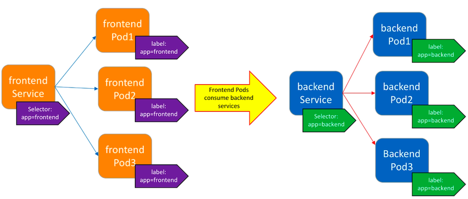
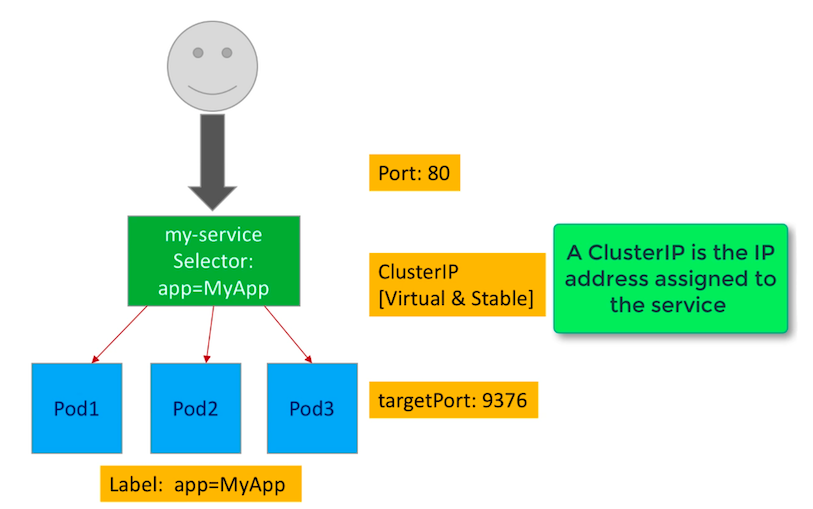
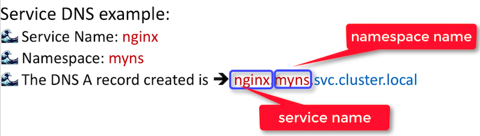

# Services

Pods, which get their own IP addresses, are **ephemeral** - So what to do when IPs keep changing?

The Service abstraction keeps track of its dynamic set of Pods.



## ClusterIP



A **ClusterIP** is a **stable and virtual** IP address, unlike a Ports IP address which often changes. Kubernetes will automatically load balance incoming request to Service via the label selector to Pods.

**ClusterIP** in **only** reachable from with the cluster.

## Define a Service

The above could be defined as:

```yaml
kind: Service
apiVersion: v1
metadata:
	name: my-service
spec:
	selector:
		app: MyApp
	ports:
  	- name: http 
  	  protocol: TCP
  		port: 80
  		targetPort: 9376
  	- name: https
  		protocol: TCP
  		port: 443
  		targetPort: 9377
```

The selector is evaluated continuously to determine the current set of backend Pods and the results are posted to an **Endpoints** object. The Endpoint objects are created automatically, unless you do not specify a **spec.selector**. Why would you not define a spec.selector? If your service interacts with services that are not managed by Kubernetes - and in this case you would need to define your own Endpoint manifests.

Let's now create a Service that load balances incoming  client traffic to Nginx Pods.

- Deploy 4 Nginx Pod Replicas
- And a Service to target these Pods, exposing the service only on a ClusterIP address

We'll create 4 replicas using [pod-nginx-deploy.yaml](../k8s/services/pod-nginx-deploy.yaml):

```yaml
kind: Deployment
apiVersion: apps/v1
metadata:
  name: nginx
  labels:
    app: nginx
spec:
  replicas: 4
  
  selector:
    matchLabels:
      app: nginx
            
  template:
    metadata:
      labels:
        app: nginx
    spec:
      containers:
        - name: nginx                
          image: nginx:1.13.8
          ports:
            - containerPort: 80
```

```bash
kubernetes-backwards/kubernetes-mastery-on-aws/k8s/services at ☸️ backwards.k8s.local
➜ kc apply -f pod-nginx-deploy.yaml
```

And a Service:

```bash
kubernetes-backwards/kubernetes-mastery-on-aws/k8s/services at ☸️ backwards.k8s.local
➜ kc expose deployment.apps/nginx --name=nginx --labels="app=nginx"
service/nginx exposed
```

The Service will copy the port i.e. port 80 from the Deployment resource that's being exposed.

```bash
kubernetes-backwards/kubernetes-mastery-on-aws/k8s/services at ☸️ backwards.k8s.local
➜ kc get service nginx -o wide
NAME    TYPE        CLUSTER-IP      EXTERNAL-IP   PORT(S)   AGE     SELECTOR
nginx   ClusterIP   100.66.77.139   <none>        80/TCP    2m22s   app=nginx
```

```bash
kubernetes-backwards/kubernetes-mastery-on-aws/k8s/services at ☸️ backwards.k8s.local
➜ kc describe service/nginx
Name:              nginx
Namespace:         default
Labels:            app=nginx
Annotations:       <none>
Selector:          app=nginx
Type:              ClusterIP
IP:                100.66.77.139
Port:              <unset>  80/TCP
TargetPort:        80/TCP
Endpoints:         100.96.1.4:80,100.96.1.5:80,100.96.2.4:80 + 1 more...
Session Affinity:  None
Events:            <none>
```

```bash
kubernetes-backwards/kubernetes-mastery-on-aws/k8s/services at ☸️ backwards.k8s.local
➜ kc get ep nginx
NAME    ENDPOINTS                                               AGE
nginx   100.96.1.4:80,100.96.1.5:80,100.96.2.4:80 + 1 more...   8m12s
```

The above endpoints will match those of the Pods:

```bash
kubernetes-backwards/kubernetes-mastery-on-aws/k8s/services on  master [!?] at ☸️ backwards.k8s.local
➜ kc get pods -o wide
NAME                    READY   STATUS    IP           NODE
nginx-7b5b5845d-2pn68   1/1     Running   100.96.2.5   ip-172-20-37-51.eu-west-2.compute.internal
nginx-7b5b5845d-jg6wn   1/1     Running   100.96.1.5   ip-172-20-63-131.eu-west-2.compute.internal
nginx-7b5b5845d-rh85d   1/1     Running   100.96.1.4   ip-172-20-63-131.eu-west-2.compute.internal
nginx-7b5b5845d-rh879   1/1     Running   100.96.2.4   ip-172-20-37-51.eu-west-2.compute.internal
```

Make a request - though which Pod handles it? Let's tail the logs:

```bash
kubernetes-backwards on  master [!?] at ☸️ backwards.k8s.local
➜ kubetail nginx
Will tail 4 logs...
nginx-7b5b5845d-2pn68
nginx-7b5b5845d-jg6wn
nginx-7b5b5845d-rh85d
nginx-7b5b5845d-rh879
[nginx-7b5b5845d-2pn68] 100.96.2.4 - - [06/Jun/2020:17:27:44 +0000] "GET / HTTP/1.1" 200 612 "-" "curl/7.52.1" "-"
[nginx-7b5b5845d-rh85d] 100.96.2.4 - - [06/Jun/2020:17:27:52 +0000] "GET / HTTP/1.1" 200 612 "-" "curl/7.52.1" "-"
[nginx-7b5b5845d-2pn68] 100.96.2.4 - - [06/Jun/2020:17:27:56 +0000] "GET / HTTP/1.1" 200 612 "-" "curl/7.52.1" "-"
[nginx-7b5b5845d-2pn68] 100.96.2.4 - - [06/Jun/2020:17:27:58 +0000] "GET / HTTP/1.1" 200 612 "-" "curl/7.52.1" "-"
[nginx-7b5b5845d-jg6wn] 100.96.2.4 - - [06/Jun/2020:17:28:00 +0000] "GET / HTTP/1.1" 200 612 "-" "curl/7.52.1" "-"
[nginx-7b5b5845d-rh879] 100.96.2.1 - - [06/Jun/2020:17:28:03 +0000] "GET / HTTP/1.1" 200 612 "-" "curl/7.52.1" "-"
```

```bash
kubernetes-backwards/kubernetes-mastery-on-aws/k8s/services at ☸️ backwards.k8s.local
➜ kc get service/nginx
NAME    TYPE        CLUSTER-IP      EXTERNAL-IP   PORT(S)   AGE
nginx   ClusterIP   100.66.77.139   <none>        80/TCP    49m

kc exec -it pod/nginx-7b5b5845d-rh879 -- /bin/bash
root@nginx-7b5b5845d-rh879:/# apt-get update
root@nginx-7b5b5845d-rh879:/# apt-get upgrade
root@nginx-7b5b5845d-rh879:/# apt-get install curl

root@nginx-7b5b5845d-rh879:/# curl 100.66.77.139
<title>Welcome to nginx!</title>

root@nginx-7b5b5845d-rh879:/# curl 100.66.77.139
<title>Welcome to nginx!</title>

root@nginx-7b5b5845d-rh879:/# curl 100.66.77.139
<title>Welcome to nginx!</title>

root@nginx-7b5b5845d-rh879:/# curl 100.66.77.139
<title>Welcome to nginx!</title>

root@nginx-7b5b5845d-rh879:/# curl 100.66.77.139
<title>Welcome to nginx!</title>

root@nginx-7b5b5845d-rh879:/# curl 100.66.77.139
<title>Welcome to nginx!</title>
```

To clean up:

```bash
kubernetes-backwards/kubernetes-mastery-on-aws/k8s/services at ☸️ backwards.k8s.local
➜ kc delete deploy,service nginx
deployment.apps "nginx" deleted
service "nginx" deleted
```

## Service Discovery

DNS is provided by Kubernetes as **CoreDNS** - it sets up a DNS Pod and Service running on the cluster. DNS watches the Kubernetes API for new services and creates a **DNS A record** for each **ClusterIP** - Every service will be assigned a DNS name, Pods can use the k8s DNS server's IP address to do name resolution of services automatically.

Example:



The generated name is a tad long. However, Pods in the **same namespace** can find the service by doing a DNS query of just the desired service name e.g. **nginx**.

Pods in other namespaces must include the namespace e.g. **nginx.myns**.

The DNS server will return the **ClusterIP** as the result of the above name queries.