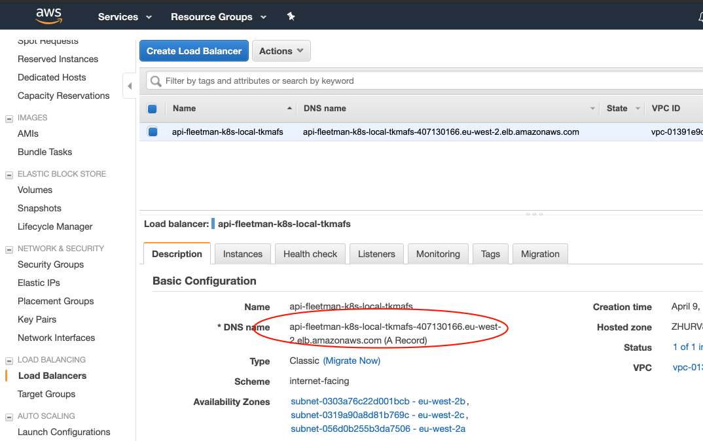
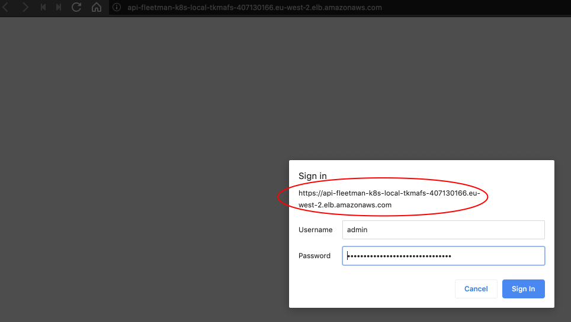
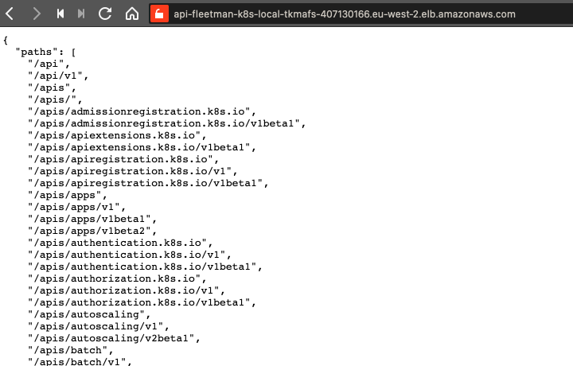
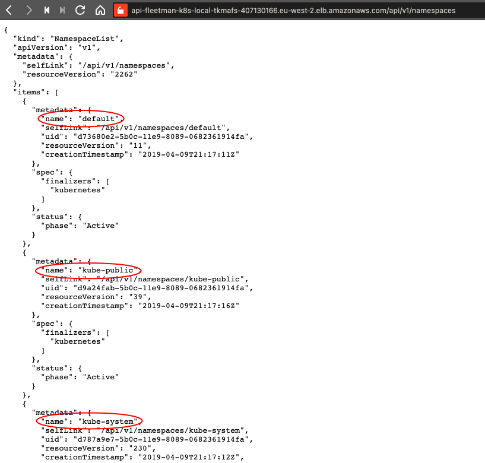
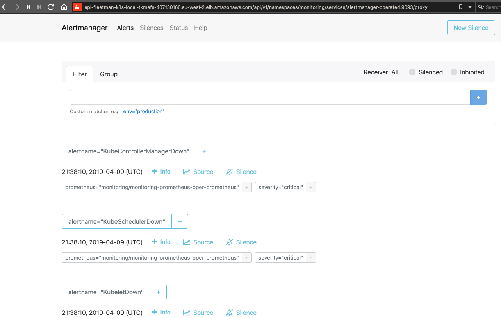
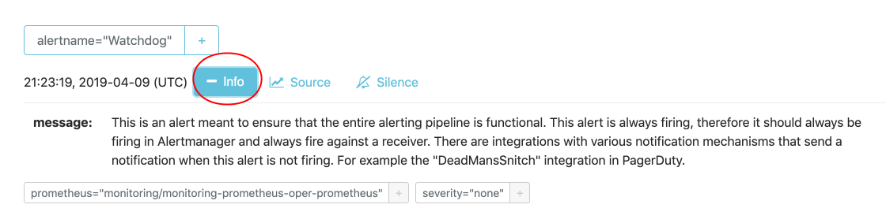

# Alerting

There is an alering service provided by Prometheus. Instead of once again exposing it through a load balancer, we can go via Kubernetes proxy, where we will need the following user / password:

```bash
$ kubectl config view --minify
apiVersion: v1
clusters:
- cluster:
    certificate-authority-data: REDACTED
    server: https://api-fleetman-k8s-local-tkmafs-407130166.eu-west-2.elb.amazonaws.com
  name: fleetman.k8s.local
contexts:
- context:
    cluster: fleetman.k8s.local
    user: fleetman.k8s.local
  name: fleetman.k8s.local
current-context: fleetman.k8s.local
kind: Config
preferences: {}
users:
- name: fleetman.k8s.local
  user:
    client-certificate-data: REDACTED
    client-key-data: REDACTED
    password: QwDpy1yuZYAErCdxkQTVmheBPC45t80N
    username: admin
```

The URL to access:



---



---



We can view the **namespaces** API:



The full URL to view the **alert manager** is [https://api-fleetman-k8s-local-tkmafs-407130166.eu-west-2.elb.amazonaws.com/api/v1/namespaces/monitoring/services/alertmanager-operated:9093/proxy](https://api-fleetman-k8s-local-tkmafs-407130166.eu-west-2.elb.amazonaws.com/api/v1/namespaces/monitoring/services/alertmanager-operated:9093/proxy):



There are a few alerts e.g.

