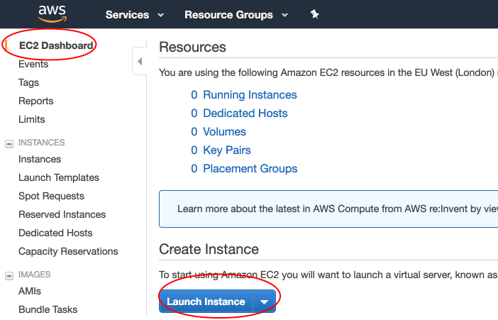
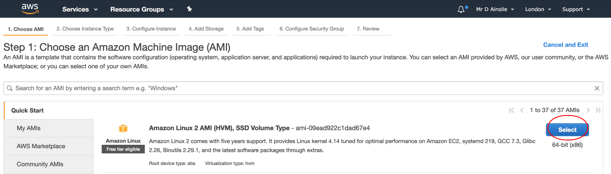
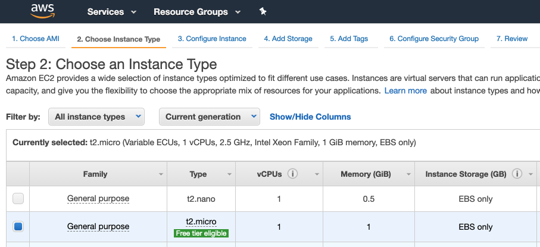
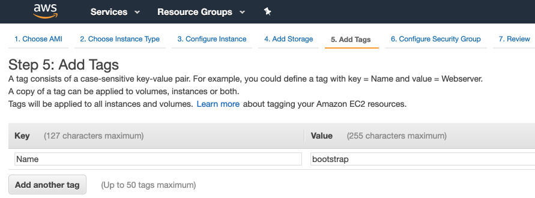
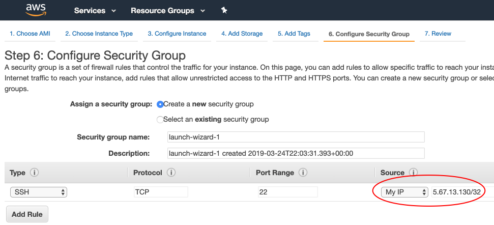
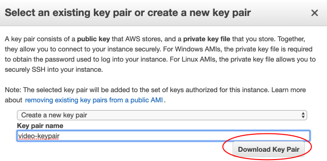
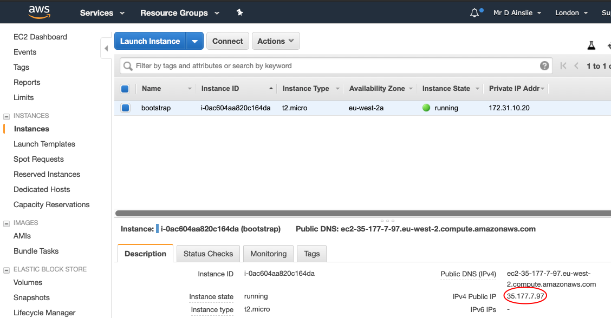

# Kops

If you have missed previous setups, then apply the following:

```bash
$ brew update && brew install kops
```

Though initially we are going to launch an EC2 instance manually.



---



---



Go through the configurations (accepting the defaults) and add a **tag**:



and add a bit of security:



Upon launching, we'll be asked to select or create a **key pair** which will allow us to log into this instance. When a key pair is created, download the key pair file, which is used for login.



Copy the key pair to the k8s directory with our manifests and then **ssh** onto our instance given by the generated IP address:



```bash
$ chmod go-rwx video-keypair.pem
```

```bash
$ ssh -i video-keypair.pem ec2-user@35.178.250.8

       __|  __|_  )
       _|  (     /   Amazon Linux 2 AMI
      ___|\___|___|

https://aws.amazon.com/amazon-linux-2/
[ec2-user@ip-172-31-11-187 ~]$
```

