# Kops

If you have missed previous setups, then apply the following:

```bash
$ brew update && brew install kops
```

Though initially we are going to launch an EC2 instance manually.


---


---


Go through the configurations (accepting the defaults) and add a **tag**:


and add a bit of security:


Upon launching, we'll be asked to select or create a **key pair** which will allow us to log into this instance. When a key pair is created, download the key pair file, which is used for login.


Copy the key pair to the k8s directory with our manifests and then **ssh** onto our instance given by the generated IP address:


```bash
$ chmod go-rwx video-keypair.pem
```

```bash
$ ssh -i video-keypair.pem ec2-user@35.177.7.97
The authenticity of host '35.177.7.97 (35.177.7.97)' can't be established.
ECDSA key fingerprint is SHA256:rz24AbSgSq0zcSOgv1TVk+e+kI7eS82YWnSWTpa2dcw.
Are you sure you want to continue connecting (yes/no)? yes
Warning: Permanently added '35.177.7.97' (ECDSA) to the list of known hosts.

       __|  __|_  )
       _|  (     /   Amazon Linux 2 AMI
      ___|\___|___|

https://aws.amazon.com/amazon-linux-2/
[ec2-user@ip-172-31-10-20 ~]$ curl -Lo kops https://github.com/kubernetes/kops/releases/download/$(curl -s https://api.github.com/repos/kubernetes/kops/releases/latest | grep tag_name | cut -d '"' -f 4)/kops-linux-amd64
chmod +x ./kops
sudo mv ./kops /usr/local/bin/

[ec2-user@ip-172-31-10-20 ~]$ curl -Lo kubectl https://storage.googleapis.com/kubernetes-release/release/$(curl -s https://storage.googleapis.com/kubernetes-release/release/stable.txt)/bin/linux/amd64/kubectl
chmod +x ./kubectl
sudo mv ./kubectl /usr/local/bin/kubectl
```

## Kops IAM User

We can run:

```bash
[ec2-user@ip-172-31-10-20 ~]$ aws iam create-group --group-name kops

aws iam attach-group-policy --policy-arn arn:aws:iam::aws:policy/AmazonEC2FullAccess --group-name kops
aws iam attach-group-policy --policy-arn arn:aws:iam::aws:policy/AmazonRoute53FullAccess --group-name kops
aws iam attach-group-policy --policy-arn arn:aws:iam::aws:policy/AmazonS3FullAccess --group-name kops
aws iam attach-group-policy --policy-arn arn:aws:iam::aws:policy/IAMFullAccess --group-name kops
aws iam attach-group-policy --policy-arn arn:aws:iam::aws:policy/AmazonVPCFullAccess --group-name kops

aws iam create-user --user-name kops

aws iam add-user-to-group --user-name kops --group-name kops

aws iam create-access-key --user-name kops
```

Or go through the UI:

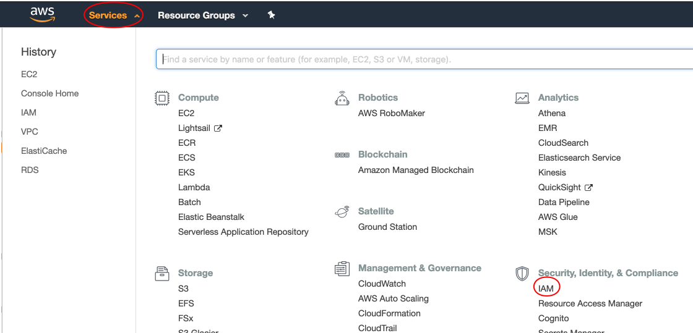

Create a **new group**:

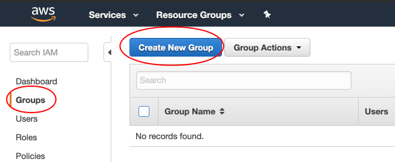

---

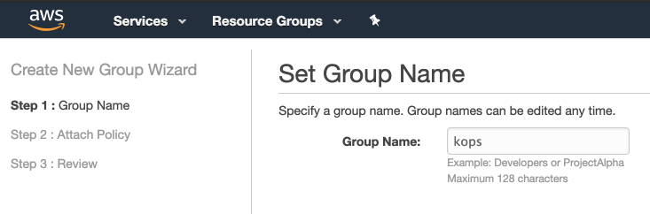

---

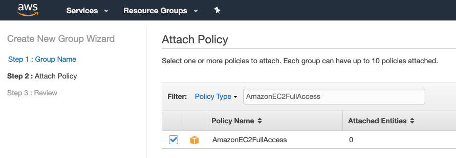

---

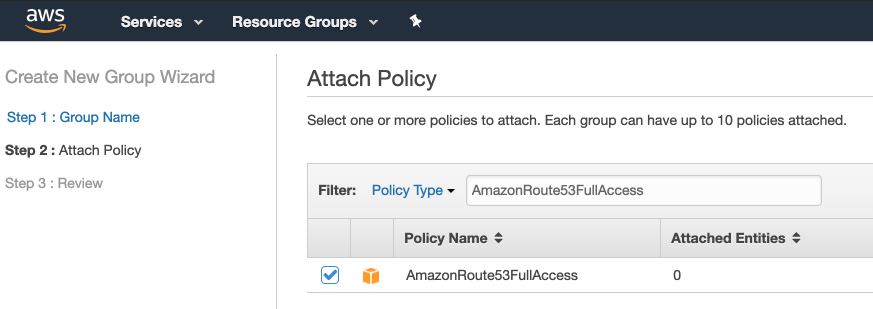

---

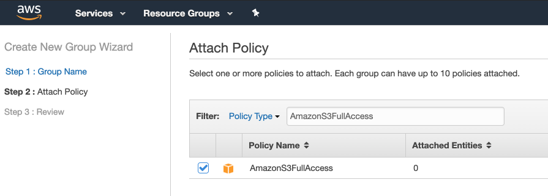

---


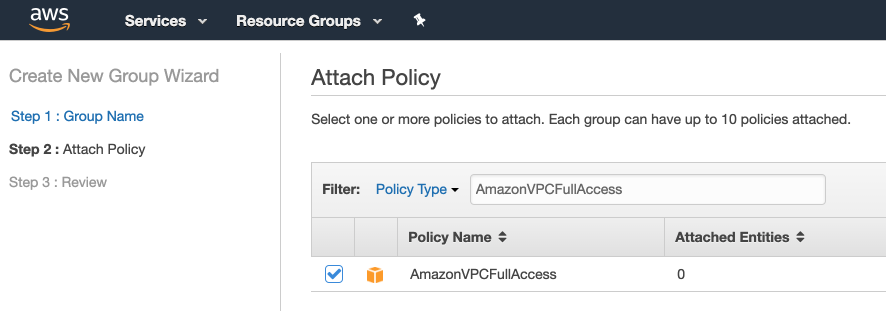

The **next step** gives us a review:

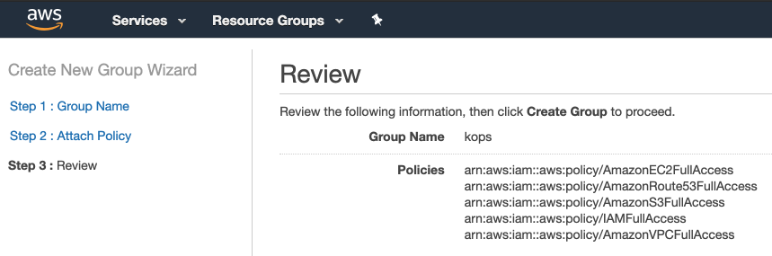

Now **add user**:

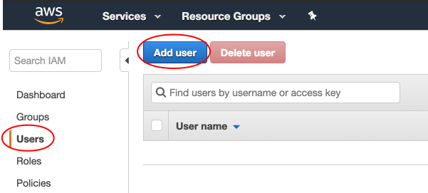

---

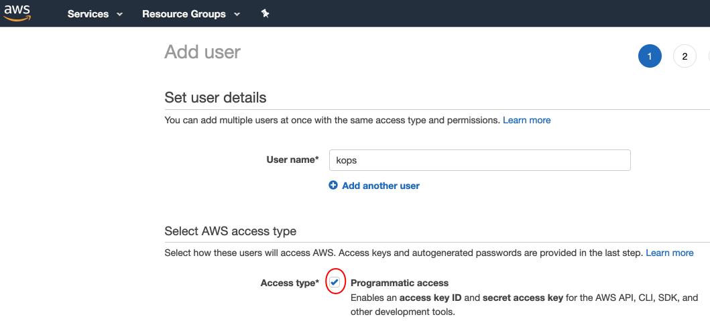

---

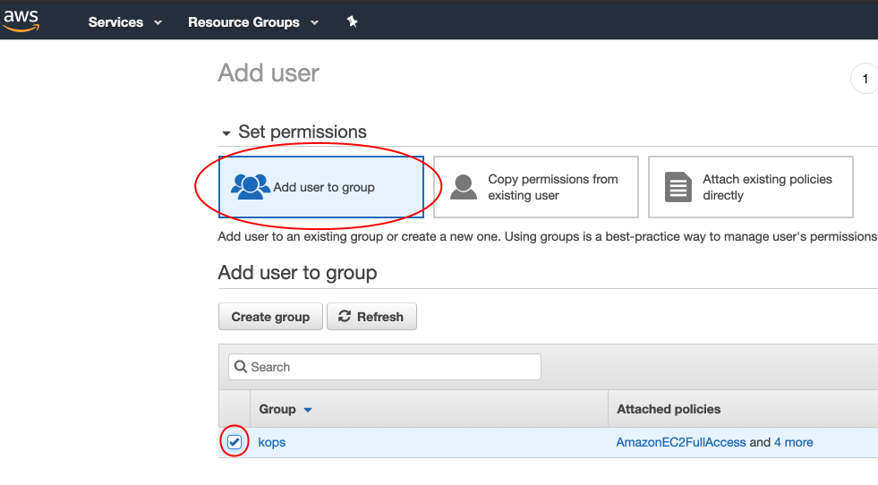

## AWS Configure

```bash
[ec2-user@ip-172-31-10-20 ~]$ aws configure
AWS Access Key ID [None]: <your key>
AWS Secret Access Key [None]: <your secret>
Default region name [None]: eu-west-2
Default output format [None]:
[ec2-user@ip-172-31-10-20 ~]$
```

```bash
[ec2-user@ip-172-31-10-20 ~]$ aws iam list-users
{
    "Users": [
        {
            "Path": "/",
            "UserName": "david",
            "UserId": "AIDAJWYA4T56M6BWTROFG",
            "Arn": "arn:aws:iam::890953945913:user/david",
            "CreateDate": "2019-03-26T21:34:00Z"
        },
        {
            "Path": "/",
            "UserName": "kops",
            "UserId": "AIDAIZ5G6B5QLAIAZIDNW",
            "Arn": "arn:aws:iam::890953945913:user/kops",
            "CreateDate": "2019-03-26T21:37:24Z"
        }
    ]
}
```

```bash
[ec2-user@ip-172-31-10-20 ~]$ export AWS_ACCESS_KEY_ID=$(aws configure get aws_access_key_id)
[ec2-user@ip-172-31-10-20 ~]$ export AWS_SECRET_ACCESS_KEY=$(aws configure get aws_secret_access_key)
```

## Configure Cluster

Create a **S3** bucket (a distributed file system):

```bash
$ aws s3api create-bucket --bucket kops-has-storage --region eu-west-2 --create-bucket-configuration LocationConstraint=eu-west-2
{
    "Location": "http://kops-has-storage.s3.amazonaws.com/"
}
```

Or do the above via the UI:

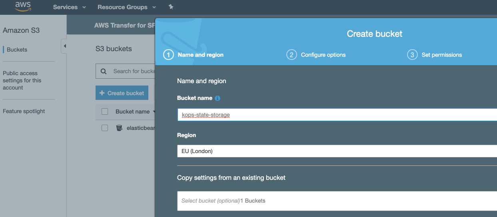

To set up a cluster, first set some environment variables:

```bash
$ export NAME=fleetman.k8s.local

$ export KOPS_STATE_STORE=s3://kops-has-storage
```

Noting that for a **gossip based** cluster, make sure the name ends with **k8s.local**.

Now we want to distribute (configure) our application node across available data centres (within a region):

```bash
$ aws ec2 describe-availability-zones --region eu-west-2
{
    "AvailabilityZones": [
        {
            "State": "available",
            "Messages": [],
            "RegionName": "eu-west-2",
            "ZoneName": "eu-west-2a",
            "ZoneId": "euw2-az2"
        },
        {
            "State": "available",
            "Messages": [],
            "RegionName": "eu-west-2",
            "ZoneName": "eu-west-2b",
            "ZoneId": "euw2-az3"
        },
        {
            "State": "available",
            "Messages": [],
            "RegionName": "eu-west-2",
            "ZoneName": "eu-west-2c",
            "ZoneId": "euw2-az1"
        }
    ]
}
```

The next command creates configuration files for the cluster (it does not actually create a cluster as implied):

(Noting that if the following cluster has already been configured you can do):

```bash
$ kops delete cluster --name ${NAME}
```

```bash
$ kops create cluster --zones eu-west-2a,eu-west-2b,eu-west-2c ${NAME}

I0326 22:25:14.700961   22393 create_cluster.go:496] Inferred --cloud=aws from zone "eu-west-2a"
...
I0326 22:25:15.645382   22393 create_cluster.go:1407] Using SSH public key: /Users/davidainslie/.ssh/id_rsa.pub
...
I0326 22:25:16.550843   22393 apply_cluster.go:542] Gossip DNS: skipping DNS validation
...
Will create resources:
  AutoscalingGroup/master-eu-west-2a.masters.fleetman.k8s.local
...
Cluster configuration has been created.

Suggestions:
 * list clusters with: kops get cluster
 * edit this cluster with: kops edit cluster fleetman.k8s.local
 * edit your node instance group: kops edit ig --name=fleetman.k8s.local nodes
 * edit your master instance group: kops edit ig --name=fleetman.k8s.local master-eu-west-2a

Finally configure your cluster with: kops update cluster fleetman.k8s.local --yes
```

We can edit the configuration, but what is more important is to change/edit the following:

```bash
$ kops edit ig nodes --name ${NAME}
```

and change **machineType** to **t2.micro**; **maxSize** to **5**; **minSize** to **3**.

```yaml
apiVersion: kops/v1alpha2
kind: InstanceGroup
metadata:
  creationTimestamp: 2019-03-26T22:25:15Z
  labels:
    kops.k8s.io/cluster: fleetman.k8s.local
  name: nodes
spec:
  image: kope.io/k8s-1.11-debian-stretch-amd64-hvm-ebs-2018-08-17
  machineType: t2.medium
  maxSize: 2
  minSize: 2
  nodeLabels:
    kops.k8s.io/instancegroup: nodes
  role: Node
  subnets:
  - eu-west-2a
  - eu-west-2b
  - eu-west-2c
```

and edit the **master** configuration:

```bash
$ kops edit ig master-eu-west-2a --name ${NAME}
```

again changing **machineType** to **t2.micro**.

Check the changes:

```bash
$ kops get ig --name ${NAME}

NAME			         	ROLE		MACHINETYPE		MIN		MAX		ZONES
master-eu-west-2a		Master	t2.micro			1			1			eu-west-2a
nodes								Node		t2.micro			3			5			eu-west-2a,eu-west-2b,eu-west-2c
```

## Create Cluster

With all the legwork done to configure our cluster, we just need to issue:

```bash
$ kops update cluster ${NAME} --yes
...
Cluster is starting.  It should be ready in a few minutes.

Suggestions:
 * validate cluster: kops validate cluster
 * list nodes: kubectl get nodes --show-labels
 * ssh to the master: ssh -i ~/.ssh/id_rsa admin@api.fleetman.k8s.local
 * the admin user is specific to Debian. If not using Debian please use the appropriate user based on your OS.
 * read about installing addons at: https://github.com/kubernetes/kops/blob/master/docs/addons.md.
```

```bash
$ kops validate cluster
Using cluster from kubectl context: fleetman.k8s.local

Validating cluster fleetman.k8s.local

INSTANCE GROUPS
NAME			        ROLE	  MACHINETYPE	 MIN	MAX	 SUBNETS
master-eu-west-2a	Master	t2.micro	   1	  1	   eu-west-2a
nodes			        Node	  t2.micro	   3	  5	   eu-west-2a,eu-west-2b,eu-west-2c

NODE STATUS
NAME						                             ROLE	   READY
ip-172-20-112-94.eu-west-2.compute.internal	 node	   True
ip-172-20-38-252.eu-west-2.compute.internal	 node	   True
ip-172-20-48-86.eu-west-2.compute.internal	 master	 True
ip-172-20-65-73.eu-west-2.compute.internal	 node	   True

Your cluster fleetman.k8s.local is ready
```

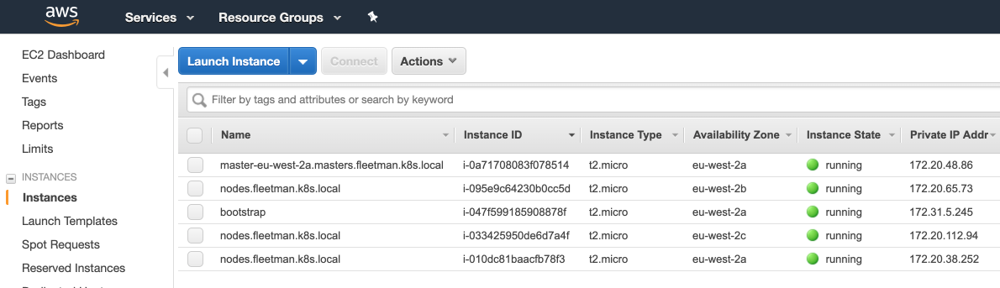

---

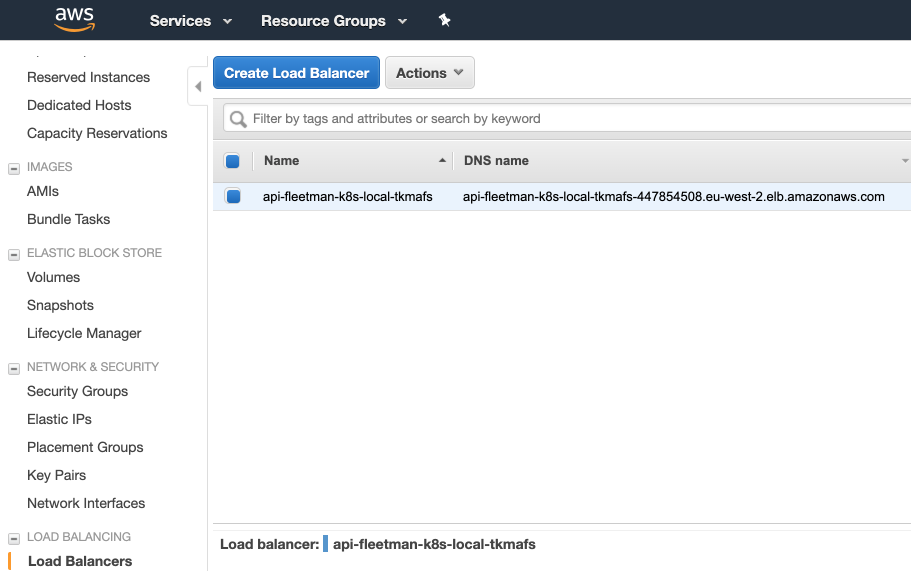

---

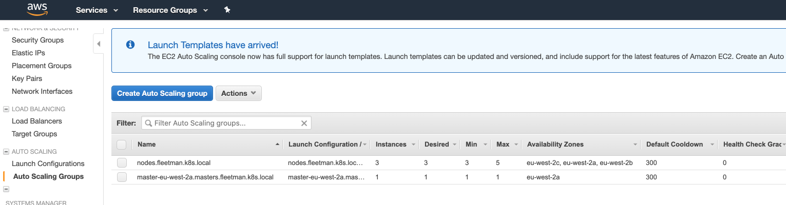

## Deploy

To **apply** our k8s manifests onto the AWS cluster (instead of locally on Minikube), hopefully the command line shows that we are in the required context:

```bash
kubernetes-backwards/kubernetes-microservices/k8s on  master [!?] at ☸️ fleetman.k8s.local
```

Note, we'll have to update the **storage** manifest to use AWS.

Here we see our initial volumes, where:

- top 3 are for the *worker* nodes
- next is for the master
- followed by 2 key/value databases
- finally our original *bootstrap* for giving us a starting point

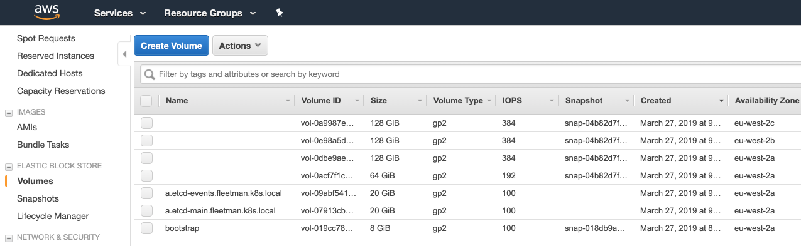

We want to add to this list for **Mongo**. So just to check things are working, let's only **apply** the storage manifest:

```bash
$ kubectl apply -f storage.yml
persistentvolumeclaim "mongo-pvc" created
storageclass "cloud-ssd" created
```

```bash
$ kubectl get pvc
NAME      STATUS VOLUME                                  CAPACITY ACCESS MODES   STORAGECLASS 
mongo-pvc Bound  pvc-7a7144b6-5268-11e9-b54c-06725bb9d18e 7Gi      RWO           cloud-ssd
```

Now even though we did not declare a **volume** in the manifest, we can see that one is dynamically generated for us:

```bash
$ kubectl get pv
NAME                                 CAPACITY ACCESS RECLAIM STATUS    CLAIM     STORAGECLASS
pvc-7a7144b6-5268-11e9-b54c-06725bb9d18e  7Gi  RWO  Delete Bound  default/mongo-pvc cloud-ssd 
```

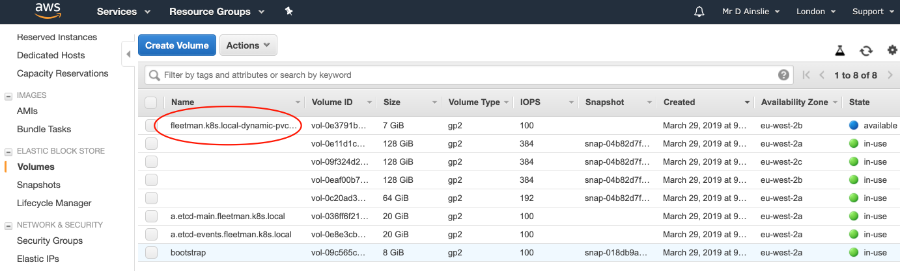

and apply our mongo stack:

```bash
$ kubectl apply -f mongo-deployment.yml
deployment "mongo" created

$ kubectl apply -f mongo-service.yml
service "fleetman-mongodb" created
```

```bash
$ kubectl get all
NAME           DESIRED   CURRENT   UP-TO-DATE   AVAILABLE   AGE
deploy/mongo   1         1         1            1           1m

NAME                  DESIRED   CURRENT   READY     AGE
rs/mongo-7b974f887c   1         1         1         1m

NAME                        READY     STATUS    RESTARTS   AGE
po/mongo-7b974f887c-2g2jw   1/1       Running   0          1m

NAME                   TYPE        CLUSTER-IP     EXTERNAL-IP   PORT(S)     AGE
svc/fleetman-mongodb   ClusterIP   100.69.97.66   <none>        27017/TCP   46s
svc/kubernetes         ClusterIP   100.64.0.1     <none>        443/TCP     28m
```

and our volume will now be **in-use**:

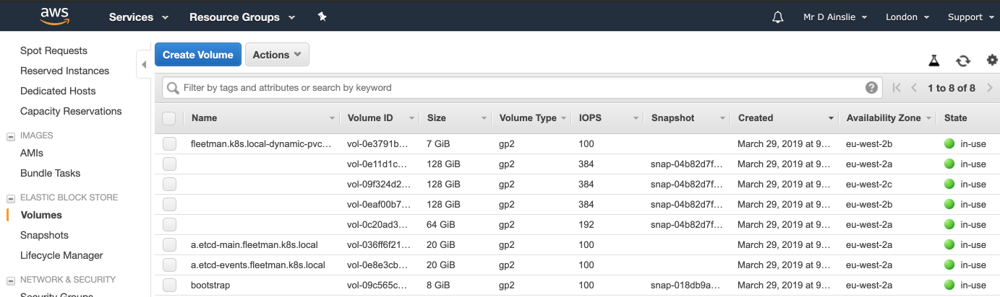

Before we deploy the remaining manifest, first replace **NodePort** with **LoadBalancer** and **ClusterIP** in our services. A node port is really only for local development and testing. And **apply** everything else:

```bash
$ kubectl apply -f .
deployment "api-gateway" created
service "fleetman-api-gateway" created
deployment "mongo" configured
service "fleetman-mongodb" unchanged
deployment "position-simulator" created
deployment "position-tracker" created
service "fleetman-position-tracker" created
deployment "queue" created
service "fleetman-queue" created
persistentvolumeclaim "mongo-pvc" unchanged
storageclass "cloud-ssd" configured
deployment "webapp" created
service "fleetman-webapp" created
```

```bash
$ kubectl get all
NAME                        DESIRED   CURRENT   UP-TO-DATE   AVAILABLE   AGE
deploy/api-gateway          1         1         1            1           1m
deploy/mongo                1         1         1            1           17m
deploy/position-simulator   1         1         1            1           1m
deploy/position-tracker     1         1         1            1           1m
deploy/queue                1         1         1            1           1m
deploy/webapp               1         1         1            1           1m

NAME                               DESIRED   CURRENT   READY     AGE
rs/api-gateway-567cccb5f9          1         1         1         1m
rs/mongo-7b974f887c                1         1         1         17m
rs/position-simulator-8577f77866   1         1         1         1m
rs/position-tracker-59d5c69c97     1         1         1         1m
rs/queue-865db57799                1         1         1         1m
rs/webapp-64ddf56664               1         1         1         1m

NAME                                     READY     STATUS    RESTARTS   AGE
po/api-gateway-567cccb5f9-nvlgj          1/1       Running   0          1m
po/mongo-7b974f887c-2g2jw                1/1       Running   0          17m
po/position-simulator-8577f77866-rxzhb   1/1       Running   0          1m
po/position-tracker-59d5c69c97-2lkjd     1/1       Running   0          1m
po/queue-865db57799-jhbqr                1/1       Running   0          1m
po/webapp-64ddf56664-8bz4w               1/1       Running   0          1m

NAME                          TYPE          CLUSTER-IP      EXTERNAL-IP    PORT(S)
svc/fleetman-api-gateway      ClusterIP     100.64.28.123   <none>         8080/TCP
svc/fleetman-mongodb          ClusterIP     100.69.97.66    <none>         27017/TCP
svc/fleetman-position-tracker ClusterIP     100.70.183.1    <none>         8080/TCP
svc/fleetman-queue            ClusterIP     100.65.142.105  <none>         8161/TCP,61616/TCP
svc/fleetman-webapp           LoadBalancer  100.64.139.67   ad46d7b84526d..80:31786/TCP 
svc/kubernetes                ClusterIP     100.64.0.1      <none>         443/TCP
```

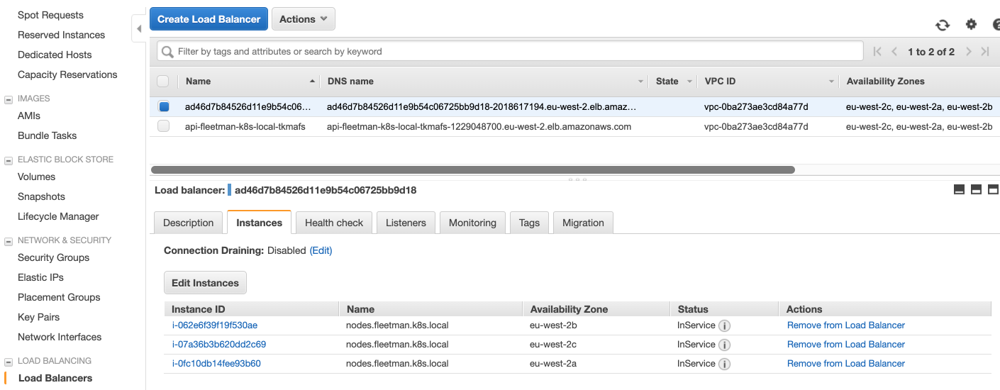

---

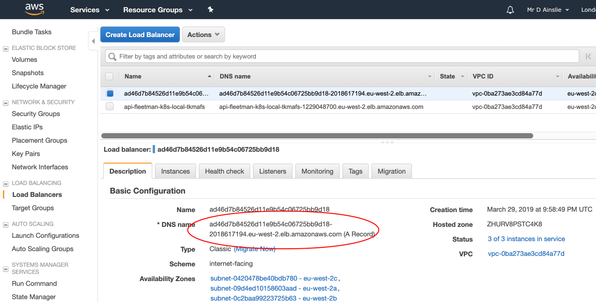

---

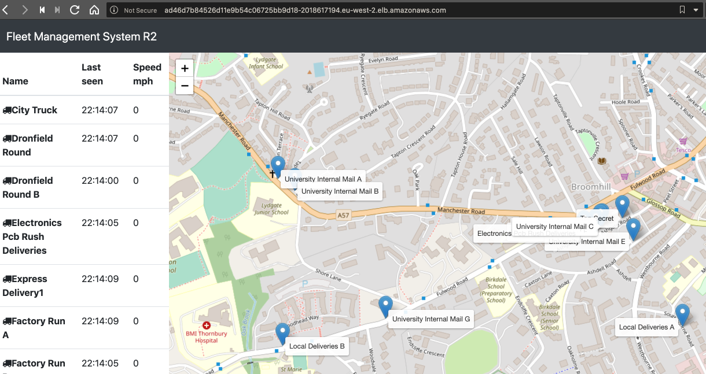

## Real Domain Name


## Delete Cluster

```bash
$ kops delete cluster --name ${NAME} --yes
```