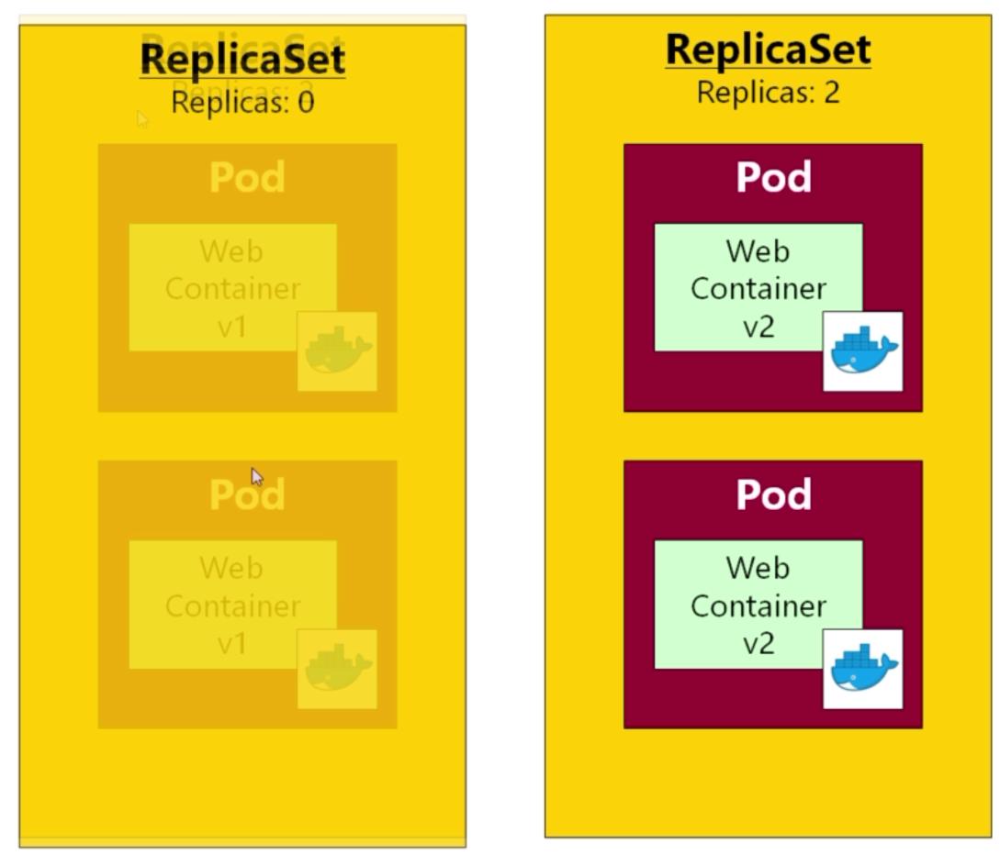

# Deployments

Deployments can be thought of as one step up from ReplicaSets, whereby we are given rolling deployments with zero downtime.

So let's archive our ReplicaSets to "v2", delete any ReplicaSets in our cluster and upgrade our ReplicaSet manifest to a Deployment:

```bash
$ kubectl get all
NAME        DESIRED   CURRENT   READY     AGE
rs/webapp   1         1         1         1d

NAME              READY     STATUS    RESTARTS   AGE
po/queue          1/1       Running   1          1d
po/webapp-zr657   1/1       Running   1          1d

NAME                  TYPE        CLUSTER-IP       EXTERNAL-IP   PORT(S)          AGE
svc/fleetman-queue    NodePort    10.101.118.156   <none>        8161:30010/TCP   1d
svc/fleetman-webapp   NodePort    10.107.169.44    <none>        8081:30080/TCP   1d
svc/kubernetes        ClusterIP   10.96.0.1        <none>        443/TCP          4d
```

Remembering that we can't just delete a Pod associated with a ReplicaSet because Kubernetes will just restart a new instance:

```bash
$ kubectl delete rs webapp
replicaset "webapp" deleted

$ kubectl get all
NAME       READY     STATUS    RESTARTS   AGE
po/queue   1/1       Running   1          1d

NAME                  TYPE        CLUSTER-IP       EXTERNAL-IP   PORT(S)          AGE
svc/fleetman-queue    NodePort    10.101.118.156   <none>        8161:30010/TCP   1d
svc/fleetman-webapp   NodePort    10.107.169.44    <none>        8081:30080/TCP   1d
svc/kubernetes        ClusterIP   10.96.0.1        <none>        443/TCP          4d
```

Deploy:

```bash
$ kubectl apply -f .
pod "queue" unchanged
service "fleetman-queue" unchanged
deployment "webapp" created
service "fleetman-webapp" unchanged
```

And we see our new Deployment - though also a ReplicaSet:

```bash
$ kubectl get all
NAME            DESIRED   CURRENT   UP-TO-DATE   AVAILABLE   AGE
deploy/webapp   2         2         2            2           9s

NAME                   DESIRED   CURRENT   READY     AGE
rs/webapp-5cb8885495   2         2         2         9s

NAME                         READY     STATUS    RESTARTS   AGE
po/queue                     1/1       Running   1          1d
po/webapp-5cb8885495-42xjk   1/1       Running   0          9s
po/webapp-5cb8885495-lgl9b   1/1       Running   0          9s

NAME                  TYPE        CLUSTER-IP       EXTERNAL-IP   PORT(S)          AGE
svc/fleetman-queue    NodePort    10.101.118.156   <none>        8161:30010/TCP   1d
svc/fleetman-webapp   NodePort    10.107.169.44    <none>        8081:30080/TCP   1d
svc/kubernetes        ClusterIP   10.96.0.1        <none>        443/TCP          4d
```

So a Deployment creates an associated ReplicaSet.

Think of a Deployment as an entity that manages a ReplicaSet.

And of course a ReplicaSet creates corresponding Pods.

Upon rolling out a new version, once said new version is up and running, Kubernetes can get rid of the pods with the previous version e.g. deploying "v2" in favour of "v1":

> 

We can rollback by resetting **Replicas: 0** to **Replicas: 2** for the original ReplicaSet.

We roll out a new version by changing the following in **web-deployment.yml**:

```yaml
image: richardchesterwood/k8s-fleetman-webapp-angular:release0
```

to

```yaml
image: richardchesterwood/k8s-fleetman-webapp-angular:release0-5
```

and then:

```bash
$ kubectl apply -f .
pod "queue" unchanged
service "fleetman-queue" unchanged
deployment "webapp" configured
service "fleetman-webapp" unchanged

$ kubectl get all
NAME            DESIRED   CURRENT   UP-TO-DATE   AVAILABLE   AGE
deploy/webapp   2         3         1            2           18m

NAME                   DESIRED   CURRENT   READY     AGE
rs/webapp-576bd64445   1         1         0         4s
rs/webapp-5cb8885495   2         2         2         18m

NAME                         READY     STATUS    RESTARTS   AGE
po/queue                     1/1       Running   1          1d
po/webapp-576bd64445-8tlfr   0/1       Pending   0          4s
po/webapp-5cb8885495-42xjk   1/1       Running   0          18m
po/webapp-5cb8885495-lgl9b   1/1       Running   0          18m

NAME                  TYPE        CLUSTER-IP       EXTERNAL-IP   PORT(S)          AGE
svc/fleetman-queue    NodePort    10.101.118.156   <none>        8161:30010/TCP   1d
svc/fleetman-webapp   NodePort    10.107.169.44    <none>        8081:30080/TCP   1d
svc/kubernetes        ClusterIP   10.96.0.1        <none>        443/TCP          4d
```

```bash
$ kubectl rollout status deployment webapp
deployment "webapp" successfully rolled out
```

For illustration, let's revert the image (a manual rollback) in our deployment from **release0-5** back to **release0** to see continual information from the **rollout** command:

```bash
$ kubectl apply -f .
pod "queue" unchanged
service "fleetman-queue" unchanged
deployment "webapp" configured
service "fleetman-webapp" unchanged
```

```bash
$ kubectl rollout status deployment webapp
Waiting for rollout to finish: 1 out of 2 new replicas have been updated...
Waiting for rollout to finish: 1 out of 2 new replicas have been updated...
Waiting for rollout to finish: 1 out of 2 new replicas have been updated...
Waiting for rollout to finish: 1 old replicas are pending termination...
Waiting for rollout to finish: 1 old replicas are pending termination...
Waiting for rollout to finish: 1 old replicas are pending termination...
deployment "webapp" successfully rolled out
```

And we'll see the old ReplicaSet hanging around but with zero Replicas:

```bash
$ kubectl get all
NAME            DESIRED   CURRENT   UP-TO-DATE   AVAILABLE   AGE
deploy/webapp   2         2         2            2           11m

NAME                   DESIRED   CURRENT   READY     AGE
rs/webapp-69cd68d8d7   2         2         2         2m
rs/webapp-76997d5d65   0         0         0         11m

NAME                         READY     STATUS    RESTARTS   AGE
po/queue                     1/1       Running   0          11m
po/webapp-69cd68d8d7-8vdf6   1/1       Running   0          2m
po/webapp-69cd68d8d7-fmtfv   1/1       Running   0          2m

NAME                  TYPE        CLUSTER-IP       EXTERNAL-IP   PORT(S)          AGE
svc/fleetman-queue    NodePort    10.101.170.198   <none>        8161:30010/TCP   11m
svc/fleetman-webapp   NodePort    10.106.155.128   <none>        8081:30080/TCP   11m
svc/kubernetes        ClusterIP   10.96.0.1        <none>        443/TCP          4d
```

```bash
$ kubectl rollout history deployment webapp
deployments "webapp"
REVISION  CHANGE-CAUSE
1         <none>
2         <none>
```

So, instead of playing around with the manifests to select roll forward and rollbacks, we can do the following:

```bash
$ kubectl rollout undo deployment webapp
deployment "webapp"
```

Or get more specific:

```bash
$ kubectl rollout undo deployment webapp --to-revision=1
```

```bash
$ kubectl rollout history deployment webapp
deployments "webapp"
REVISION  CHANGE-CAUSE
2         <none>
3         <none>
```

