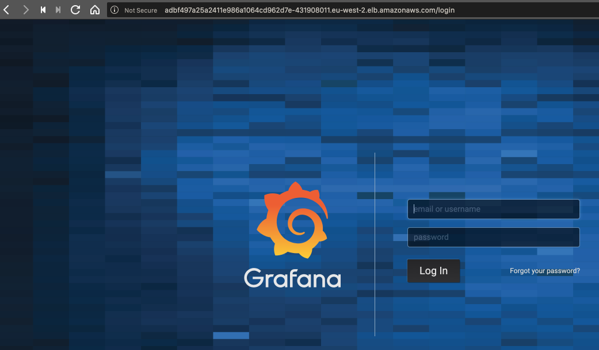
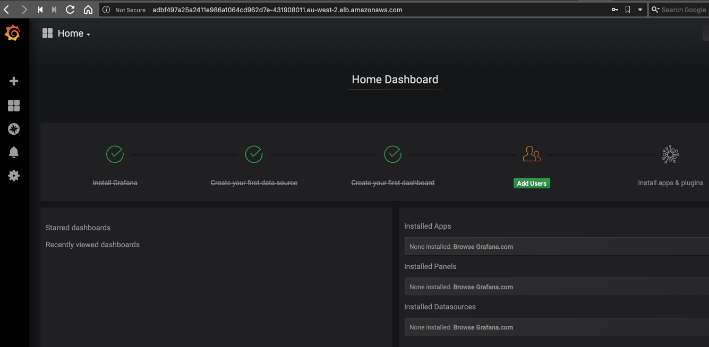
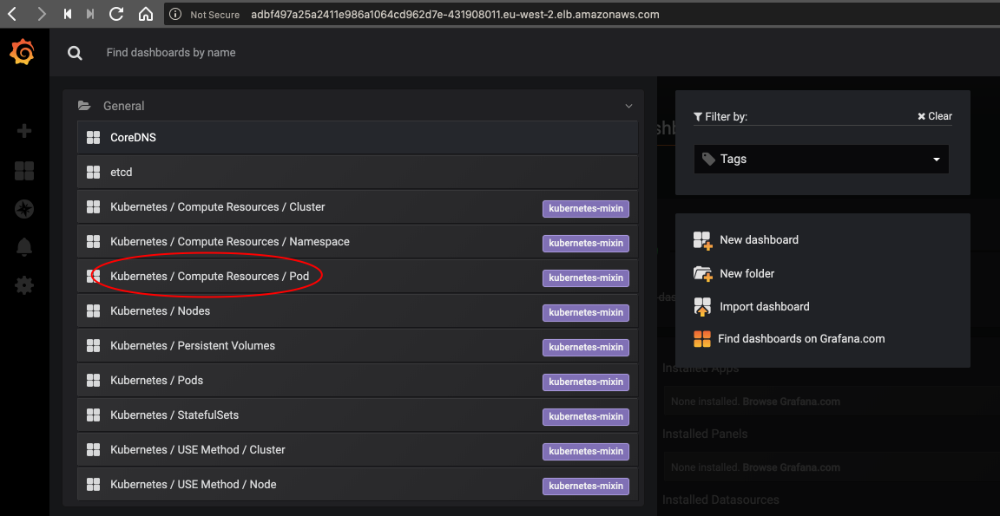
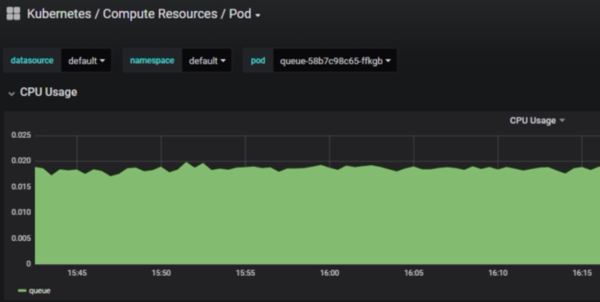
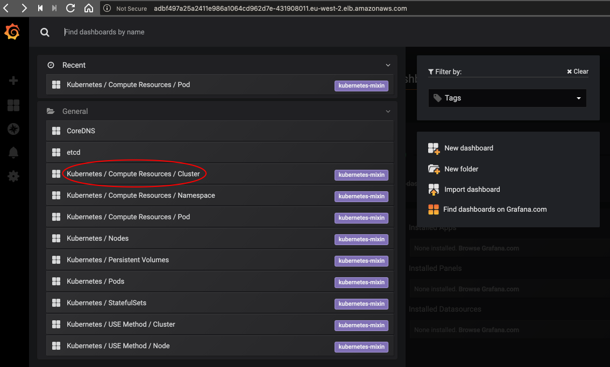
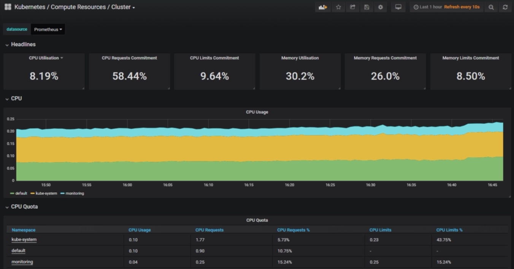

# Grafana

First change prometheus back to using a ClusterIP instead of LoadBalancer (to save money), which will include removing the nodePort:

```bash
$ kubectl edit service/monitoring-prometheus-oper-prometheus --namespace monitoring
```

Then switch the Grafana manifest to using a LoadBalancer instead of a ClusterIP:

```bash
$ kubectl edit service/monitoring-grafana --namespace monitoring
```



Use the default user / password of **admin / prom-operator** for the helm chart, which can be overridden.



View more dashboards from the **Home** dropdown:



---



Let's take a look at the whole cluster:



---

